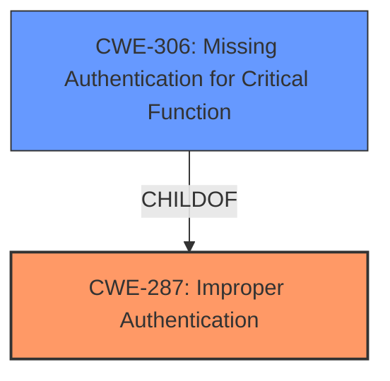

# Enhanced Analysis for CVE-2024-38351

# Summary
| CWE ID  | CWE Name                                                              | Confidence | CWE Abstraction Level | CWE Vulnerability Mapping Label | CWE-Vulnerability Mapping Notes |
| :-------- | :-------------------------------------------------------------------- | :----------- | :---------------------- | :------------------------------ | :------------------------------ |
| CWE-287   | Improper Authentication                                               | 0.9          | Class                  | Primary                         | Discouraged                     |
| CWE-306   | Missing Authentication for Critical Function                          | 0.7          | Base                   | Secondary                       | Allowed                         |

## Evidence and Confidence

*   **Confidence Score:** 0.8
*   **Evidence Strength:** HIGH

## Relationship Analysis

The primary weakness is classified as CWE-287, Improper Authentication, because the application does not sufficiently verify the user's identity during the OAuth2 linking process. CWE-306, Missing Authentication for Critical Function, is a related weakness as the linking of accounts is a critical function that lacks proper authentication. The relationship between CWE-287 and CWE-306 is that CWE-306 can be a child of CWE-287, suggesting that the missing authentication contributes to the broader issue of improper authentication. CWE-287 is a class level weakness, and therefore it is usually discouraged to use this CWE when a child CWE is more appropriate. However, in this case, the other identified CWEs are too specific.



## Vulnerability Chain

The vulnerability chain starts with a **lack of account verification** and **unverified OAuth2 accounts**, leading to **improper authentication**, and culminating in **account takeover**.

1.  **Lack of Account Verification**: Initial registration with an unverified email.
2.  **Unverified OAuth2 Accounts**: Subsequent OAuth2 signup without proper verification.
3.  **Improper Authentication (CWE-287)**: Insufficiently proving the user's identity during OAuth2 linking.
4.  **Missing Authentication for Critical Function (CWE-306)**: Absence of authentication for the critical function of account linking.
5.  **Account Takeover**: Malicious actor gains access to the targeted user account.

## Summary of Analysis

The analysis indicates that **improper authentication** is the primary weakness, stemming from the **lack of account verification** and the use of **unverified OAuth2 accounts**. The application **does not properly** verify the identity of the user during the OAuth2 linking process, allowing a malicious actor to compromise other user accounts.

The keyphrase analysis highlights the following:

*   **ROOTCAUSE: 'lack of account verification'**: CWE-1390, CWE-287, and CWE-306 are relevant.
*   **ROOTCAUSE: 'unverified OAuth2 accounts'**: CWE-1390, CWE-287, and CWE-306 are relevant.
*   **IMPACT: 'account takeover'**: CWE-1390, CWE-287, and CWE-306 are relevant.

CWE-287, Improper Authentication, is selected as the primary CWE because the application **insufficiently proves** that the claim is correct during OAuth2 linking and there is not a better option. CWE-306, Missing Authentication for Critical Function, is a secondary weakness because the account linking process lacks proper authentication mechanisms.

The provided evidence supports the classification, as the vulnerability description explicitly states that the application **does not** change the password of the existing PocketBase user during the linking, allowing the malicious actor to login with the initially created email/password. The graph relationships influenced the decision by highlighting the hierarchical connection between improper authentication and missing authentication for critical functions.

The selected CWEs are at the optimal level of specificity because they directly address the **root cause** of the vulnerability, which is the application's failure to properly verify user identities during OAuth2 linking.

CWEs considered but not used:

*   CWE-1390: Weak Authentication - While relevant, it is a class level CWE and might have Base-level children that would be more appropriate, but none of the children are a good fit.
*   CWE-863: Incorrect Authorization - Authorization is a later process, and is not the cause of the vulnerability.
*   CWE-201: Insertion of Sensitive Information Into Sent Data - This is not the root cause of the vulnerability.
*   CWE-620: Unverified Password Change - Not directly applicable as the issue is more about account linking than password changes.
*   CWE-502: Deserialization of Untrusted Data - Not applicable.


## CWE Relationship Analysis

Current CWEs represent these abstraction levels: .


### Vulnerability Chain Analysis

**Chain starting from CWE-1390:**
- 1390 (Weak Authentication) - ROOT


**Chain starting from CWE-863:**
- 863 (Incorrect Authorization) - ROOT


### CWE Relationship Diagram

```mermaid
graph TD
    classDef primary fill:#f96,stroke:#333,stroke-width:2px
    classDef secondary fill:#69f,stroke:#333
    classDef tertiary fill:#9e9,stroke:#333
```