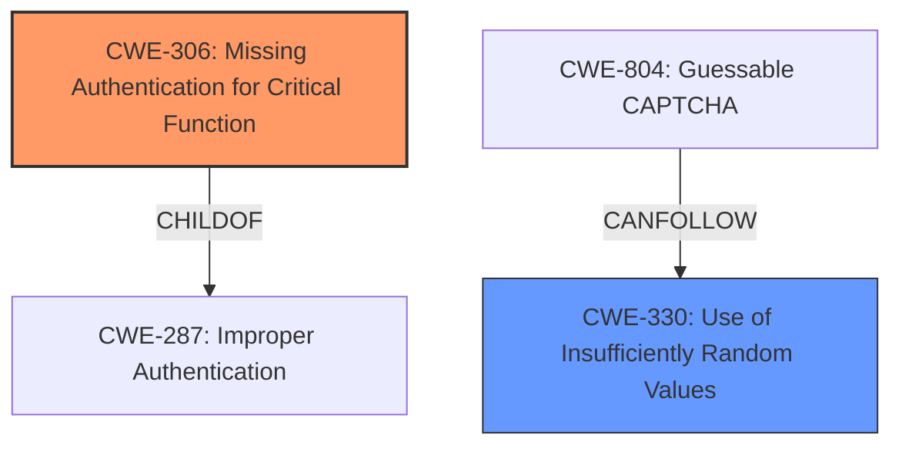

# Analysis for CVE-2024-38353

# Summary
| CWE ID | CWE Name | Confidence | CWE Abstraction Level | CWE Vulnerability Mapping Label | CWE-Vulnerability Mapping Notes |
|---|---|---|---|---|---|
| CWE-306 | Missing Authentication for Critical Function | 1 | Base | Primary | Allowed |
| CWE-330 | Use of Insufficiently Random Values | 0.8 | Class | Secondary | Discouraged |

## Evidence and Confidence

*   **Confidence Score:** 0.9
*   **Evidence Strength:** HIGH

## Relationship Analysis
The primary relationship influencing the decision is the parent-child relationship between CWE-287 (Improper Authentication) and CWE-306 (Missing Authentication for Critical Function). Because the vulnerability description explicitly states that authentication is **missing**, CWE-306 is the more specific and appropriate choice over the more general CWE-287. The relationship between CWE-330 and CWE-804 was also considered.

## Vulnerability Chain
The vulnerability chain begins with the **missing authentication** (CWE-306), which allows for unauthorized access. This is compounded by the **use of insufficiently random values** (CWE-330) in filename generation, making it easier for attackers to guess the URLs of uploaded images. The ultimate impact is unauthorized access to image data and potential for malicious uploads.

## Summary of Analysis
The initial analysis identified CWE-306 as the primary weakness due to the explicit statement of **missing authentication and access control**. This is supported by the "Vulnerability Description Key Phrases" section, which lists "**missing authentication and access control**" as the **rootcause**. The "CVE Reference Links Content Summary" section also explicitly states "CodiMD does not require authentication to access or upload image data."

The Retriever Results suggested other CWEs, such as CWE-639 (Authorization Bypass Through User-Controlled Key) and CWE-425 (Direct Request ('Forced Browsing')). However, these are less relevant because the issue is not about bypassing authorization but rather the complete absence of authentication.

CWE-330 (Use of Insufficiently Random Values) is included as a secondary weakness because the "CVE Reference Links Content Summary" identifies insecure filename generation as contributing to the exploitability of the **missing authentication** vulnerability. Specifically, weak randomness increases the likelihood of guessing image URLs, thus amplifying the impact of CWE-306.

The selected CWEs are at the optimal level of specificity. CWE-306 is a Base level CWE that directly addresses the **missing authentication**. While CWE-330 is a Class, a more specific child is not obviously applicable, but the evidence supports the lack of secure random number generation.

Relevant CWE Information:

# Enhanced Context (25 CWEs)
The following CWEs were identified as potentially relevant to this vulnerability:

## CWE-306: Missing Authentication for Critical Function
| CWE ID | CWE Name | Confidence | CWE Abstraction Level | CWE Vulnerability Mapping Label | CWE-Vulnerability Mapping Notes |
|---|---|---|---|---|---|
| CWE-306 | Missing Authentication for Critical Function | 1 | Base | Primary | Allowed |

**CWE-306: Missing Authentication for Critical Function**
The product does not perform any authentication for functionality that requires a provable user identity or consumes a significant amount of resources.
The vulnerability description states, "CodiMD before 2.5.4 is **missing authentication and access control** vulnerability allowing an unauthenticated attacker to gain unauthorised access to image data uploaded to CodiMD." This directly aligns with the definition of CWE-306. The impact is unauthorized access to uploaded images. This is the primary weakness.
- Usage: Allowed
- Rationale: This CWE entry is at the Base level of abstraction, which is a preferred level of abstraction for mapping to the root causes of vulnerabilities.

## CWE-330: Use of Insufficiently Random Values
| CWE ID | CWE Name | Confidence | CWE Abstraction Level | CWE Vulnerability Mapping Label | CWE-Vulnerability Mapping Notes |
|---|---|---|---|---|---|
| CWE-330 | Use of Insufficiently Random Values | 0.8 | Class | Secondary | Discouraged |

**CWE-330: Use of Insufficiently Random Values**
The product uses insufficiently random numbers or values in a security context that depends on unpredictable numbers.
The vulnerability description notes that the Formidable library uses insecure random filename generation, which increases the likelihood of the issue being exploited. The "CVE Reference Links Content Summary" section details the `hexoid` library's use of `Math.random()` and an incrementing suffix, making filenames predictable. This aligns with CWE-330. The impact is increased exploitability of the **missing authentication** vulnerability.
- Usage: Discouraged
- Rationale: This CWE entry is a level-1 Class (i.e., a child of a Pillar). It might have lower-level children that would be more appropriate