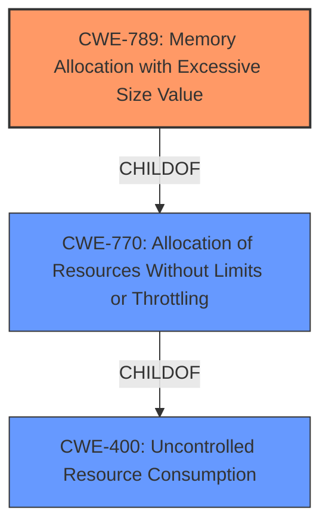

# Raw Analyzer Response for CVE-2024-38359

# Summary
| CWE ID | CWE Name | Confidence | CWE Abstraction Level | CWE Vulnerability Mapping Label | CWE-Vulnerability Mapping Notes |
|---|---|---|---|---|---|
| CWE-789 | Memory Allocation with Excessive Size Value | 1.0 | Variant | Primary | Allowed |
| CWE-770 | Allocation of Resources Without Limits or Throttling | 0.8 | Base | Secondary | Allowed |
| CWE-400 | Uncontrolled Resource Consumption | 0.6 | Class | Secondary | Discouraged |

## Evidence and Confidence

*   **Confidence Score:** 0.9
*   **Evidence Strength:** HIGH

## Relationship Analysis
The primary CWE is CWE-789, which is a child of CWE-770, showing a hierarchical relationship. CWE-770 is a parent of CWE-789. CWE-770 is also a child of CWE-400. This hierarchy guided the selection of more specific CWE-789 as the primary cause, while acknowledging the broader resource management issues reflected in CWE-770 and CWE-400.

## Vulnerability Chain
The vulnerability chain begins with the **missing bounds check** in the onion processing logic, leading to **excessive memory allocation**, ultimately resulting in a **denial of service**.

*   **Root Cause:** CWE-789 (Memory Allocation with Excessive Size Value) because of **parsing vulnerability**
*   **Chain Link 1:** CWE-770 (Allocation of Resources Without Limits or Throttling)
*   **Impact:** CWE-400 (Uncontrolled Resource Consumption) leading to DoS

## Summary of Analysis
The analysis is heavily based on the provided evidence, especially the "CVE Reference Links Content Summary". The description clearly points to a **parsing vulnerability** in the onion processing logic, specifically a **missing bounds check** that allows **excessive memory allocation**. The vulnerability occurs because the `HopPayload.Decode` function allocates memory based on a length specified in the onion packet without proper validation. This allows an attacker to specify a large payload length, causing excessive memory allocation and leading to a DoS.

The primary CWE, CWE-789 (Memory Allocation with Excessive Size Value), accurately represents the root cause, as the code allocates memory based on an untrusted size value without ensuring it is within expected limits. The retriever results also support this choice, with CWE-789 being a top match.

CWE-770 (Allocation of Resources Without Limits or Throttling) is also relevant, as the vulnerability involves allocating resources (memory) without proper limits or throttling. The hierarchical relationship between CWE-789 and CWE-770 (CWE-789 is a child of CWE-770) further supports this connection.

CWE-400 (Uncontrolled Resource Consumption) represents the broader impact of the vulnerability, as the excessive memory allocation leads to resource exhaustion and DoS.

Other CWEs considered but not used:

*   CWE-1284 (Improper Validation of Specified Quantity in Input): While input validation is missing, the core issue is the memory allocation itself, making CWE-789 a more precise fit.
*   CWE-131 (Incorrect Calculation of Buffer Size): Similar to CWE-1284, the calculation isn't necessarily incorrect, but the size is untrusted and unbounded.
*   CWE-190 (Integer Overflow or Wraparound): Not directly related to the described vulnerability.
*   CWE-1333 (Inefficient Regular Expression Complexity): Not applicable as regular expressions are not involved.

The final CWE selection provides the optimal level of specificity, capturing both the root cause (CWE-789) and the broader resource management issues (CWE-770, CWE-400).