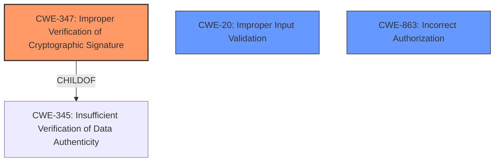

# Raw Analyzer Response for CVE-2024-38365

# Summary

| CWE ID   | CWE Name                                                                            | Confidence | CWE Abstraction Level | CWE Vulnerability Mapping Label | CWE-Vulnerability Mapping Notes |
| :------- | :---------------------------------------------------------------------------------- | :--------- | :-------------------- | :------------------------------ | :------------------------------ |
| CWE-347  | Improper Verification of Cryptographic Signature                                    | 0.9        | Base                  | Primary                         | Allowed                         |
| CWE-20   | Improper Input Validation                                                            | 0.7        | Class                 | Secondary                       | Allowed-with-Review             |
| CWE-863  | Incorrect Authorization                                                             | 0.6        | Class                 | Secondary                       | Allowed-with-Review             |

## Evidence and Confidence

*   **Confidence Score:** 0.8
*   **Evidence Strength:** HIGH

## Relationship Analysis

The primary relationship influencing the CWE selection is the parent-child relationship. CWE-347 (Improper Verification of Cryptographic Signature) is a child of CWE-345 (Insufficient Verification of Data Authenticity). While CWE-345 is a broader class, CWE-347 is more specific to the cryptographic aspect of the vulnerability, making it a better fit. CWE-347 is related to CWE-20 (Improper Input Validation) in that the lack of proper input validation can lead to issues with signature verification. CWE-863 (Incorrect Authorization) is a peer of CWE-287 (Improper Authentication) and is considered since signature validation could be considered a form of authentication.

## Vulnerability Chain

The vulnerability chain starts with the **improper re-implementation of FindAndDelete() functionality**, which leads to **improper verification of the cryptographic signature** (CWE-347). This then causes a consensus failure, allowing attackers to either cause a chain split (accepting an invalid block) or DoS the btcd nodes (rejecting a valid block). Improper input validation (CWE-20) and incorrect authorization (CWE-863) could also be factors.

## Summary of Analysis

The primary weakness is the **improper re-implementation of FindAndDelete() functionality**, which directly leads to signature verification failures. The evidence for this is: "btcd Bitcoin client (versions 0.10 to 0.24) did not correctly re-implement Bitcoin Cores FindAndDelete() functionality...difference in behavior with the other Bitcoin clients can lead to btcd clients accepting an invalid Bitcoin block (or rejecting a valid one)." This directly supports CWE-347. The graph relationships influenced the decision to include CWE-20 and CWE-863 as secondary considerations, as input validation and authorization issues can often be related to signature verification problems. The selected CWEs are at an optimal level of specificity, as CWE-347 directly addresses the cryptographic signature verification issue, while CWE-20 and CWE-863 cover related aspects of the vulnerability.

Relevant CWE Information:

# Enhanced Context (25 CWEs)
The following CWEs were identified as potentially relevant to this vulnerability:

## CWE-407: Inefficient Algorithmic Complexity
**Abstraction Level**: Class
**Similarity Score**: 0.72
**Source**: dense

**Description**:
An algorithm in a product has an inefficient worst-case computational complexity that may be detrimental to system performance and can be triggered by an attacker, typically using crafted manipulations that ensure that the worst case is being reached.

**Mapping Guidance**:
- Usage: Allowed-with-Review
- Rationale: This CWE entry is a Class and might have Base-level children that would be more appropriate

*Not selected*: This vulnerability is not about algorithmic complexity, but about incorrect implementation.

## CWE-328: Use of Weak Hash
**Abstraction Level**: Base
**Similarity Score**: 0.71
**Source**: dense

**Description**:
The product uses an algorithm that produces a digest (output value) that does not meet security expectations for a hash function that allows an adversary to reasonably determine the original input (preimage attack), find another input that can produce the same hash (2nd preimage attack), or find multiple inputs that evaluate to the same hash (birthday attack).

**Mapping Guidance**:
- Usage: Allowed
- Rationale: This CWE entry is at the Base level of abstraction, which is a preferred level of abstraction for mapping to the root causes of vulnerabilities.

*Not selected*: While hashes are involved, the core issue is not the use of a weak hash function, but the incorrect handling of signature data.

## CWE-755: Improper Handling of Exceptional Conditions
**Abstraction Level**: Class
**Similarity Score**: 0.71
**Source**: dense

**Description**:
The product does not handle or incorrectly handles an exceptional condition.

**Mapping Guidance**:
- Usage: Discouraged
- Rationale: This CWE entry is a level-1 Class (i.e., a child of a Pillar). It might have lower-level children that would be more appropriate

*Not selected*: Too generic. This is about a very specific flaw in signature handling, not general exception handling.

## CWE-617: Reachable Assertion
**Abstraction Level**: Base
**Similarity Score**: 0.71
**Source**: dense

**Description**:
The product contains an assert() or similar statement that can be triggered by an attacker, which leads to an application exit or other behavior that is more severe than necessary.

**Mapping Guidance**:
- Usage: Allowed
- Rationale: This CWE entry is at the Base level of abstraction, which is a preferred level of abstraction for mapping to the root causes of vulnerabilities.

*Not selected*: Not related to assertions.

## CWE-345: Insufficient Verification of Data Authenticity
**Abstraction Level**: Class
**Similarity Score**: 0.71
**Source**: dense

**Description**:
The product does not sufficiently verify the origin or authenticity of data, in a way that causes it to accept invalid data.

**Mapping Guidance**:
- Usage: Discouraged
- Rationale: This CWE entry is a level-1 Class (i.e., a child of a Pillar). It might have lower-level children that would be more appropriate

*Not selected*: This is too broad. CWE-347 is a more specific child and therefore a better fit.

## CWE-754: Improper Check for Unusual or Exceptional Conditions
**Abstraction Level**: Class
**Similarity Score**: 0.71
**Source**: dense

**Description**:
The product does not check or incorrectly checks for unusual or exceptional conditions that are not expected to occur frequently during day to day operation of the product.

**Mapping Guidance**:
- Usage: Allowed-with-Review
- Rationale: This CWE entry is a Class and might have Base-level children that would be more appropriate

*Not selected*: Not related to exception conditions.

## CWE-1286: Improper Validation of Syntactic Correctness of Input
**Abstraction Level**: Base
**Similarity Score**: 0.71
**Source**: dense

**Description**:
The product receives input that is expected to be well-formed - i.e., to comply with a certain syntax - but it does not validate or incorrectly validates that the input complies with the syntax.

**Mapping Guidance**:
- Usage: Allowed
- Rationale: This CWE entry is at the Base level of abstraction, which is a preferred level of abstraction for mapping to the root causes of vulnerabilities.

*Not selected*: While input validation is related, CWE-347 directly addresses the cryptographic signature.

## CWE-88: Improper Neutralization of Argument Delimiters in a Command ('Argument Injection')
**Abstraction Level**: Base
**Similarity Score**: 0.71
**Source**: dense

**Description**:
The product constructs a string for a command to be executed by a separate component
in another control sphere, but it does not properly delimit the
intended arguments, options, or switches within that command string.

**Mapping Guidance**:
- Usage: Allowed
- Rationale: This CWE entry is at the Base level of abstraction, which is a preferred level of abstraction for mapping to the root causes of vulnerabilities.

*Not selected*: This is not related to command injection.

## CWE-252: Unchecked Return Value
**Abstraction Level**: Base
**Similarity Score**: 0.71
**Source**: dense

**Description**:
The product does not check the return value from a method or function, which can prevent it from detecting unexpected states and conditions.

**Mapping Guidance**:
- Usage: Allowed
- Rationale: This CWE entry is at the Base level of abstraction,