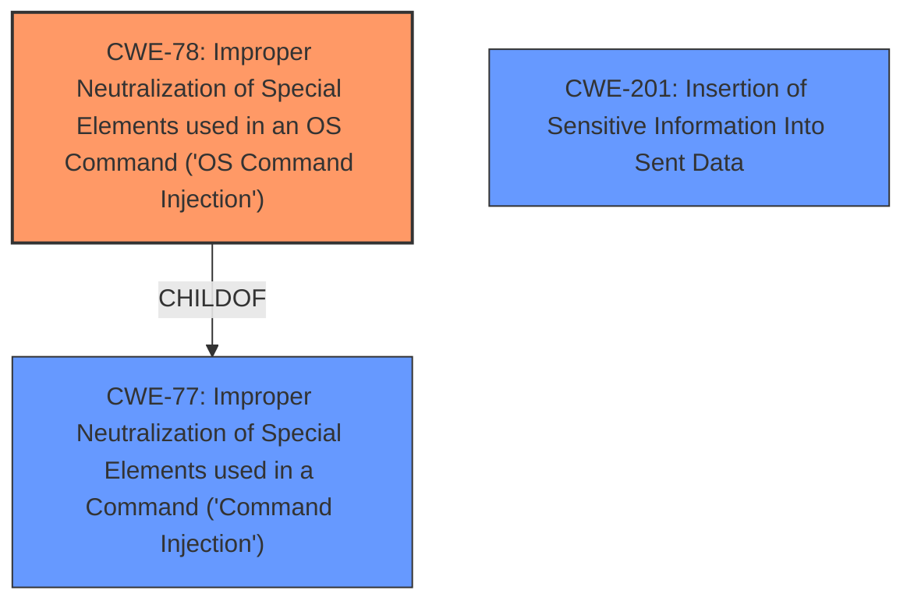

# Analysis Report for CVE-2024-38366

# Vulnerability Analysis Report: CVE-2024-38366

## Description

trunk.cocoapods.org is the authentication server for the CoacoaPods dependency manager. The part of trunk which verifies whether a user has a real email address on signup used a rfc-822 library which executes a shell command to validate the email domain MX records validity. It works via an DNS MX. This lookup could be manipulated to also execute a command on the trunk server, effectively giving root access to the server and the infrastructure. This issue was patched server-side with commit 001cc3a430e75a16307f5fd6cdff1363ad2f40f3 in September 2023. This RCE triggered a full user-session reset, as an attacker could have used this method to write to any Podspec in trunk.

## Vulnerability Description Key Phrases

- **Weakness:** command injection
- **Impact:** ['RCE', 'execute a command on the trunk server', 'write to any Podspec in trunk']
- **Vector:** DNS MX lookup manipulation
- **Product:** trunk.cocoapods.org
- **Component:** part of trunk which verifies email address on signup

## Analysis (with Relationship Data)

# Summary
| CWE ID | CWE Name | Confidence | CWE Abstraction Level | CWE Vulnerability Mapping Label | CWE-Vulnerability Mapping Notes |
|---|---|---|---|---|---|
| CWE-78 | Improper Neutralization of Special Elements used in an OS Command ('OS Command Injection') | 1.0 | Base | Allowed | Primary CWE: This is the root cause of the vulnerability, where user-controlled input is used to construct an OS command without proper sanitization. |
| CWE-77 | Improper Neutralization of Special Elements used in a Command ('Command Injection') | 0.7 | Class | Allowed-with-Review | Secondary Candidate: This is a broader class of command injection, which the OS Command Injection falls under. |
| CWE-201 | Insertion of Sensitive Information Into Sent Data | 0.4 | Base | Allowed | Secondary Candidate: The attacker could have used this method to write to any Podspec in trunk which could have included sensitive information. |

## Evidence and Confidence

*   **Confidence Score:** 0.9
*   **Evidence Strength:** HIGH

## Relationship Analysis
The primary CWE, CWE-78, is a base CWE which is a child of the class CWE-77. CWE-77 is a more general form of command injection. The exploit described allows an attacker to inject commands into the OS, making CWE-78 the most appropriate selection.
CWE-201 is added as a secondary concern because of the possible impact of writing to any Podspec in trunk, possibly inserting sensitive information.



## Vulnerability Chain
1.  The **weakness** is that the rfc-822 library executes a shell command to validate the email domain MX records validity using an OS command.
2.  The rfc-822 library's `host_mx` method executes an arbitrary OS command concatenating it with the user-provided email’s domain without proper validation, allowing for **command injection**.
3.  An attacker provides a malicious email address during the registration process, specifically crafting the domain part to include command injection sequences.
4.  This triggers the vulnerable `host` command execution through the `rfc-822` library.
5.  The impact is that an attacker could execute arbitrary shell commands on the trunk server, potentially gaining access to environment variables, the CocoaPods/Specs repo, and the trunk database, and write to any Podspec in trunk.

## Summary of Analysis
The analysis is based on the provided evidence. The **weakness** is the **command injection** vulnerability in the trunk.cocoapods.org authentication server. The server used a rfc-822 library that executes a shell command to validate email domain MX records. The library's `host_mx` method executes an arbitrary OS command, concatenating it with the user-provided email's domain without proper validation. This allowed for **command injection**, enabling an attacker to execute arbitrary shell commands on the trunk server.

The graph relationships influenced the final selection by showing that CWE-78 is a more specific instance of CWE-77. Given the specific nature of the vulnerability as an OS command injection, CWE-78 was chosen as the primary CWE.

The selected CWEs are at the optimal level of specificity. CWE-78 accurately represents the vulnerability as an OS command injection, while CWE-77 is a broader, less specific category. CWE-201 captures a potential impact of the vulnerability, where sensitive information could be inserted into sent data.

CWEs considered but not used:
*   CWE-77: Considered as a parent of CWE-78, but not used because CWE-78 is more specific.
*   CWE-95: Ruled out as the commands are not dynamically evaluated code.
*   CWE-88: Ruled out as the commands are not argument delimiters.
*   CWE-1336: Ruled out as the commands are not related to a template engine.
*   CWE-201: Considered as a secondary weakness, since the attacker could have used this method to write to any Podspec in trunk, possibly inserting sensitive information.
*   CWE-923: Ruled out as the vulnerability does not involve restriction of a communication channel.
*   CWE-1390: Ruled out as the vulnerability is not related to weak authentication.
*   CWE-359: Ruled out as the vulnerability is not primarily about exposure of private personal information.
*   CWE-184: Ruled out as the vulnerability is not related to an incomplete list of disallowed inputs.


## CWE Relationship Analysis

Current CWEs represent these abstraction levels: .


### Vulnerability Chain Analysis

**Chain starting from CWE-1390:**
- 1390 (Weak Authentication) - ROOT


**Chain starting from CWE-359:**
- 359 (Exposure of Private Personal Information to an Unauthorized Actor) - ROOT


### CWE Relationship Diagram

```mermaid
graph TD
    classDef primary fill:#f96,stroke:#333,stroke-width:2px
    classDef secondary fill:#69f,stroke:#333
    classDef tertiary fill:#9e9,stroke:#333
```


*Report generated on 2025-07-13 10:31:29*
