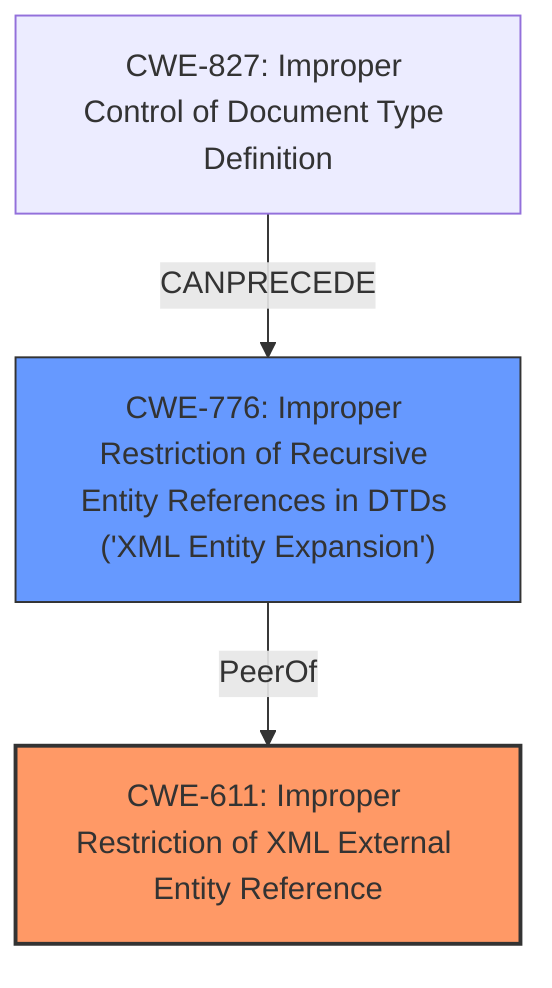

# Analysis for CVE-2024-38374

# Summary
| CWE ID | CWE Name | Confidence | CWE Abstraction Level | CWE Vulnerability Mapping Label | CWE-Vulnerability Mapping Notes |
|---|---|---|---|---|---|
| CWE-611 | Improper Restriction of XML External Entity Reference | 1.0 | Base | Allowed | Primary CWE: The **root cause** is the **improper configuration of DocumentBuilderFactory**, leading to an **XML External Entity (XXE)** vulnerability. |
| CWE-776 | Improper Restriction of Recursive Entity References in DTDs ('XML Entity Expansion') | 0.7 | Base | Allowed | Secondary Candidate: Although XXE is the primary issue, recursive entity references could be a related concern. |

## Evidence and Confidence

*   **Confidence Score:** 0.9
*   **Evidence Strength:** HIGH

## Relationship Analysis
The primary relationship influencing the decision is that CWE-611 is a Base level CWE, directly addressing the **XML External Entity (XXE)** vulnerability due to the **improper configuration of the DocumentBuilderFactory**. CWE-776, while related to XML vulnerabilities, is more specific to recursive entity references and less directly applicable to the described root cause. The hierarchical relationships support choosing the more direct and representative CWE-611.

## Vulnerability Chain
The vulnerability chain starts with the **improper configuration of the DocumentBuilderFactory**, leading directly to an **XML External Entity (XXE)** injection vulnerability, which could result in local file content exfiltration or Server Side Request Forgery (SSRF).

Improper Configuration of DocumentBuilderFactory -> **CWE-611: Improper Restriction of XML External Entity Reference** -> Local File Content Exfiltration / SSRF

## Summary of Analysis
The assessment is based on the provided evidence, specifically the vulnerability description and the CVE reference content summary. The evidence clearly indicates that the **root cause** of the vulnerability is the **insecure configuration of the DocumentBuilderFactory**, making it susceptible to **XML External Entity (XXE)** injection. The CVE reference explicitly states that the library was vulnerable to XXE injection because external DTDs and schemas were not disabled, which perfectly aligns with the description of CWE-611. The choice of CWE-611 is at the optimal level of specificity as it directly addresses the root cause weakness, as supported by both the vulnerability description and the CVE reference summary.

Relevant CWE Information:

# Enhanced Context (25 CWEs)
The following CWEs were identified as potentially relevant to this vulnerability:

## CWE-611: Improper Restriction of XML External Entity Reference
**Abstraction Level**: Base
**Similarity Score**: 0.80
**Source**: dense

**Description**:
The product processes an XML document that can contain XML entities with URIs that resolve to documents outside of the intended sphere of control, causing the product to embed incorrect documents into its output.

**Mapping Guidance**:
- Usage: Allowed
- Rationale: This CWE entry is at the Base level of abstraction, which is a preferred level of abstraction for mapping to the root causes of vulnerabilities.

## CWE-776: Improper Restriction of Recursive Entity References in DTDs ('XML Entity Expansion')
**Abstraction Level**: Base
**Similarity Score**: 0.73
**Source**: dense

**Description**:
The product uses XML documents and allows their structure to be defined with a Document Type Definition (DTD), but it does not properly control the number of recursive definitions of entities.

**Mapping Guidance**:
- Usage: Allowed
- Rationale: This CWE entry is at the Base level of abstraction, which is a preferred level of abstraction for mapping to the root causes of vulnerabilities.

## CWE-611: Improper Restriction of XML External Entity Reference
**Abstraction Level**: Base
**Similarity Score**: 1446.09
**Source**: sparse

**Description**:
The product processes an XML document that can contain XML entities with URIs that resolve to documents outside of the intended sphere of control, causing the product to embed incorrect documents into its output.

**Mapping Guidance**:
- Usage: Allowed
- Rationale: This CWE entry is at the Base level of abstraction, which is a preferred level of abstraction for mapping to the root causes of vulnerabilities.

## CWE-776: Improper Restriction of Recursive Entity References in DTDs ('XML Entity Expansion')
**Abstraction Level**: Base
**Similarity Score**: 1272.94
**Source**: sparse

**Description**:
The product uses XML documents and allows their structure to be defined with a Document Type Definition (DTD), but it does not properly control the number of recursive definitions of entities.

**Mapping Guidance**:
- Usage: Allowed
- Rationale: This CWE entry is at the Base level of abstraction, which is a preferred level of abstraction for mapping to the root causes of vulnerabilities.

The primary CWE is **CWE-611 (Improper Restriction of XML External Entity Reference)** because the `DocumentBuilderFactory` was not securely configured, leading to the possibility of resolving external entities. The CVE reference explicitly mentions that external DTDs and schemas were not disabled.

CWE-776 (Improper Restriction of Recursive Entity References in DTDs ('XML Entity Expansion')) was considered but not selected as the primary CWE because the vulnerability description focuses on the lack of restriction of external entities in general, rather than specifically recursive entities. While CWE-776 could be a related concern, CWE-611 more accurately represents the **root cause** of the vulnerability.