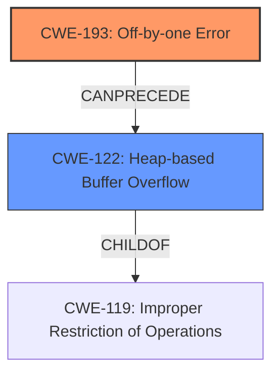

# Analysis Report for CVE-2024-38440

# Vulnerability Analysis Report: CVE-2024-38440

## Description

Netatalk before 3.2.1 has an **off-by-one error**, and resultant **heap-based buffer overflow** and segmentation violation, because of incorrectly using FPLoginExt in BN_bin2bn in etc/uams/uams_dhx_pam.c. The original issue 1097 report stated The latest version of Netatalk (v3.2.0) contains a security vulnerability. This vulnerability arises due to a **lack of validation** for the length field after parsing user-provided data, leading to an out-of-bounds heap write of one byte (\0). Under specific configurations, this can result in reading metadata of the next heap block, potentially causing a Denial of Service (DoS) under certain heap layouts or with ASAN enabled. ... The vulnerability is located in the FPLoginExt operation of Netatalk, in the BN_bin2bn function found in /etc/uams/uams_dhx_pam.c ... if (!(bn = BN_bin2bn((unsigned char *)ibuf, KEYSIZE, NULL))) ... threads ... [#0] Id 1, Name afpd, stopped 0x7ffff4304e58 in ?? (), reason SIGSEGV ... [#0] 0x7ffff4304e58 mov BYTE PTR [r14+0x8], 0x0 ... mov rdx, QWORD PTR [rsp+0x18] ... afp_login_ext(obj=, ibuf=0x62d000010424 , ibuflen=0xffffffffffff0015, rbuf=, rbuflen=) ... afp_over_dsi(obj=0x5555556154c0 ). 2.4.1 and 3.1.19 are also fixed versions.

## Vulnerability Description Key Phrases

- **Rootcause:** ['lack of validation', 'off-by-one error']
- **Weakness:** heap-based buffer overflow
- **Impact:** ['Denial of Service', 'segmentation violation']
- **Product:** Netatalk
- **Version:** before 3.2.1
- **Component:** BN_bin2bn in etc/uams/uams_dhx_pam.c

## Analysis (with Relationship Data)

# Summary

| CWE ID  | CWE Name                                                     | Confidence | CWE Abstraction Level | CWE Vulnerability Mapping Label | CWE-Vulnerability Mapping Notes |
| :-------- | :----------------------------------------------------------- | :--------- | :-------------------- | :------------------------------ | :------------------------------ |
| CWE-193   | Off-by-one Error                                             | 0.95       | Base                  | Primary                         | Allowed                         |
| CWE-122   | Heap-based Buffer Overflow                                   | 0.95       | Base                  | Secondary                       | Allowed                         |

## Evidence and Confidence

*   **Confidence Score:** 0.95
*   **Evidence Strength:** HIGH

## Relationship Analysis

The primary relationship that impacted the decision was the "CanPrecede" relationship. CWE-193 **Off-by-one Error** can precede CWE-122 **Heap-based Buffer Overflow**. The vulnerability description explicitly states an **off-by-one error** that leads to a **heap-based buffer overflow**, making this relationship highly relevant. The abstraction levels were also considered, with both selected CWEs being at the Base level, which is preferred.



## Vulnerability Chain

The vulnerability chain starts with **CWE-193 Off-by-one Error**, which then leads to **CWE-122 Heap-based Buffer Overflow**, and finally results in a Denial of Service (DoS) and segmentation violation.

*   **CWE-193 Off-by-one Error**: Root cause due to incorrect calculation.
*   **CWE-122 Heap-based Buffer Overflow**: Result of the **off-by-one error**, leading to memory corruption.
*   Denial of Service and segmentation violation: Impact of the buffer overflow.

## Summary of Analysis

The initial analysis focused on identifying the root cause and the resulting weaknesses based on the provided description. The vulnerability description clearly indicates an **off-by-one error** leading to a **heap-based buffer overflow**.

The selection of CWE-193 and CWE-122 is strongly supported by the evidence in the vulnerability description: "Netatalk before 3.2.1 has an **off-by-one error**, and resultant **heap-based buffer overflow**...". This direct quote highlights the relationship between the two weaknesses. The retriever results also showed high scores for both CWEs in relation to the keyphrases "off-by-one error" and "heap-based buffer overflow".

The selected CWEs are at the optimal level of specificity because they accurately represent the specific types of errors present in the vulnerability. CWE-193 describes the nature of the calculation error, and CWE-122 describes the specific type of buffer overflow that occurs.

Relevant CWE Information:

# Enhanced Context (25 CWEs)
The following CWEs were identified as potentially relevant to this vulnerability:

## CWE-131: Incorrect Calculation of Buffer Size
**Abstraction Level**: Base
**Similarity Score**: 0.75
**Source**: dense

**Description**:
The product does not correctly calculate the size to be used when allocating a buffer, which could lead to a buffer overflow.

**Mapping Guidance**:
- Usage: Allowed
- Rationale: This CWE entry is at the Base level of abstraction, which is a preferred level of abstraction for mapping to the root causes of vulnerabilities.

## CWE-129: Improper Validation of Array Index
**Abstraction Level**: Variant
**Similarity Score**: 0.74
**Source**: dense

**Description**:
The product uses untrusted input when calculating or using an array index, but the product does not validate or incorrectly validates the index to ensure the index references a valid position within the array.

**Mapping Guidance**:
- Usage: Allowed
- Rationale: This CWE entry is at the Variant level of abstraction, which is a preferred level of abstraction for mapping to the root causes of vulnerabilities.

## CWE-703: Improper Check or Handling of Exceptional Conditions
**Abstraction Level**: Pillar
**Similarity Score**: 0.74
**Source**: dense

**Description**:
The product does not properly anticipate or handle exceptional conditions that rarely occur during normal operation of the product.

**Mapping Guidance**:
- Usage: Discouraged
- Rationale: This CWE entry is extremely high-level, a Pillar.

## CWE-193: Off-by-one Error
**Abstraction Level**: Base
**Similarity Score**: 0.74
**Source**: dense

**Description**:
A product calculates or uses an incorrect maximum or minimum value that is 1 more, or 1 less, than the correct value.

**Mapping Guidance**:
- Usage: Allowed
- Rationale: This CWE entry is at the Base level of abstraction, which is a preferred level of abstraction for mapping to the root causes of vulnerabilities.

## CWE-754: Improper Check for Unusual or Exceptional Conditions
**Abstraction Level**: Class
**Similarity Score**: 0.73
**Source**: dense

**Description**:
The product does not check or incorrectly checks for unusual or exceptional conditions that are not expected to occur frequently during day to day operation of the product.

**Mapping Guidance**:
- Usage: Allowed-with-Review
- Rationale: This CWE entry is a Class and might have Base-level children that would be more appropriate

## CWE-824: Access of Uninitialized Pointer
**Abstraction Level**: Base
**Similarity Score**: 0.73
**Source**: dense

**Description**:
The product accesses or uses a pointer that has not been initialized.

**Mapping Guidance**:
- Usage: Allowed
- Rationale: This CWE entry is at the Base level of abstraction, which is a preferred level of abstraction for mapping to the root causes of vulnerabilities.

## CWE-667: Improper Locking
**Abstraction Level**: Class
**Similarity Score**: 0.73
**Source**: dense

**Description**:
The product does not properly acquire or release a lock on a resource, leading to unexpected resource state changes and behaviors.

**Mapping Guidance**:
- Usage: Allowed-with-Review
- Rationale: This CWE entry is a Class and might have Base-level children that would be more appropriate

## CWE-755: Improper Handling of Exceptional Conditions
**Abstraction Level**: Class
**Similarity Score**: 0.73
**Source**: dense

**Description**:
The product does not handle or incorrectly handles an exceptional condition.

**Mapping Guidance**:
- Usage: Discouraged
- Rationale: This CWE entry is a level-1 Class (i.e., a child of a Pillar). It might have lower-level children that would be more appropriate

## CWE-617: Reachable Assertion
**Abstraction Level**: Base
**Similarity Score**: 0.73
**Source**: dense

**Description**:
The product contains an assert() or similar statement that can be triggered by an attacker, which leads to an application exit or other behavior that is more severe than necessary.

**Mapping Guidance**:
- Usage: Allowed
- Rationale: This CWE entry is at the Base level of abstraction, which is a preferred level of abstraction for mapping to the root causes of vulnerabilities.

## CWE-252: Unchecked Return Value
**Abstraction Level**: Base
**Similarity Score**: 0.73
**Source**: dense

**Description**:
The product does not check the return value from a method or function, which can prevent it from detecting unexpected states and conditions.

**Mapping Guidance**:
- Usage: Allowed
- Rationale: This CWE entry is at the Base level of abstraction, which is a preferred level of abstraction for mapping to the root causes of vulnerabilities.

## CWE-190: Integer Overflow or Wraparound
**Abstraction Level**: Base
**Similarity Score**: 4162.96
**Source**: sparse

**Description**:
The product performs a calculation that can
         produce an integer overflow or wraparound when the logic
         assumes that the resulting value will always be larger than
         the original value. This occurs when an integer value is
         incremented to a value that is too large to store in the
         associated representation. When this occurs, the value may
         become a very small or negative number.

**Mapping Guidance**:
- Usage: Allowed
- Rationale: This CWE entry is at the Base level of abstraction, which is a preferred level of abstraction for mapping to the root causes of vulnerabilities.

## CWE-1284: Improper Validation of Specified Quantity in Input
**Abstraction Level**: Base
**Similarity Score**: 3981.93
**Source**: sparse

**Description**:


## CWE Relationship Analysis

Current CWEs represent these abstraction levels: .


### Vulnerability Chain Analysis

**Chain starting from CWE-617:**
- 617 (Reachable Assertion) - ROOT


**Chain starting from CWE-1284:**
- 1284 (Improper Validation of Specified Quantity in Input) - ROOT


### CWE Relationship Diagram

```mermaid
graph TD
    classDef primary fill:#f96,stroke:#333,stroke-width:2px
    classDef secondary fill:#69f,stroke:#333
    classDef tertiary fill:#9e9,stroke:#333
```


*Report generated on 2025-07-13 10:36:27*
