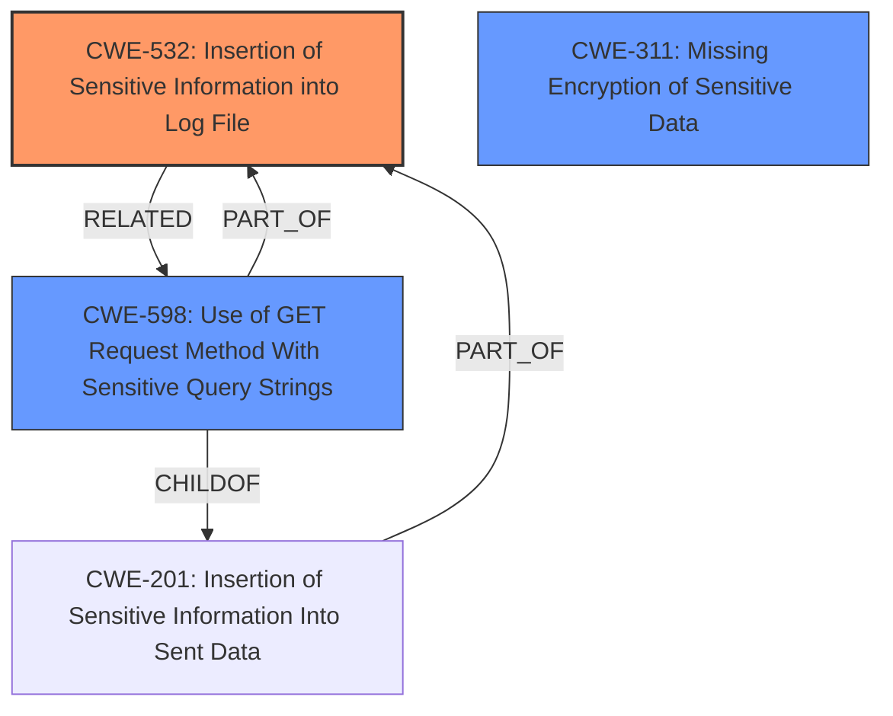

# Analysis for CVE-2024-38460

# Summary
| CWE ID | CWE Name | Confidence | CWE Abstraction Level | CWE Vulnerability Mapping Label | CWE-Vulnerability Mapping Notes |
|---|---|---|---|---|---|
| CWE-532 | Insertion of Sensitive Information into Log File | 1.0 | Base | Allowed | Primary CWE. The vulnerability results from logging sensitive information. |
| CWE-598 | Use of GET Request Method With Sensitive Query Strings | 0.8 | Variant | Allowed | Secondary CWE. Using GET requests exposes the sensitive information through query strings. |
| CWE-311 | Missing Encryption of Sensitive Data | 0.7 | Class | Discouraged | Secondary CWE. Data intended to be encrypted is exposed in plain text due to improper handling, which can be seen as a failure to encrypt it effectively, though encryption was attempted. |

## Evidence and Confidence

*   **Confidence Score:** 0.9
*   **Evidence Strength:** HIGH

## Relationship Analysis
The primary CWE is CWE-532 (Insertion of Sensitive Information into Log File), which directly addresses the logging of sensitive data. CWE-598 (Use of GET Request Method With Sensitive Query Strings) is a variant that explains how the sensitive data gets into the logs, that is using GET requests exposes the data in the URL. CWE-311 (Missing Encryption of Sensitive Data) is a class-level CWE that describes the high-level issue of failing to encrypt sensitive data, although the attempt was there, which led to the exposure. The hierarchical relationship informed the selection, favoring the more specific Base level CWE-532.

## Vulnerability Chain
1.  The application uses a GET request to send data for encryption via the `/encrypt` API endpoint.
2.  This results in the sensitive data being included in the URL query string (**CWE-598: Use of GET Request Method With Sensitive Query Strings**).
3.  The web server logs the URL, including the sensitive data (**CWE-532: Insertion of Sensitive Information into Log File**).
4.  The **impact** is that sensitive data intended for encryption is exposed in plain text, which can be seen as a failure to encrypt it effectively (**CWE-311: Missing Encryption of Sensitive Data**).

## Summary of Analysis
The vulnerability is primarily due to the logging of sensitive information. The evidence clearly indicates that encrypted values are exposed in cleartext within the logs due to their presence in the URL parameters. This aligns directly with CWE-532 (Insertion of Sensitive Information into Log File). The use of GET requests (CWE-598) exacerbates the issue by placing the sensitive data in the URL. The attempt to encrypt the data was **insufficient**, leading to the exposure (**impact**).

The retriever results correctly identified CWE-532 as the top candidate. While other CWEs like CWE-312 (Cleartext Storage of Sensitive Information) and CWE-256 (Plaintext Storage of a Password) were considered, they were less relevant because the data was not stored in cleartext, but rather exposed in logs during transmission. The selection of CWE-532 is at the optimal level of specificity, as it accurately describes the core issue of sensitive data being logged.

Relevant CWE Information:

**CWE-532: Insertion of Sensitive Information into Log File**
The product writes sensitive information to a log file.

**CWE-598: Use of GET Request Method With Sensitive Query Strings**
The product uses the GET request method to transmit sensitive information as part of a query string. This can expose the information to an unauthorized actor.

**CWE-311: Missing Encryption of Sensitive Data**
The product does not encrypt sensitive or critical information before storage or transmission.

The selection of these CWEs is based on the evidence that the application logs sensitive information in URLs due to the use of GET requests. This leads to the **impact** that the data, intended to be encrypted, is exposed in plain text.