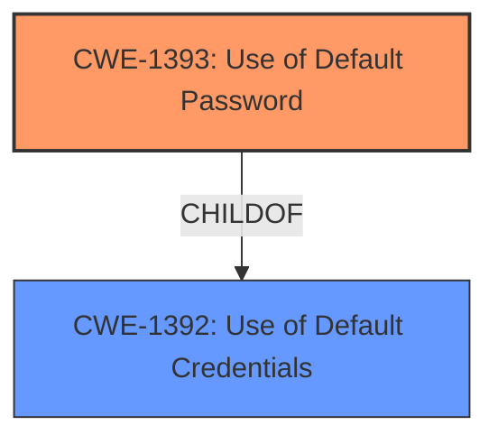

# Analysis for CVE-2024-38466

# Summary
| CWE ID | CWE Name | Confidence | CWE Abstraction Level | CWE Vulnerability Mapping Label | CWE-Vulnerability Mapping Notes |
|---|---|---|---|---|---|
| CWE-1393 | Use of Default Password | 1.0 | Base | Allowed | Primary CWE |

## Evidence and Confidence

*   **Confidence Score:** 1.0
*   **Evidence Strength:** HIGH

## Relationship Analysis
The primary CWE selected is CWE-1393, which is a Base level CWE. There are no direct parent or child relationships that significantly influence the selection in this case, as the description directly matches the Base CWE. The other CWEs considered were either too general (Class level) or didn't directly address the specific issue of a **default password**.

## Vulnerability Chain
The vulnerability chain is simple: the root cause is the use of a **default password** (CWE-1393), which can lead to unauthorized access and compromise of the Shenzhen Guoxin Synthesis image system.

## Summary of Analysis
The vulnerability description clearly states the presence of a **default password**. This directly corresponds to CWE-1393, which is "Use of Default Password". The evidence is strong, as the description explicitly mentions the **default password** "123456Qw". The retriever results also list CWE-1393 as a potential candidate.

Relevant CWE Information:

# Enhanced Context (25 CWEs)
The following CWEs were identified as potentially relevant to this vulnerability:

## CWE-1393: Use of Default Password
**Abstraction Level**: Base
**Similarity Score**: 0.77
**Source**: dense

**Description**:
The product uses default passwords for potentially critical functionality.

**Mapping Guidance**:
- Usage: Allowed
- Rationale: This CWE entry is at the Base level of abstraction, which is a preferred level of abstraction for mapping to the root causes of vulnerabilities.

Based on the provided vulnerability description, the primary weakness is the presence of a **default password**. This aligns directly with CWE-1393 "Use of Default Password".

Other CWEs Considered but Not Used:

*   CWE-259 (Use of Hard-coded Password): While related, this is more specific to hard-coded passwords rather than **default passwords** that are intended to be changed (but often aren't).
*   CWE-798 (Use of Hard-coded Credentials): Similar to CWE-259, this is about hard-coded credentials, not necessarily **default** ones.
*   CWE-1392 (Use of Default Credentials): This is a broader category that includes passwords and cryptographic keys. CWE-1393 is more specific to passwords, making it a better fit.
*   CWE-1188 (Initialization of a Resource with an Insecure Default): This CWE is too broad. While using a **default password** can be seen as initializing a resource with an insecure default, CWE-1393 is more precise.
*   CWE-306 (Missing Authentication for Critical Function): This could be a consequence of using a **default password**, but the root cause is the **default password** itself.
*   CWE-620 (Unverified Password Change): Not relevant because the issue is with the **default password**, not the password change process.
*   CWE-916 (Use of Password Hash With Insufficient Computational Effort): This is about the strength of the password hash, not the use of a **default password**.
*   CWE-330 (Use of Insufficiently Random Values): This is about the randomness of generated values, not the use of a **default password**.
*   CWE-340 (Generation of Predictable Numbers or Identifiers): This is about predictable numbers/identifiers, not the use of a **default password**.
*   CWE-923 (Improper Restriction of Communication Channel to Intended Endpoints): This is not related to the **default password** issue.
*   CWE-321 (Use of Hard-coded Cryptographic Key): This is about cryptographic keys, not passwords.
*   CWE-472 (External Control of Assumed-Immutable Web Parameter): Not related to the **default password** issue.
*   CWE-350 (Reliance on Reverse DNS Resolution for a Security-Critical Action): Not related to the **default password** issue.
*   CWE-384 (Session Fixation): Not related to the **default password** issue.