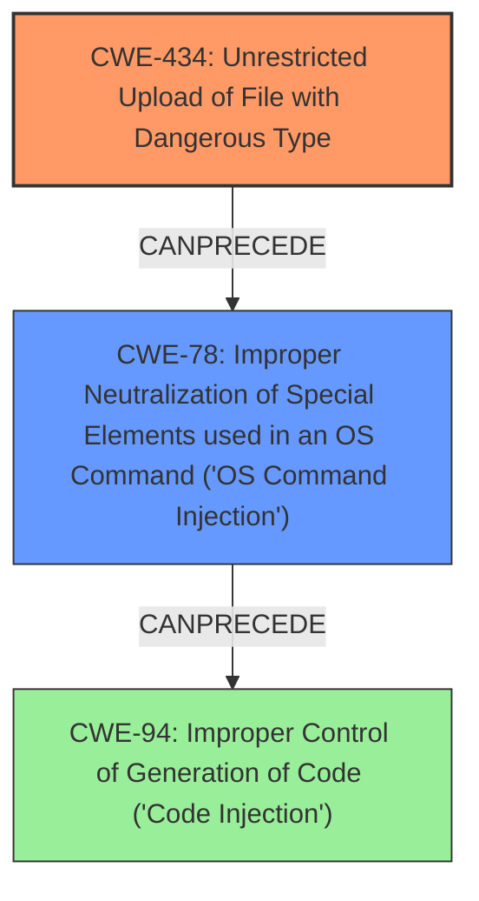

# Raw Analyzer Response for CVE-2024-38492

# Summary

| CWE ID | CWE Name | Confidence | CWE Abstraction Level | CWE Vulnerability Mapping Label | CWE-Vulnerability Mapping Notes |
|---|---|---|---|---|---|
| CWE-434 | Unrestricted Upload of File with Dangerous Type | 0.8 | Base | Allowed | Primary CWE |
| CWE-78 | Improper Neutralization of Special Elements used in an OS Command ('OS Command Injection') | 0.6 | Base | Allowed | Secondary Candidate |

## Evidence and Confidence

*   **Confidence Score:** 0.7
*   **Evidence Strength:** LOW

## Relationship Analysis
The primary relationship that influenced my decision was the chain relationship where an unrestricted file upload (CWE-434) can lead to OS command injection (CWE-78).
CWE-434 allows an attacker to upload a malicious file. If this file is then processed without proper sanitization, it can lead to the execution of arbitrary OS commands.
The abstraction levels were considered to ensure that the selected CWEs were at the base level, which is preferred for root cause analysis.

## Vulnerability Chain
The vulnerability chain starts with the **unrestricted upload of a file** (CWE-434). If the system **fails to properly validate or sanitize this uploaded file**, it can lead to **OS command injection** (CWE-78), allowing the attacker to execute arbitrary commands on the system.

## Summary of Analysis
Based on the provided vulnerability description, the primary weakness is the **ability to upload a specially crafted PAM upgrade file** that leads to remote command execution. I am rating this with a confidence of 0.7, due to limited evidence.
The description states that an unauthenticated attacker can upload this file. This strongly suggests an **Unrestricted Upload of File with Dangerous Type (CWE-434)**. The subsequent remote command execution indicates that the uploaded file, once processed, leads to **Improper Neutralization of Special Elements used in an OS Command ('OS Command Injection') (CWE-78)**.
The graph relationships, especially the CANPRECEDE relationship between CWE-434 and CWE-78, support this conclusion.
CWE-434 is at the optimal level of specificity as it directly describes the **root cause** of the vulnerability.

The following CWEs were considered but not used:

*   CWE-502 (Deserialization of Untrusted Data): While deserialization issues can lead to remote code execution, the description specifically mentions uploading a file, making CWE-434 a more direct fit.
*   CWE-787 (Out-of-bounds Write): This is a memory corruption issue, and while it could potentially lead to remote code execution, the description doesn't provide enough information to support this.
*   CWE-138 (Improper Neutralization of Special Elements): This is a high-level class, and more specific CWEs like CWE-78 are more appropriate.
*   CWE-287 (Improper Authentication): The description mentions an unauthenticated attacker, but the primary issue isn't the lack of authentication but rather the dangerous file upload, making CWE-434 the more appropriate primary CWE.
*   CWE-89 (Improper Neutralization of Special Elements used in an SQL Command ('SQL Injection')): This is specific to SQL injection, which isn't mentioned in the vulnerability description.
*   CWE-306 (Missing Authentication for Critical Function): Similar to CWE-287, while the attacker is unauthenticated, the core issue is the file upload, not the missing authentication.
*   CWE-250 (Execution with Unnecessary Privileges): This is a more general issue and not as directly relevant as CWE-434 and CWE-78.
*   CWE-184 (Incomplete List of Disallowed Inputs): This is a more general case and CWE-434 is a better fit.