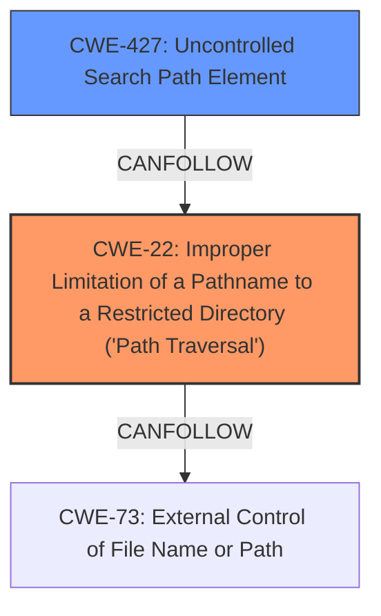

# Analysis Report for CVE-2024-38519

# Vulnerability Analysis Report: CVE-2024-38519

## Description

`yt-dlp` and `youtube-dl` are command-line audio/video downloaders. Prior to the fixed versions, `yt-dlp` and `youtube-dl` **do not limit the extensions of downloaded files**, which could lead to arbitrary filenames being created in the download folder (and **path traversal** on Windows). Since `yt-dlp` and `youtube-dl` also read config from the working directory (and on Windows executables will be executed from the `yt-dlp` or `youtube-dl` directory), this could lead to arbitrary code being executed. `yt-dlp` version 2024.07.01 fixes this issue by whitelisting the allowed extensions. `youtube-dl` fixes this issue in commit `d42a222` on the `master` branch and in nightly builds tagged 2024-07-03 or later. This might mean some very uncommon extensions might not get downloaded, however it will also limit the possible exploitation surface. In addition to upgrading, have `.%(ext)s` at the end of the output template and make sure the user trusts the websites that they are downloading from. Also, make sure to never download to a directory within PATH or other sensitive locations like ones user directory, `system32`, or other binaries locations. For users who are not able to upgrade, keep the default output template (`-o %(title)s [%(id)s].%(ext)s`) make sure the extension of the media to download is a common video/audio/sub/... one try to avoid the generic extractor and/or use `--ignore-config --config-location ...` to not load config from common locations.

## Vulnerability Description Key Phrases

- **Rootcause:** do not limit the extensions of downloaded files
- **Weakness:** path traversal
- **Impact:** arbitrary code execution
- **Vector:** arbitrary filenames being created
- **Product:** ['yt-dlp', 'youtube-dl']

## Analysis (with Relationship Data)

# Summary

| CWE ID | CWE Name | Confidence | CWE Abstraction Level | CWE Vulnerability Mapping Label | CWE-Vulnerability Mapping Notes |
|---|---|---|---|---|---|
| CWE-22 | Improper Limitation of a Pathname to a Restricted Directory ('Path Traversal') | 1.0 | Base | Allowed | Primary CWE. The vulnerability allows writing files outside of the intended directory due to **improper limitation of pathname**. |
| CWE-427 | Uncontrolled Search Path Element | 0.7 | Base | Allowed | Secondary CWE. The vulnerability allows code execution by writing files in the program's working directory because of an **uncontrolled search path**. |

## Evidence and Confidence

*   **Confidence Score:** 0.9
*   **Evidence Strength:** HIGH

## Relationship Analysis
The primary CWE is CWE-22, which describes the path traversal vulnerability. CWE-427 is a secondary issue where the program reads configuration from the working directory, allowing for code execution.



## Vulnerability Chain
1.  **Root Cause:** **yt-dlp and youtube-dl do not limit the extensions of downloaded files**.
2.  **Weakness:** **Path traversal** due to the lack of extension validation.
3.  **Impact:** Arbitrary code execution by writing executable files in the program's working directory or by crafting configuration files.

## Summary of Analysis
The analysis is based on the provided vulnerability description and the CVE reference. The key issue is the **lack of validation** of file extensions, leading to path traversal and potential code execution.

The selection of CWE-22 is based on the vulnerability description stating that the application creates arbitrary filenames in the download folder leading to **path traversal**. The CVE Reference Links Content Summary confirms this, stating that "path separators within the file extension could be used to create files outside the intended download directory."

CWE-427 is included because the application reads configuration from the working directory, allowing code execution by writing files in this directory.

The retriever results support the selection of CWE-22. Other CWEs were considered but deemed less relevant. For example, CWE-59 and CWE-61 relate to symlink issues, which are not the primary concern here.
CWE-73 (External Control of File Name or Path) was not selected because the core issue is not merely external control, but specifically the lack of proper sanitization leading to path traversal.
# Enhanced Context (25 CWEs)
The following CWEs were identified as potentially relevant to this vulnerability:

## CWE-59: Improper Link Resolution Before File Access ('Link Following')
**Abstraction Level**: Base
**Similarity Score**: 0.77
**Source**: dense

**Description**:
The product attempts to access a file based on the filename, but it does not properly prevent that filename from identifying a link or shortcut that resolves to an unintended resource.

**Mapping Guidance**:
- Usage: Allowed
- Rationale: This CWE entry is at the Base level of abstraction, which is a preferred level of abstraction for mapping to the root causes of vulnerabilities.


## CWE-427: Uncontrolled Search Path Element
**Abstraction Level**: Base
**Similarity Score**: 0.77
**Source**: dense

**Description**:
The product uses a fixed or controlled search path to find resources, but one or more locations in that path can be under the control of unintended actors.

**Mapping Guidance**:
- Usage: Allowed
- Rationale: This CWE entry is at the Base level of abstraction, which is a preferred level of abstraction for mapping to the root causes of vulnerabilities.


## CWE-61: UNIX Symbolic Link (Symlink) Following
**Abstraction Level**: Compound
**Similarity Score**: 0.76
**Source**: dense

**Description**:
The product, when opening a file or directory, does not sufficiently account for when the file is a symbolic link that resolves to a target outside of the intended control sphere. This could allow an attacker to cause the product to operate on unauthorized files.

**Mapping Guidance**:
- Usage: Allowed
- Rationale: This is a well-known Composite of multiple weaknesses that must all occur simultaneously, although it is attack-oriented in nature.


## CWE-116: Improper Encoding or Escaping of Output
**Abstraction Level**: Class
**Similarity Score**: 0.75
**Source**: dense

**Description**:
The product prepares a structured message for communication with another component, but encoding or escaping of the data is either missing or done incorrectly. As a result, the intended structure of the message is not preserved.

**Mapping Guidance**:
- Usage: Allowed-with-Review
- Rationale: This CWE entry is a Class and might have Base-level children that would be more appropriate


## CWE-451: User Interface (UI) Misrepresentation of Critical Information
**Abstraction Level**: Class
**Similarity Score**: 0.75
**Source**: dense

**Description**:
The user interface (UI) does not properly represent critical information to the user, allowing the information - or its source - to be obscured or spoofed. This is often a component in phishing attacks.

**Mapping Guidance**:
- Usage: Allowed-with-Review
- Rationale: This CWE entry is a Class and might have Base-level children that would be more appropriate


## CWE-23: Relative Path Traversal
**Abstraction Level**: Base
**Similarity Score**: 0.75
**Source**: dense

**Description**:
The product uses external input to construct a pathname that should be within a restricted directory, but it does not properly neutralize sequences such as ".." that can resolve to a location that is outside of that directory.

**Mapping Guidance**:
- Usage: Allowed
- Rationale: This CWE entry is at the Base level of abstraction, which is a preferred level of abstraction for mapping to the root causes of vulnerabilities.


## CWE-346: Origin Validation Error
**Abstraction Level**: Class
**Similarity Score**: 0.75
**Source**: dense

**Description**:
The product does not properly verify that the source of data or communication is valid.

**Mapping Guidance**:
- Usage: Allowed-with-Review
- Rationale: This CWE entry is a Class and might have Base-level children that would be more appropriate


## CWE-923: Improper Restriction of Communication Channel to Intended Endpoints
**Abstraction Level**: Class
**Similarity Score**: 0.74
**Source**: dense

**Description**:
The product establishes a communication channel to (or from) an endpoint for privileged or protected operations, but it does not properly ensure that it is communicating with the correct endpoint.

**Mapping Guidance**:
- Usage: Allowed-with-Review
- Rationale: This CWE entry is a Class and might have Base-level children that would be more appropriate


## CWE-73: External Control of File Name or Path
**Abstraction Level**: Base
**Similarity Score**: 0.74
**Source**: dense

**Description**:
The product allows user input to control or influence paths or file names that are used in filesystem operations.

**Mapping Guidance**:
- Usage: Allowed
- Rationale: This CWE entry is at the Base level of abstraction, which is a preferred level of abstraction for mapping to the root causes of vulnerabilities.


## CWE-184: Incomplete List of Disallowed Inputs
**Abstraction Level**: Base
**Similarity Score**: 0.74
**Source**: dense

**Description**:
The product implements a protection mechanism that relies on a list of inputs (or properties of inputs) that are not allowed by policy or otherwise require other action to neutralize before additional processing takes place, but the list is incomplete.

**Mapping Guidance**:
- Usage: Allowed
- Rationale: This CWE entry is at the Base level of abstraction, which is a preferred level of abstraction for mapping to the root causes of vulnerabilities.


## CWE-59: Improper Link Resolution Before File Access ('Link Following')
**Abstraction Level**: Base
**Similarity Score**: 1712.20
**Source**: sparse

**Description**:
The product attempts to access a file based on the filename, but it does not properly prevent that filename from identifying a link or shortcut that resolves to an unintended resource.

**Mapping Guidance**:
- Usage: Allowed
- Rationale: This CWE entry is at the Base level of abstraction, which is a preferred level of abstraction for mapping to the root causes of vulnerabilities.


## CWE-22: Improper Limitation of a Pathname to a Restricted Directory ('Path Traversal')
**Abstraction Level**: Base
**Similarity Score**: 1697.52
**Source**: sparse

**Description**:
The


## CWE Relationship Analysis

Current CWEs represent these abstraction levels: .


### Vulnerability Chain Analysis

**Chain starting from CWE-427:**
- 427 (Uncontrolled Search Path Element) - ROOT


**Chain starting from CWE-116:**
- 116 (Improper Encoding or Escaping of Output) - ROOT


### CWE Relationship Diagram

```mermaid
graph TD
    classDef primary fill:#f96,stroke:#333,stroke-width:2px
    classDef secondary fill:#69f,stroke:#333
    classDef tertiary fill:#9e9,stroke:#333
```


*Report generated on 2025-07-13 10:40:40*
