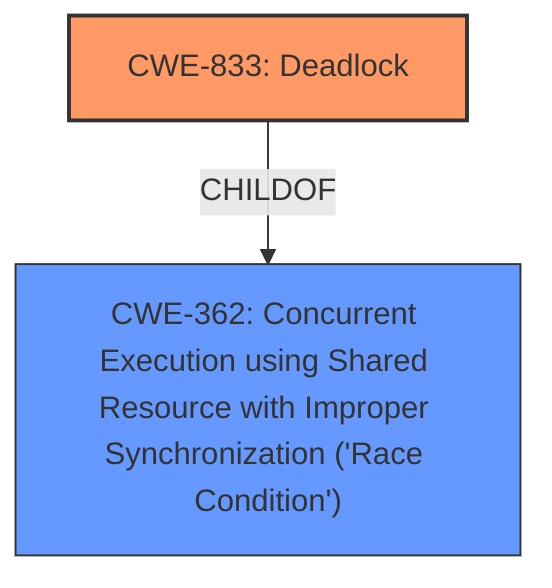

# Analysis Report for CVE-2024-38582

# Vulnerability Analysis Report: CVE-2024-38582

## Description

In the Linux kernel, the following vulnerability has been resolved nilfs2 fix **potential hang in nilfs_detach_log_writer**() Syzbot has reported a **potential hang in nilfs_detach_log_writer**() called during nilfs2 unmount. Analysis revealed that this is because nilfs_segctor_sync(), which synchronizes with the log writer thread, can be called after nilfs_segctor_destroy() terminates that thread, as shown in the call trace below nilfs_detach_log_writer nilfs_segctor_destroy nilfs_segctor_kill_thread --> Shut down log writer thread flush_work nilfs_iput_work_func nilfs_dispose_list iput nilfs_evict_inode nilfs_transaction_commit nilfs_construct_segment (if inode needs sync) nilfs_segctor_sync --> Attempt to synchronize with log writer thread *** DEADLOCK *** Fix this issue by changing nilfs_segctor_sync() so that the log writer thread returns normally without synchronizing after it terminates, and by forcing tasks that are already waiting to complete once after the thread terminates. The skipped inode metadata flushout will then be processed together in the subsequent cleanup work in nilfs_segctor_destroy().

## Vulnerability Description Key Phrases

- **Weakness:** potential hang in nilfs_detach_log_writer
- **Impact:** ['deadlock', 'hang']
- **Product:** Linux kernel
- **Component:** nilfs2

## Analysis (with Relationship Data)

# Summary
| CWE ID | CWE Name | Confidence | CWE Abstraction Level | CWE Vulnerability Mapping Label | CWE-Vulnerability Mapping Notes |
|---|---|---|---|---|---|
| CWE-833 | Deadlock | 1.0 | Base | Primary | Allowed |
| CWE-362 | Concurrent Execution using Shared Resource with Improper Synchronization ('Race Condition') | 0.8 | Class | Secondary | Allowed-with-Review |

## Evidence and Confidence

*   **Confidence Score:** 0.9
*   **Evidence Strength:** HIGH

## Relationship Analysis
The primary relationship influencing the CWE selection is that CWE-833 (Deadlock) is a specific type of concurrency issue. CWE-362 (Race Condition) represents the broader class of concurrent execution problems, but CWE-833 more precisely describes the **resulting deadlock**. Therefore, CWE-833 is chosen as the primary CWE due to its higher specificity and the evidence directly pointing to a deadlock scenario.



## Vulnerability Chain
The vulnerability chain starts with a **race condition** (CWE-362) where `nilfs_segctor_sync()` is called after `nilfs_segctor_destroy()` terminates the log writer thread. This leads to the primary vulnerability, which is a **deadlock** (CWE-833), because the synchronizing thread waits indefinitely for a terminated thread.

## Summary of Analysis
The initial analysis focused on identifying the root cause of the vulnerability described in the Linux kernel. The description clearly states a **potential hang in nilfs_detach_log_writer**(), ultimately leading to a **deadlock**. The CVE Reference Links Content Summary reinforces this by highlighting the race condition between thread termination and synchronization attempts, resulting in a system hang.

The retriever results suggested CWE-667 (Improper Locking), CWE-833 (Deadlock), and CWE-362 (Race Condition) as potential candidates. While CWE-667 and CWE-362 describe the conditions leading to the issue, CWE-833 directly represents the observed outcome, which is a deadlock.

The relationship graph emphasizes that CWE-833 is a specific type of concurrency issue (child of CWE-362), justifying its selection as the primary CWE due to its higher specificity. The evidence strongly supports this classification. The provided patches are specifically designed to avoid the deadlock scenario, further validating this choice.

The selected CWEs are at the optimal level of specificity, with CWE-833 representing the precise vulnerability and CWE-362 capturing the broader context of concurrent execution issues that contribute to the deadlock.

Relevant CWE Information:

# Enhanced Context (25 CWEs)
The following CWEs were identified as potentially relevant to this vulnerability:

## CWE-667: Improper Locking
**Abstraction Level**: Class
**Similarity Score**: 0.76
**Source**: dense

**Description**:
The product does not properly acquire or release a lock on a resource, leading to unexpected resource state changes and behaviors.

**Mapping Guidance**:
- Usage: Allowed-with-Review
- Rationale: This CWE entry is a Class and might have Base-level children that would be more appropriate

## CWE-833: Deadlock
**Abstraction Level**: Base
**Similarity Score**: 0.76
**Source**: dense

**Description**:
The product contains multiple threads or executable segments that are waiting for each other to release a necessary lock, resulting in deadlock.

**Mapping Guidance**:
- Usage: Allowed
- Rationale: This CWE entry is at the Base level of abstraction, which is a preferred level of abstraction for mapping to the root causes of vulnerabilities.

## CWE-362: Concurrent Execution using Shared Resource with Improper Synchronization ('Race Condition')
**Abstraction Level**: Class
**Similarity Score**: 0.73
**Source**: dense

**Description**:
The product contains a concurrent code sequence that requires temporary, exclusive access to a shared resource, but a timing window exists in which the shared resource can be modified by another code sequence operating concurrently.

**Mapping Guidance**:
- Usage: Allowed-with-Review
- Rationale: This CWE entry is a Class and might have Base-level children that would be more appropriate

## CWE-61: UNIX Symbolic Link (Symlink) Following
**Abstraction Level**: Compound
**Similarity Score**: 0.73
**Source**: dense

**Description**:
The product, when opening a file or directory, does not sufficiently account for when the file is a symbolic link that resolves to a target outside of the intended control sphere. This could allow an attacker to cause the product to operate on unauthorized files.

**Mapping Guidance**:
- Usage: Allowed
- Rationale: This is a well-known Composite of multiple weaknesses that must all occur simultaneously, although it is attack-oriented in nature.

## CWE-476: NULL Pointer Dereference
**Abstraction Level**: Base
**Similarity Score**: 0.73
**Source**: dense

**Description**:
The product dereferences a pointer that it expects to be valid but is NULL.

**Mapping Guidance**:
- Usage: Allowed
- Rationale: This CWE entry is at the Base level of abstraction, which is a preferred level of abstraction for mapping to the root causes of vulnerabilities.

## CWE-755: Improper Handling of Exceptional Conditions
**Abstraction Level**: Class
**Similarity Score**: 0.73
**Source**: dense

**Description**:
The product does not handle or incorrectly handles an exceptional condition.

**Mapping Guidance**:
- Usage: Discouraged
- Rationale: This CWE entry is a level-1 Class (i.e., a child of a Pillar). It might have lower-level children that would be more appropriate

## CWE-59: Improper Link Resolution Before File Access ('Link Following')
**Abstraction Level**: Base
**Similarity Score**: 0.72
**Source**: dense

**Description**:
The product attempts to access a file based on the filename, but it does not properly prevent that filename from identifying a link or shortcut that resolves to an unintended resource.

**Mapping Guidance**:
- Usage: Allowed
- Rationale: This CWE entry is at the Base level of abstraction, which is a preferred level of abstraction for mapping to the root causes of vulnerabilities.

## CWE-367: Time-of-check Time-of-use (TOCTOU) Race Condition
**Abstraction Level**: Base
**Similarity Score**: 0.72
**Source**: dense

**Description**:
The product checks the state of a resource before using that resource, but the resource's state can change between the check and the use in a way that invalidates the results of the check. This can cause the product to perform invalid actions when the resource is in an unexpected state.

**Mapping Guidance**:
- Usage: Allowed
- Rationale: This CWE entry is at the Base level of abstraction, which is a preferred level of abstraction for mapping to the root causes of vulnerabilities.

## CWE-617: Reachable Assertion
**Abstraction Level**: Base
**Similarity Score**: 0.72
**Source**: dense

**Description**:
The product contains an assert() or similar statement that can be triggered by an attacker, which leads to an application exit or other behavior that is more severe than necessary.

**Mapping Guidance**:
- Usage: Allowed
- Rationale: This CWE entry is at the Base level of abstraction, which is a preferred level of abstraction for mapping to the root causes of vulnerabilities.

## CWE-824: Access of Uninitialized Pointer
**Abstraction Level**: Base
**Similarity Score**: 0.71
**Source**: dense

**Description**:
The product accesses or uses a pointer that has not been initialized.

**Mapping Guidance**:
- Usage: Allowed
- Rationale: This CWE entry is at the Base level of abstraction, which is a preferred level of abstraction for mapping to the root causes of vulnerabilities.

## CWE-667: Improper Locking
**Abstraction Level**: Class
**Similarity Score**: 1455.71
**Source**: sparse

**Description**:
The product does not properly acquire or release a lock on a resource, leading to unexpected resource state changes and behaviors.

**Mapping Guidance**:
- Usage: Allowed-with-Review
- Rationale: This CWE entry is a Class and might have Base-level children that would be more appropriate

## CWE-833: Deadlock
**Abstraction Level**: Base
**Similarity Score**: 1356.78
**Source**: sparse

**Description**:
The product contains multiple threads or executable segments that are waiting for each other to release a necessary lock, resulting in deadlock.

**Mapping Guidance**:
- Usage: Allowed
- Rationale: This CWE entry is at the Base level of abstraction, which is a preferred level of abstraction for mapping to the root causes of vulnerabilities.

## CWE-367: Time-of-


## CWE Relationship Analysis

Current CWEs represent these abstraction levels: .


### Vulnerability Chain Analysis

**Chain starting from CWE-476:**
- 476 (NULL Pointer Dereference) - ROOT


**Chain starting from CWE-59:**
- 59 (Improper Link Resolution Before File Access ('Link Following')) - ROOT


### CWE Relationship Diagram

```mermaid
graph TD
    classDef primary fill:#f96,stroke:#333,stroke-width:2px
    classDef secondary fill:#69f,stroke:#333
    classDef tertiary fill:#9e9,stroke:#333
```


*Report generated on 2025-07-13 10:44:24*
