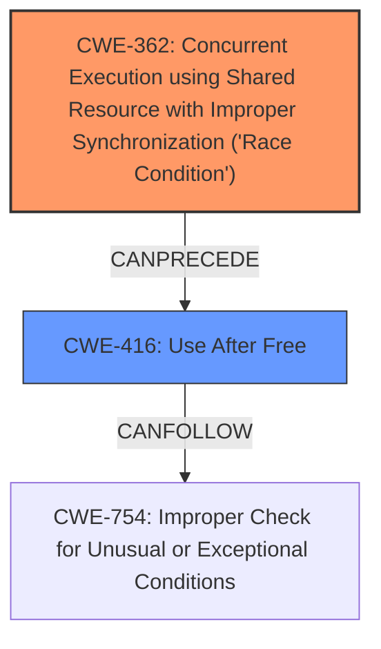

# Analysis Report for CVE-2024-38588

# Vulnerability Analysis Report: CVE-2024-38588

## Description

In the Linux kernel, the following vulnerability has been resolved ftrace Fix possible **use-after-free** issue in ftrace_location() KASAN reports a bug BUG KASAN **use-after-free** in ftrace_location+0x90/0x120 Read of size 8 at addr ffff888141d40010 by task insmod/424 CPU 8 PID 424 Comm insmod Tainted G W 6.9.0-rc2+ [...] Call Trace dump_stack_lvl+0x68/0xa0 print_report+0xcf/0x610 kasan_report+0xb5/0xe0 ftrace_location+0x90/0x120 register_kprobe+0x14b/0xa40 kprobe_init+0x2d/0xff0 [kprobe_example] do_one_initcall+0x8f/0x2d0 do_init_module+0x13a/0x3c0 load_module+0x3082/0x33d0 init_module_from_file+0xd2/0x130 __x64_sys_finit_module+0x306/0x440 do_syscall_64+0x68/0x140 entry_SYSCALL_64_after_hwframe+0x71/0x79 The root cause is that, in lookup_rec(), ftrace record of some address is being searched in ftrace pages of some module, but those ftrace pages at the same time is being freed in ftrace_release_mod() as the corresponding module is being deleted CPU1 | CPU2 register_kprobes() { | delete_module() { check_kprobe_address_safe() { | arch_check_ftrace_location() { | ftrace_location() { | lookup_rec() // USE! | ftrace_release_mod() // Free! To fix this issue 1. Hold rcu lock as accessing ftrace pages in ftrace_location_range() 2. Use ftrace_location_range() instead of lookup_rec() in

## Vulnerability Description Key Phrases

- **Rootcause:** race condition
- **Weakness:** use-after-free
- **Product:** Linux kernel
- **Component:** ftrace_location()

## Analysis (with Relationship Data)

# Summary
| CWE ID | CWE Name | Confidence | CWE Abstraction Level | CWE Vulnerability Mapping Label | CWE-Vulnerability Mapping Notes |
|---|---|---|---|---|---|
| CWE-362 | Concurrent Execution using Shared Resource with Improper Synchronization ('Race Condition') | 1.0 | Class | Allowed-with-Review | Primary CWE: The **root cause** is a **race condition** where ftrace pages are freed while being accessed. |
| CWE-416 | Use After Free | 1.0 | Variant | Allowed | Secondary CWE: The **weakness** is a **use-after-free** vulnerability, a direct consequence of the race condition. |

## Evidence and Confidence

*   **Confidence Score:** 1.0
*   **Evidence Strength:** HIGH

## Relationship Analysis
The primary weakness is a **race condition (CWE-362)**, which leads to a **use-after-free (CWE-416)** vulnerability. CWE-362 is a Class, and CWE-416 is a Variant. The relationship is that the race condition *causes* the use-after-free.



## Vulnerability Chain
The vulnerability chain starts with a **race condition (CWE-362)** where ftrace pages are freed while being accessed. This leads directly to a **use-after-free (CWE-416)**, which can result in a kernel crash or other undefined behavior.

## Summary of Analysis
The analysis is based on the provided evidence from the vulnerability description and CVE reference links, which clearly state the **root cause** as a **race condition** and the **weakness** as a **use-after-free**. The CVE description explicitly mentions: "Root cause: In `lookup_rec()`, the ftrace record of an address is searched in the ftrace pages of a module, while these ftrace pages are being freed in `ftrace_release_mod()` because the corresponding module is being deleted.\n\nWeaknesses: Use-after-free vulnerability in `ftrace_location()` function." The retriever results also strongly suggest **CWE-362** and **CWE-416** as relevant CWEs.

The selected CWEs are at the optimal level of specificity. **CWE-362 (Race Condition)** accurately captures the **root cause**, and **CWE-416 (Use After Free)** precisely describes the resulting vulnerability.

Relevant CWE Information:

# Enhanced Context (25 CWEs)
The following CWEs were identified as potentially relevant to this vulnerability:

## CWE-366: Race Condition within a Thread
**Abstraction Level**: Base
**Similarity Score**: 0.79
**Source**: dense
**Description**:
If two threads of execution use a resource simultaneously, there exists the possibility that resources may be used while invalid, in turn making the state of execution undefined.
**Mapping Guidance**:
- Usage: Allowed
- Rationale: This CWE entry is at the Base level of abstraction, which is a preferred level of abstraction for mapping to the root causes of vulnerabilities.

## CWE-667: Improper Locking
**Abstraction Level**: Class
**Similarity Score**: 0.76
**Source**: dense
**Description**:
The product does not properly acquire or release a lock on a resource, leading to unexpected resource state changes and behaviors.
**Mapping Guidance**:
- Usage: Allowed-with-Review
- Rationale: This CWE entry is a Class and might have Base-level children that would be more appropriate

## CWE-362: Concurrent Execution using Shared Resource with Improper Synchronization ('Race Condition')
**Abstraction Level**: Class
**Similarity Score**: 0.76
**Source**: dense
**Description**:
The product contains a concurrent code sequence that requires temporary, exclusive access to a shared resource, but a timing window exists in which the shared resource can be modified by another code sequence operating concurrently.
**Mapping Guidance**:
- Usage: Allowed-with-Review
- Rationale: This CWE entry is a Class and might have Base-level children that would be more appropriate

## CWE-367: Time-of-check Time-of-use (TOCTOU) Race Condition
**Abstraction Level**: Base
**Similarity Score**: 0.76
**Source**: dense
**Description**:
The product checks the state of a resource before using that resource, but the resource's state can change between the check and the use in a way that invalidates the results of the check. This can cause the product to perform invalid actions when the resource is in an unexpected state.
**Mapping Guidance**:
- Usage: Allowed
- Rationale: This CWE entry is at the Base level of abstraction, which is a preferred level of abstraction for mapping to the root causes of vulnerabilities.

## CWE-404: Improper Resource Shutdown or Release
**Abstraction Level**: Class
**Similarity Score**: 0.73
**Source**: dense
**Description**:
The product does not release or incorrectly releases a resource before it is made available for re-use.
**Mapping Guidance**:
- Usage: Allowed-with-Review
- Rationale: This CWE entry is a Class and might have Base-level children that would be more appropriate

## CWE-754: Improper Check for Unusual or Exceptional Conditions
**Abstraction Level**: Class
**Similarity Score**: 0.72
**Source**: dense
**Description**:
The product does not check or incorrectly checks for unusual or exceptional conditions that are not expected to occur frequently during day to day operation of the product.
**Mapping Guidance**:
- Usage: Allowed-with-Review
- Rationale: This CWE entry is a Class and might have Base-level children that would be more appropriate

## CWE-662: Improper Synchronization
**Abstraction Level**: Class
**Similarity Score**: 0.72
**Source**: dense
**Description**:
The product utilizes multiple threads or processes to allow temporary access to a shared resource that can only be exclusive to one process at a time, but it does not properly synchronize these actions, which might cause simultaneous accesses of this resource by multiple threads or processes.
**Mapping Guidance**:
- Usage: Discouraged
- Rationale: This CWE entry is a level-1 Class (i.e., a child of a Pillar). It might have lower-level children that would be more appropriate

## CWE-824: Access of Uninitialized Pointer
**Abstraction Level**: Base
**Similarity Score**: 0.72
**Source**: dense
**Description**:
The product accesses or uses a pointer that has not been initialized.
**Mapping Guidance**:
- Usage: Allowed
- Rationale: This CWE entry is at the Base level of abstraction, which is a preferred level of abstraction for mapping to the root causes of vulnerabilities.

## CWE-415: Double Free
**Abstraction Level**: Variant
**Similarity Score**: 0.72
**Source**: dense
**Description**:
The product calls free() twice on the same memory address, potentially leading to modification of unexpected memory locations.
**Mapping Guidance**:
- Usage: Allowed
- Rationale: This CWE entry is at the Variant level of abstraction, which is a preferred level of abstraction for mapping to the root causes of vulnerabilities.

## CWE-703: Improper Check or Handling of Exceptional Conditions
**Abstraction Level**: Pillar
**Similarity Score**: 0.71
**Source**: dense
**Description**:
The product does not properly anticipate or handle exceptional conditions that rarely occur during normal operation of the product.
**Mapping Guidance**:
- Usage: Discouraged
- Rationale: This CWE entry is extremely high-level, a Pillar.

## CWE-362: Concurrent Execution using Shared Resource with Improper Synchronization ('Race Condition')
**Abstraction Level**: Class
**Similarity Score**: 1997.28
**Source**: sparse
**Description**:
The product contains a concurrent code sequence that requires temporary, exclusive access to a shared resource, but a timing window exists in which the shared resource can be modified by another code sequence operating concurrently.
**Mapping Guidance**:
- Usage: Allowed-with-Review
- Rationale: This CWE entry is a Class and might have Base-level children that would be more appropriate

## CWE-667: Improper Locking
**Abstraction Level**: Class
**Similarity Score**: 1936.31
**Source**: sparse
**Description**:
The product does not properly acquire or release a lock on a resource, leading to unexpected resource state changes and behaviors.
**Mapping Guidance**:
- Usage: Allowed-with-Review
- Rationale: This CWE entry is a Class and might have Base-level children that would be more appropriate


## CWE Relationship Analysis

Current CWEs represent these abstraction levels: .


### Vulnerability Chain Analysis

**Chain starting from CWE-662:**
- 662 (Improper Synchronization) - ROOT


**Chain starting from CWE-416:**
- 416 (Use After Free) - ROOT


### CWE Relationship Diagram

```mermaid
graph TD
    classDef primary fill:#f96,stroke:#333,stroke-width:2px
    classDef secondary fill:#69f,stroke:#333
    classDef tertiary fill:#9e9,stroke:#333
```


*Report generated on 2025-07-13 10:45:04*
