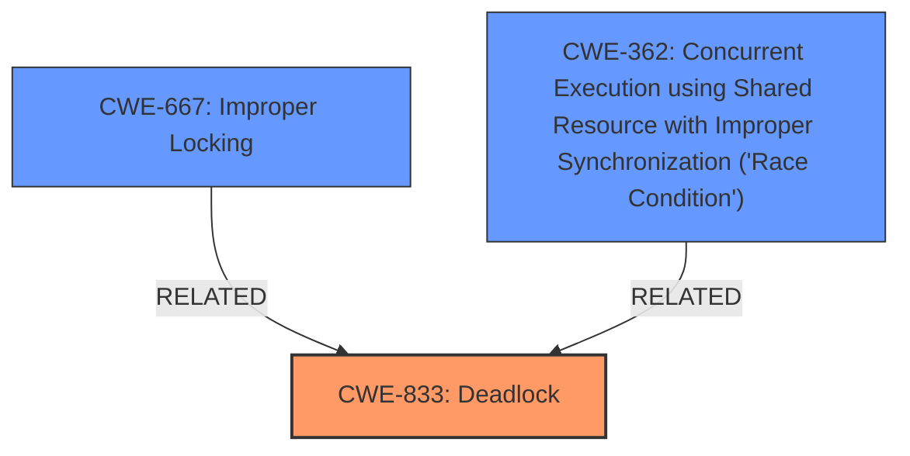

# Analysis Report for CVE-2024-38591

# Vulnerability Analysis Report: CVE-2024-38591

## Description

In the Linux kernel, the following vulnerability has been resolved RDMA/hns Fix **deadlock** on SRQ async events. xa_lock for SRQ table may be required in AEQ. Use xa_store_irq()/ xa_erase_irq() to avoid **deadlock**.

## Vulnerability Description Key Phrases

- **Weakness:** deadlock
- **Vector:** async events
- **Product:** Linux kernel
- **Component:** RDMA/hns

## Analysis (with Relationship Data)

# Summary
| CWE ID | CWE Name | Confidence | CWE Abstraction Level | CWE Vulnerability Mapping Label | CWE-Vulnerability Mapping Notes |
|---|---|---|---|---|---|
| CWE-833 | Deadlock | 1.0 | Base | Primary | Allowed |
| CWE-667 | Improper Locking | 0.7 | Class | Secondary Candidate | Allowed-with-Review |
| CWE-362 | Concurrent Execution using Shared Resource with Improper Synchronization ('Race Condition') | 0.6 | Class | Secondary Candidate | Allowed-with-Review |

## Evidence and Confidence

*   **Confidence Score:** 0.9
*   **Evidence Strength:** HIGH

## Relationship Analysis
The primary CWE is CWE-833 (Deadlock), which is a base-level CWE. CWE-667 (Improper Locking) and CWE-362 (Race Condition) are class-level CWEs and potential contributing factors. There is no direct hierarchical relationship between CWE-833 and the other two, but they all relate to concurrency issues.



## Vulnerability Chain
The vulnerability chain starts with an **improper locking** mechanism (potentially CWE-667) leading to a **deadlock** (CWE-833) due to SRQ async events. A race condition (CWE-362) might contribute to the locking issue. The final impact is a system hang or unresponsiveness.

## Summary of Analysis
The primary vulnerability is a **deadlock**, which aligns with CWE-833. The evidence is strong due to the explicit mention of "**deadlock**" in the vulnerability description and the fix involving interrupt-safe functions (`xa_store_irq` and `xa_erase_irq`). The retriever results also list CWE-833 as a top candidate. The analysis also considered CWE-667 (Improper Locking) and CWE-362 (Race Condition) as contributing factors, but the primary issue is the resulting deadlock. The selection of CWE-833 as the primary CWE is based on its direct match with the vulnerability description and its Base level of abstraction.

Relevant CWE Information:

# Enhanced Context (25 CWEs)
The following CWEs were identified as potentially relevant to this vulnerability:

## CWE-833: Deadlock
**Abstraction Level**: Base
**Similarity Score**: 0.78
**Source**: dense

**Description**:
The product contains multiple threads or executable segments that are waiting for each other to release a necessary lock, resulting in **deadlock**.

**Mapping Guidance**:
- Usage: Allowed
- Rationale: This CWE entry is at the Base level of abstraction, which is a preferred level of abstraction for mapping to the root causes of vulnerabilities.

## CWE-667: Improper Locking
**Abstraction Level**: Class
**Similarity Score**: 0.77
**Source**: dense

**Description**:
The product does not properly acquire or release a lock on a resource, leading to unexpected resource state changes and behaviors.

**Mapping Guidance**:
- Usage: Allowed-with-Review
- Rationale: This CWE entry is a Class and might have Base-level children that would be more appropriate

## CWE-362: Concurrent Execution using Shared Resource with Improper Synchronization ('Race Condition')
**Abstraction Level**: Class
**Similarity Score**: 0.74
**Source**: dense

**Description**:
The product contains a concurrent code sequence that requires temporary, exclusive access to a shared resource, but a timing window exists in which the shared resource can be modified by another code sequence operating concurrently.

**Mapping Guidance**:
- Usage: Allowed-with-Review
- Rationale: This CWE entry is a Class and might have Base-level children that would be more appropriate

### CWE Selection Details:

*   **CWE-833: Deadlock**
    *   **Technical Explanation:** The vulnerability description explicitly states a "**deadlock**" condition. The fix involves using interrupt-safe functions to avoid the **deadlock**. This directly matches the definition of CWE-833, where multiple threads are waiting for each other.
    *   **Security Implications:** A deadlock can lead to a system hang or unresponsiveness, impacting availability.
    *   **Relationship Analysis:** Base-level CWE, directly representing the vulnerability.
    *   **Mapping Guidance:** Usage: ALLOWED. The evidence strongly supports this mapping.
*   **CWE-667: Improper Locking**
    *   **Technical Explanation:** The **deadlock** implies there's an underlying **improper locking** mechanism. The description mentions that `xa_lock` may be required in AEQ, suggesting a potential locking issue.
    *   **Security Implications:** **Improper locking** can lead to race conditions and deadlocks.
    *   **Relationship Analysis:** Class-level CWE, potentially contributing to the **deadlock**.
    *   **Mapping Guidance:** Usage: ALLOWED-WITH-REVIEW. While relevant, it's a higher-level CWE.
*   **CWE-362: Concurrent Execution using Shared Resource with Improper Synchronization ('Race Condition')**
    *   **Technical Explanation:** The asynchronous events and the need for interrupt-safe functions suggest a potential **race condition** where shared resources are accessed concurrently without proper synchronization.
    *   **Security Implications:** **Race conditions** can lead to unpredictable behavior and security vulnerabilities.
    *   **Relationship Analysis:** Class-level CWE, potentially contributing to the **improper locking** and **deadlock**.
    *   **Mapping Guidance:** Usage: ALLOWED-WITH-REVIEW. Relevant, but not the primary issue.

### CWEs Considered but Not Used:

*   CWE-755, CWE-703, CWE-390: These relate to error handling, but the primary issue is a concurrency problem, not error handling.
*   CWE-119, CWE-1285: These relate to memory buffer issues and input validation, which are not evident in the vulnerability description.
*   CWE-908, CWE-909: These relate to uninitialized resources, which is not apparent in the provided description.
*   CWE-364, CWE-367, CWE-609, CWE-1265, CWE-663: These are more specific types of concurrency issues but the provided information lacks the evidence to support such specific classifications.


## CWE Relationship Analysis

Current CWEs represent these abstraction levels: .


### Vulnerability Chain Analysis

**Chain starting from CWE-390:**
- 390 (Detection of Error Condition Without Action) - ROOT


**Chain starting from CWE-1265:**
- 1265 (Unintended Reentrant Invocation of Non-reentrant Code Via Nested Calls) - ROOT


### CWE Relationship Diagram

```mermaid
graph TD
    classDef primary fill:#f96,stroke:#333,stroke-width:2px
    classDef secondary fill:#69f,stroke:#333
    classDef tertiary fill:#9e9,stroke:#333
```


*Report generated on 2025-07-13 10:45:43*
