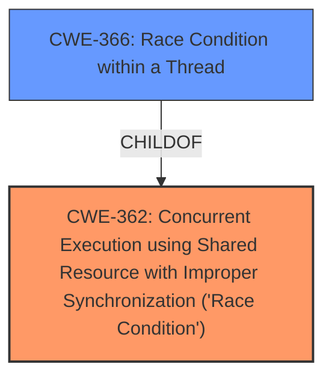

# Analysis Report for CVE-2024-38596

# Vulnerability Analysis Report: CVE-2024-38596

## Description

In the Linux kernel, the following vulnerability has been resolvedaf_unix Fix data races in unix_release_sock/unix_stream_sendmsgA **data-race condition** has been identified in af_unix. In one data path,the write function unix_release_sock() atomically writes tosk->sk_shutdown using WRITE_ONCE. However, on the reader side,unix_stream_sendmsg() does not read it atomically. Consequently, thisissue is causing the following KCSAN splat to occur BUG KCSAN data-race in unix_release_sock / unix_stream_sendmsg write (marked) to 0xffff88867256ddbb of 1 bytes by task 7270 on cpu 28 unix_release_sock (net/unix/af_unix.c640) unix_release (net/unix/af_unix.c1050) sock_close (net/socket.c659 net/socket.c1421) __fput (fs/file_table.c422) __fput_sync (fs/file_table.c508) __se_sys_close (fs/open.c1559 fs/open.c1541) __x64_sys_close (fs/open.c1541) x64_sys_call (arch/x86/entry/syscall_64.c33) do_syscall_64 (arch/x86/entry/common.c?) entry_SYSCALL_64_after_hwframe (arch/x86/entry/entry_64.S130) read to 0xffff88867256ddbb of 1 bytes by task 989 on cpu 14 unix_stream_sendmsg (net/unix/af_unix.c2273) __sock_sendmsg (net/socket.c730 net/socket.c745) ____sys_sendmsg (net/socket.c2584) __sys_sendmmsg (net/socket.c2638 net/socket.c2724) __x64_sys_sendmmsg (net/socket.c2753 net/socket.c2750 net/socket.c2750) x64_sys_call (arch/x86/entry/syscall_64.c33) do_syscall_64 (arch/x86/entry/common.c?) entry_SYSCALL_64_after_hwframe (arch/x86/entry/entry_64.S130) value changed 0x01 -> 0x03The line numbers are related to commit dd5a440a31fa (Linux 6.9-rc7).Commit e1d09c2c2f57 (af_unix Fix data races around sk->sk_shutdown.)addressed a comparable issue in the past regarding sk->sk_shutdown.However, it overlooked resolving this particular data path.This patch only offending unix_stream_sendmsg() function, since theother reads seem to be protected by unix_state_lock() as discussed in

## Vulnerability Description Key Phrases

- **Rootcause:** data-race condition
- **Impact:** KCSAN splat
- **Product:** Linux kernel
- **Component:** af_unix

## Analysis (with Relationship Data)

# Summary
| CWE ID | CWE Name | Confidence | CWE Abstraction Level | CWE Vulnerability Mapping Label | CWE-Vulnerability Mapping Notes |
|---|---|---|---|---|---|
| CWE-362 | Concurrent Execution using Shared Resource with Improper Synchronization ('Race Condition') | 1.0 | Class | Primary | Allowed-with-Review |
| CWE-366 | Race Condition within a Thread | 0.8 | Base | Secondary | Allowed |

## Evidence and Confidence

*   **Confidence Score:** 0.9
*   **Evidence Strength:** HIGH

## Relationship Analysis
The primary relationship is between **CWE-362** (Class) and **CWE-366** (Base) where CWE-366 is a child of CWE-362. Since the vulnerability involves a **data race** within a thread, **CWE-366** could be a more specific mapping. However, given that the provided information doesn't explicitly delve into the specifics of thread management, I'm choosing **CWE-362** as the primary because the description focuses on the general **data race condition**. **CWE-366** is added as a secondary CWE.



## Vulnerability Chain
The vulnerability chain starts with a **data race condition** due to **improper synchronization** in concurrent execution, leading to a KCSAN splat.

1.  **Root Cause:** **CWE-362** Concurrent Execution using Shared Resource with Improper Synchronization ('Race Condition') - The `unix_release_sock()` and `unix_stream_sendmsg()` functions concurrently access the `sk->sk_shutdown` flag without proper synchronization.
2.  **Impact:** KCSAN splat (Kernel crash) due to the **data race**.

## Summary of Analysis
The vulnerability description clearly states that a **data-race condition** exists in af_unix. The `unix_release_sock()` function writes to `sk->sk_shutdown` using `WRITE_ONCE`, while `unix_stream_sendmsg()` reads it without atomic access. This directly matches the description of **CWE-362** Concurrent Execution using Shared Resource with Improper Synchronization ('Race Condition').

The "CVE Reference Links Content Summary" section confirms the **data race** as the root cause and highlights the concurrent access to `sk->sk_shutdown` without proper synchronization.

The retriever results list **CWE-362** as the top candidate with a high score. The usage is "Allowed-with-Review" because it is a Class, suggesting that a more specific Base-level CWE might be appropriate. While **CWE-366** Race Condition within a Thread is a Base-level CWE and a child of **CWE-362**, the description is focused on the higher level issue of concurrent access and lack of atomicity.

**CWE-367** Time-of-check Time-of-use (TOCTOU) Race Condition was considered but rejected because the vulnerability isn't related to checking the state of a resource before using it. Instead, it is about concurrent read and write operations without synchronization.

**CWE-476** NULL Pointer Dereference was considered and rejected because the vulnerability description makes no mention of null pointers.

**CWE-911** Improper Update of Reference Count was considered and rejected because reference counting is not part of the vulnerability description.

I'm assigning **CWE-362** as the primary CWE due to the clear evidence of a **data race condition** caused by **improper synchronization** during concurrent execution. **CWE-366** is added as a secondary CWE, since the race condition occurs within a thread.

Relevant CWE Information:

# Enhanced Context (25 CWEs)
The following CWEs were identified as potentially relevant to this vulnerability:

## CWE-362: Concurrent Execution using Shared Resource with Improper Synchronization ('Race Condition')
**Abstraction Level**: Class
**Similarity Score**: 0.80
**Source**: dense

**Description**:
The product contains a concurrent code sequence that requires temporary, exclusive access to a shared resource, but a timing window exists in which the shared resource can be modified by another code sequence operating concurrently.

**Mapping Guidance**:
- Usage: Allowed-with-Review
- Rationale: This CWE entry is a Class and might have Base-level children that would be more appropriate

## CWE-366: Race Condition within a Thread
**Abstraction Level**: Base
**Similarity Score**: 0.77
**Source**: dense

**Description**:
If two threads of execution use a resource simultaneously, there exists the possibility that resources may be used while invalid, in turn making the state of execution undefined.

**Mapping Guidance**:
- Usage: Allowed
- Rationale: This CWE entry is at the Base level of abstraction, which is a preferred level of abstraction for mapping to the root causes of vulnerabilities.


## CWE Relationship Analysis

Current CWEs represent these abstraction levels: .


### Vulnerability Chain Analysis

**Chain starting from CWE-911:**
- 911 (Improper Update of Reference Count) - ROOT


**Chain starting from CWE-476:**
- 476 (NULL Pointer Dereference) - ROOT


### CWE Relationship Diagram

```mermaid
graph TD
    classDef primary fill:#f96,stroke:#333,stroke-width:2px
    classDef secondary fill:#69f,stroke:#333
    classDef tertiary fill:#9e9,stroke:#333
```


*Report generated on 2025-07-13 10:45:59*
