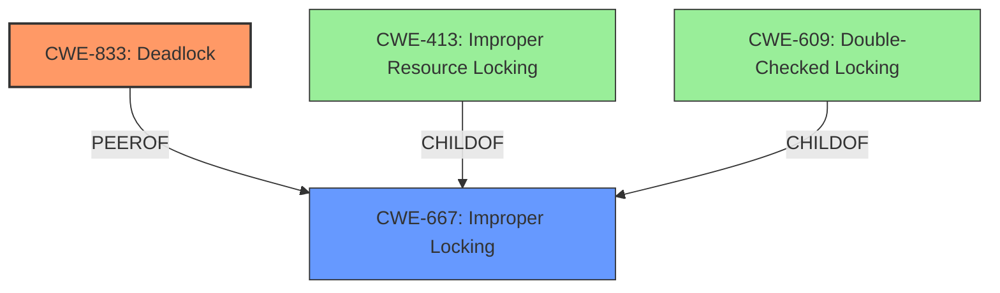

# Analysis Report for CVE-2024-38600

# Vulnerability Analysis Report: CVE-2024-38600

## Description

In the Linux kernel, the following vulnerability has been resolved ALSA Fix **deadlock**s with kctl removals at disconnection In snd_card_disconnect(), we set card->shutdown flag at the beginning, call callbacks and do sync for card->power_ref_sleep waiters at the end. The callback may delete a kctl element, and this can lead to a **deadlock** when the device was in the suspended state. Namely * A process waits for the power up at snd_power_ref_and_wait() in snd_ctl_info() or read/write() inside card->controls_rwsem. * The system gets disconnected meanwhile, and the driver tries to delete a kctl via snd_ctl_remove*() it tries to take card->controls_rwsem again, but this is already locked by the above. Since the sleeper isnt woken up, this **deadlock**s. An easy fix is to wake up sleepers before processing the driver disconnect callbacks but right after setting the card->shutdown flag. Then all sleepers will abort immediately, and the code flows again. So, basically this patch moves the wait_event() call at the right timing. While were at it, just to be sure, call wait_event_all() instead of wait_event(), although we dont use exclusive events on this queue for now.

## Vulnerability Description Key Phrases

- **Weakness:** deadlock
- **Impact:** deadlock
- **Vector:** kctl removals at disconnection
- **Product:** Linux kernel
- **Component:** ALSA

## Analysis (with Relationship Data)

# Summary

| CWE ID | CWE Name | Confidence | CWE Abstraction Level | CWE Vulnerability Mapping Label | CWE-Vulnerability Mapping Notes |
|---|---|---|---|---|---|
| CWE-833 | Deadlock | 1.0 | Base | Primary | Allowed |
| CWE-667 | Improper Locking | 0.7 | Class | Secondary | Allowed-with-Review |

## Evidence and Confidence

*   **Confidence Score:** 0.9
*   **Evidence Strength:** HIGH

## Relationship Analysis
The primary weakness is **CWE-833 (Deadlock)**, which directly reflects the core problem described in the vulnerability. **CWE-667 (Improper Locking)** is a related class that could contribute to the deadlock. The graph shows that **CWE-667** can lead to specific locking issues like double-checked locking (**CWE-609**) or improper resource locking (**CWE-413**). However, the description doesn't provide enough detail to specify these more granular locking issues so it will remain a secondary candidate.



## Vulnerability Chain
The vulnerability chain involves the following sequence:
1.  A process waits for power-up using `snd_power_ref_and_wait()` while holding `card->controls_rwsem`.
2.  The system initiates a sound card disconnection.
3.  The driver attempts to remove a kctl element via `snd_ctl_remove*()`, requiring `card->controls_rwsem`.
4.  A **deadlock** occurs because the process in step 1 holds the lock, preventing the kctl removal.

The root cause is the improper handling of locking during the disconnection process, leading to the **deadlock**.

## Summary of Analysis
The primary assessment is based on the explicit description of a **deadlock** occurring due to contention over `card->controls_rwsem` during sound card disconnection. The fix involves waking up sleeping processes before the driver disconnect callbacks to avoid lock contention.

The evidence from the "CVE Reference Links Content Summary" clearly states: "A **deadlock** can occur due to the order of operations and locking mechanisms involved in card disconnection and power management... This deletion process requires acquiring `card->controls_rwsem` again, which is already held by the waiting process, causing a **deadlock**."

The graph relationships confirm that **CWE-833 (Deadlock)** and **CWE-667 (Improper Locking)** are related, but **CWE-833** directly represents the described vulnerability.

The selected CWEs are at the optimal level of specificity because **CWE-833** accurately describes the vulnerability, while **CWE-667** represents the broader class of locking issues that contribute to the deadlock.

Relevant CWE Information:

# Enhanced Context (25 CWEs)
The following CWEs were identified as potentially relevant to this vulnerability:

## CWE-833: Deadlock
**Abstraction Level**: Base
**Similarity Score**: 0.76
**Source**: dense

**Description**:
The product contains multiple threads or executable segments that are waiting for each other to release a necessary lock, resulting in deadlock.

**Mapping Guidance**:
- Usage: Allowed
- Rationale: This CWE entry is at the Base level of abstraction, which is a preferred level of abstraction for mapping to the root causes of vulnerabilities.

## CWE-667: Improper Locking
**Abstraction Level**: Class
**Similarity Score**: 0.73
**Source**: dense

**Description**:
The product does not properly acquire or release a lock on a resource, leading to unexpected resource state changes and behaviors.

**Mapping Guidance**:
- Usage: Allowed-with-Review
- Rationale: This CWE entry is a Class and might have Base-level children that would be more appropriate

## CWE-362: Concurrent Execution using Shared Resource with Improper Synchronization ('Race Condition')
**Abstraction Level**: Class
**Similarity Score**: 0.71
**Source**: dense

**Description**:
The product contains a concurrent code sequence that requires temporary, exclusive access to a shared resource, but a timing window exists in which the shared resource can be modified by another code sequence operating concurrently.

**Mapping Guidance**:
- Usage: Allowed-with-Review
- Rationale: This CWE entry is a Class and might have Base-level children that would be more appropriate

## CWE-755: Improper Handling of Exceptional Conditions
**Abstraction Level**: Class
**Similarity Score**: 0.70
**Source**: dense

**Description**:
The product does not handle or incorrectly handles an exceptional condition.

**Mapping Guidance**:
- Usage: Discouraged
- Rationale: This CWE entry is a level-1 Class (i.e., a child of a Pillar). It might have lower-level children that would be more appropriate

## CWE-1285: Improper Validation of Specified Index, Position, or Offset in Input
**Abstraction Level**: Base
**Similarity Score**: 0.69
**Source**: dense

**Description**:
The product receives input that is expected to specify an index, position, or offset into an indexable resource such as a buffer or file, but it does not validate or incorrectly validates that the specified index/position/offset has the required properties.

**Mapping Guidance**:
- Usage: Allowed
- Rationale: This CWE entry is at the Base level of abstraction, which is a preferred level of abstraction for mapping to the root causes of vulnerabilities.

## CWE-131: Incorrect Calculation of Buffer Size
**Abstraction Level**: Base
**Similarity Score**: 0.69
**Source**: dense

**Description**:
The product does not correctly calculate the size to be used when allocating a buffer, which could lead to a buffer overflow.

**Mapping Guidance**:
- Usage: Allowed
- Rationale: This CWE entry is at the Base level of abstraction, which is a preferred level of abstraction for mapping to the root causes of vulnerabilities.

## CWE-252: Unchecked Return Value
**Abstraction Level**: Base
**Similarity Score**: 0.68
**Source**: dense

**Description**:
The product does not check the return value from a method or function, which can prevent it from detecting unexpected states and conditions.

**Mapping Guidance**:
- Usage: Allowed
- Rationale: This CWE entry is at the Base level of abstraction, which is a preferred level of abstraction for mapping to the root causes of vulnerabilities.

## CWE-824: Access of Uninitialized Pointer
**Abstraction Level**: Base
**Similarity Score**: 0.68
**Source**: dense

**Description**:
The product accesses or uses a pointer that has not been initialized.

**Mapping Guidance**:
- Usage: Allowed
- Rationale: This CWE entry is at the Base level of abstraction, which is a preferred level of abstraction for mapping to the root causes of vulnerabilities.

## CWE-754: Improper Check for Unusual or Exceptional Conditions
**Abstraction Level**: Class
**Similarity Score**: 0.68
**Source**: dense

**Description**:
The product does not check or incorrectly checks for unusual or exceptional conditions that are not expected to occur frequently during day to day operation of the product.

**Mapping Guidance**:
- Usage: Allowed-with-Review
- Rationale: This CWE entry is a Class and might have Base-level children that would be more appropriate

## CWE-908: Use of Uninitialized Resource
**Abstraction Level**: Base
**Similarity Score**: 0.68
**Source**: dense

**Description**:
The product uses or accesses a resource that has not been initialized.

**Mapping Guidance**:
- Usage: Allowed
- Rationale: This CWE entry is at the Base level of abstraction, which is a preferred level of abstraction for mapping to the root causes of vulnerabilities.

## CWE-667: Improper Locking
**Abstraction Level**: Class
**Similarity Score**: 1298.92
**Source**: sparse

**Description**:
The product does not properly acquire or release a lock on a resource, leading to unexpected resource state changes and behaviors.

**Mapping Guidance**:
- Usage: Allowed-with-Review
- Rationale: This CWE entry is a Class and might have Base-level children that would be more appropriate

## CWE-833: Deadlock
**Abstraction Level**: Base
**Similarity Score**: 1255.64
**Source**: sparse


## CWE Relationship Analysis

Current CWEs represent these abstraction levels: .


### Vulnerability Chain Analysis

**Chain starting from CWE-131:**
- 131 (Incorrect Calculation of Buffer Size) - ROOT


**Chain starting from CWE-667:**
- 667 (Improper Locking) - ROOT


### CWE Relationship Diagram

```mermaid
graph TD
    classDef primary fill:#f96,stroke:#333,stroke-width:2px
    classDef secondary fill:#69f,stroke:#333
    classDef tertiary fill:#9e9,stroke:#333
```


*Report generated on 2025-07-13 10:46:38*
