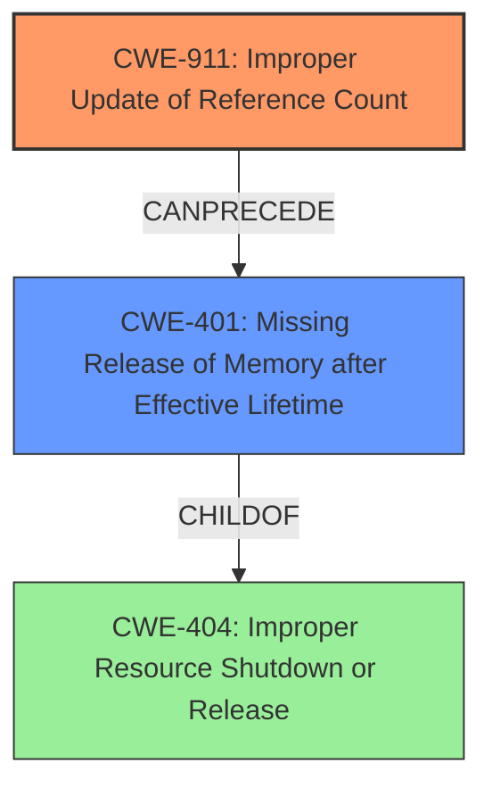

# Analysis Report for CVE-2024-38602

# Vulnerability Analysis Report: CVE-2024-38602

## Description

In the Linux kernel, the following vulnerability has been resolved ax25 Fix **reference count leak** issues of ax25_dev The ax25_addr_ax25dev() and ax25_dev_device_down() exist a **reference count leak** issue of the object ax25_dev. **Memory leak** issue in ax25_addr_ax25dev() The reference count of the object ax25_dev can be increased multiple times in ax25_addr_ax25dev(). This will cause a memory leak. **Memory leak** issues in ax25_dev_device_down() The reference count of ax25_dev is set to 1 in ax25_dev_device_up() and then increase the reference count when ax25_dev is added to ax25_dev_list. As a result, the reference count of ax25_dev is 2. But when the device is shutting down. The ax25_dev_device_down() drops the reference count once or twice depending on if we goto unlock_put or not, which will cause memory leak. As for the issue of ax25_addr_ax25dev(), it is impossible for one pointer to be on a list twice. So add a break in ax25_addr_ax25dev(). As for the issue of ax25_dev_device_down(), increase the reference count of ax25_dev once in ax25_dev_device_up() and decrease the reference count of ax25_dev after it is removed from the ax25_dev_list.

## Vulnerability Description Key Phrases

- **Weakness:** ['Memory leak', 'reference count leak']
- **Impact:** memory leak
- **Product:** Linux kernel
- **Component:** ['ax25_addr_ax25dev()', 'ax25_dev_device_down()']

## Analysis (with Relationship Data)

# Summary
| CWE ID | CWE Name | Confidence | CWE Abstraction Level | CWE Vulnerability Mapping Label | CWE-Vulnerability Mapping Notes |
|---|---|---|---|---|---|
| CWE-911 | Improper Update of Reference Count | 1.0 | Base | Primary | Allowed |
| CWE-401 | Missing Release of Memory after Effective Lifetime | 0.8 | Base | Secondary | Allowed-with-Review |

## Evidence and Confidence

*   **Confidence Score:** 0.9
*   **Evidence Strength:** HIGH

## Relationship Analysis
The primary weakness identified is **CWE-911 (Improper Update of Reference Count)**. This CWE is at the Base level, which is the preferred level of abstraction. The vulnerability description explicitly mentions "**reference count leak** issues," which aligns directly with the description of CWE-911.

CWE-401 (Missing Release of Memory after Effective Lifetime) is a potential secondary CWE, due to the **memory leak** that occurs.



## Vulnerability Chain
The vulnerability chain starts with an **improper update of the reference count** (**CWE-911**). When the reference count is not correctly decremented, the memory is not released, leading to a **memory leak** (**CWE-401**), potentially an improper resource shutdown (**CWE-404**).

## Summary of Analysis
The analysis is based on the provided evidence, specifically the vulnerability description highlighting "**reference count leak** issues" and "**memory leak**." The primary CWE, **CWE-911 (Improper Update of Reference Count)**, directly addresses the root cause of the vulnerability.

The vulnerability description explicitly states:
"ax25 Fix **reference count leak** issues of ax25_dev The ax25_addr_ax25dev() and ax25_dev_device_down() exist a **reference count leak** issue of the object ax25_dev. **Memory leak** issue in ax25_addr_ax25dev() The reference count of the object ax25_dev can be increased multiple times in ax25_addr_ax25dev(). This will cause a memory leak. **Memory leak** issues in ax25_dev_device_down() The reference count of ax25_dev is set to 1 in ax25_dev_device_up() and then increase the reference count when ax25_dev is added to ax25_dev_list. As a result, the reference count of ax25_dev is 2. But when the device is shutting down. The ax25_dev_device_down() drops the reference count once or twice depending on if we goto unlock_put or not, which will cause memory leak."

**CWE-911** is at the optimal level of specificity (Base) as it accurately describes the **root cause** of the vulnerability. The high retriever scores for **CWE-911** across all keyphrases further support this decision.

**CWE-401 (Missing Release of Memory after Effective Lifetime)** is considered because the **improper update of the reference count** leads to a **memory leak** which is a result of the resource not being released.

CWEs considered but not used:
*   CWE-190: Integer Overflow or Wraparound - While present in the retriever results, there is no mention of integer overflows or wraparounds in the vulnerability description.
*   CWE-362: Concurrent Execution using Shared Resource with Improper Synchronization ('Race Condition') - There is no mention of race conditions or concurrency issues.
*   CWE-415: Double Free - There is no mention of the free function being called twice on the same memory address.
*   CWE-639: Authorization Bypass Through User-Controlled Key - There is no mention of the system's authorization functionality being bypassed.
*   CWE-404: Improper Resource Shutdown or Release - Considered as a secondary weakness, but the primary focus is on the reference count issue, so it's less directly relevant than CWE-401.
*   CWE-772: Missing Release of Resource after Effective Lifetime - Similar to CWE-401, but less specific to memory.
*   CWE-667: Improper Locking - Not related to the root cause or the impact of the vulnerability.
*   CWE-131: Incorrect Calculation of Buffer Size - Not related to the root cause or the impact of the vulnerability.
*   CWE-824: Access of Uninitialized Pointer - Not related to the root cause or the impact of the vulnerability.
*   CWE-226: Sensitive Information in Resource Not Removed Before Reuse - Not related to the root cause or the impact of the vulnerability.
*   CWE-665: Improper Initialization - Not related to the root cause or the impact of the vulnerability.
*   CWE-703: Improper Check or Handling of Exceptional Conditions - Too high-level and not specific to the vulnerability.
*   CWE-909: Missing Initialization of Resource - Not related to the root cause or the impact of the vulnerability.
*   CWE-754: Improper Check for Unusual or Exceptional Conditions - Not specific to the vulnerability.
*   CWE-364: Signal Handler Race Condition - Irrelevant to the vulnerability description.
*   CWE-416: Use After Free - No indication of use-after-free conditions.
*   CWE-123: Write-what-where Condition - No indication of arbitrary memory writes.
*   CWE-128: Wrap-around Error - Not applicable to the vulnerability.
*   CWE-1339: Insufficient Precision or Accuracy of a Real Number - Irrelevant to the vulnerability.
*   CWE-390: Detection of Error Condition Without Action - Irrelevant to the vulnerability.


## CWE Relationship Analysis

Current CWEs represent these abstraction levels: .


### Vulnerability Chain Analysis

**Chain starting from CWE-390:**
- 390 (Detection of Error Condition Without Action) - ROOT


**Chain starting from CWE-416:**
- 416 (Use After Free) - ROOT


### CWE Relationship Diagram

```mermaid
graph TD
    classDef primary fill:#f96,stroke:#333,stroke-width:2px
    classDef secondary fill:#69f,stroke:#333
    classDef tertiary fill:#9e9,stroke:#333
```


*Report generated on 2025-07-13 10:46:52*
