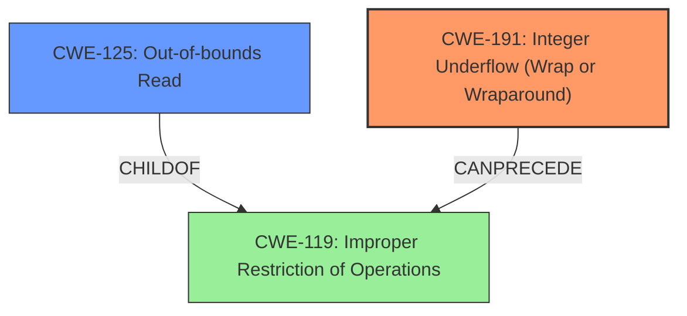

# Analysis Report for CVE-2024-38621

# Vulnerability Analysis Report: CVE-2024-38621

## Description

In the Linux kernel, the following vulnerability has been resolved media stk1160 fix bounds checking in stk1160_copy_video() The subtract in this condition is reversed. The ->length is the length of the buffer. The ->bytesused is how many bytes we have copied thus far. When the condition is reversed that means the result of the subtraction is always negative but since its unsigned then the result is a very high positive value. That means the overflow check is never true. Additionally, the ->bytesused doesnt actually work for this purpose because were not writing to buf->mem + buf->bytesused. Instead, the math to calculate the destination where we are writing is a bit involved. You calculate the number of full lines already written, multiply by two, skip a line if necessary so that we start on an odd numbered line, and add the offset into the line. To fix this **buffer overflow**, just take the actual destination where we are writing, if the offset is already out of bounds print an error and return. Otherwise, write up to buf->length bytes.

## Vulnerability Description Key Phrases

- **Rootcause:** subtract in condition is reversed
- **Weakness:** buffer overflow
- **Product:** Linux kernel
- **Component:** stk1160_copy_video()

## Analysis (with Relationship Data)

# Summary
| CWE ID | CWE Name | Confidence | CWE Abstraction Level | CWE Vulnerability Mapping Label | CWE-Vulnerability Mapping Notes |
|---|---|---|---|---|---|
| CWE-191 | Integer Underflow (Wrap or Wraparound) | 0.9 | Base |  Primary CWE | Allowed |
| CWE-125 | Out-of-bounds Read | 0.8 | Base | Secondary | Allowed |

## Evidence and Confidence

*   **Confidence Score:** 0.85
*   **Evidence Strength:** HIGH

## Relationship Analysis
The primary weakness is identified as CWE-191 Integer Underflow (Wrap or Wraparound), due to the reversed subtraction in the condition which causes an integer underflow. This underflow leads to an incorrect bounds check, ultimately resulting in an out-of-bounds read (CWE-125). CWE-191 can precede CWE-119 (Improper Restriction of Operations within the Bounds of a Memory Buffer), and CWE-125 is a child of CWE-119. The base abstraction level of both CWE-191 and CWE-125 makes them suitable for directly representing the root cause and impact, respectively.



## Vulnerability Chain
The vulnerability chain starts with **CWE-191 Integer Underflow (Wrap or Wraparound)** because the **subtract in condition is reversed**. This leads to an incorrect bounds check, which further leads to **CWE-125 Out-of-bounds Read**.
- **CWE-191:** Root cause, due to reversed subtraction.
- **CWE-125:** Impact, due to reading beyond buffer boundary.

## Summary of Analysis
The primary assessment is based on the evidence provided in the vulnerability description and CVE reference. The **rootcause** is the **subtract in condition is reversed**, leading to an integer underflow.
The description clearly states: "The subtract in this condition is reversed. The ->length is the length of the buffer. The ->bytesused is how many bytes we have copied thus far. When the condition is reversed that means the result of the subtraction is always negative but since its unsigned then the result is a very high positive value. That means the overflow check is never true."
This **rootcause** directly indicates **CWE-191 Integer Underflow (Wrap or Wraparound)**.
The ultimate effect of the failed bounds check is reading out of bounds which maps to **CWE-125 Out-of-bounds Read**. The retriever results confirm this assessment, with both CWEs appearing as top candidates.
The hierarchical relationships and chain patterns support this selection, with CWE-191 preceding CWE-125 through the intermediary CWE-119. The selected CWEs are at the optimal level of specificity (Base) to accurately represent the vulnerability.

Relevant CWE Information:

# Enhanced Context (25 CWEs)
The following CWEs were identified as potentially relevant to this vulnerability:

## CWE-191: Integer Underflow (Wrap or Wraparound)
**Abstraction Level**: Base
**Similarity Score**: 0.75
**Source**: dense

**Description**:
The product subtracts one value from another, such that the result is less than the minimum allowable integer value, which produces a value that is not equal to the correct result.

**Mapping Guidance**:
- Usage: Allowed
- Rationale: This CWE entry is at the Base level of abstraction, which is a preferred level of abstraction for mapping to the root causes of vulnerabilities.


## CWE-131: Incorrect Calculation of Buffer Size
**Abstraction Level**: Base
**Similarity Score**: 0.74
**Source**: dense

**Description**:
The product does not correctly calculate the size to be used when allocating a buffer, which could lead to a buffer overflow.

**Mapping Guidance**:
- Usage: Allowed
- Rationale: This CWE entry is at the Base level of abstraction, which is a preferred level of abstraction for mapping to the root causes of vulnerabilities.


## CWE-125: Out-of-bounds Read
**Abstraction Level**: Base
**Similarity Score**: 0.74
**Source**: dense

**Description**:
The product reads data past the end, or before the beginning, of the intended buffer.

**Mapping Guidance**:
- Usage: Allowed
- Rationale: This CWE entry is at the Base level of abstraction, which is a preferred level of abstraction for mapping to the root causes of vulnerabilities.


## CWE-190: Integer Overflow or Wraparound
**Abstraction Level**: Base
**Similarity Score**: 0.73
**Source**: dense

**Description**:
The product performs a calculation that can
         produce an integer overflow or wraparound when the logic
         assumes that the resulting value will always be larger than
         the original value. This occurs when an integer value is
         incremented to a value that is too large to store in the
         associated representation. When this occurs, the value may
         become a very small or negative number.

**Mapping Guidance**:
- Usage: Allowed
- Rationale: This CWE entry is at the Base level of abstraction, which is a preferred level of abstraction for mapping to the root causes of vulnerabilities.


## CWE-126: Buffer Over-read
**Abstraction Level**: Variant
**Similarity Score**: 0.73
**Source**: dense

**Description**:
The product reads from a buffer using buffer access mechanisms such as indexes or pointers that reference memory locations after the targeted buffer.

**Mapping Guidance**:
- Usage: Allowed
- Rationale: This CWE entry is at the Variant level of abstraction, which is a preferred level of abstraction for mapping to the root causes of vulnerabilities.


## CWE-362: Concurrent Execution using Shared Resource with Improper Synchronization ('Race Condition')
**Abstraction Level**: Class
**Similarity Score**: 0.73
**Source**: dense

**Description**:
The product contains a concurrent code sequence that requires temporary, exclusive access to a shared resource, but a timing window exists in which the shared resource can be modified by another code sequence operating concurrently.

**Mapping Guidance**:
- Usage: Allowed-with-Review
- Rationale: This CWE entry is a Class and might have Base-level children that would be more appropriate


## CWE-1285: Improper Validation of Specified Index, Position, or Offset in Input
**Abstraction Level**: Base
**Similarity Score**: 0.72
**Source**: dense

**Description**:
The product receives input that is expected to specify an index, position, or offset into an indexable resource such as a buffer or file, but it does not validate or incorrectly validates that the specified index/position/offset has the required properties.

**Mapping Guidance**:
- Usage: Allowed
- Rationale: This CWE entry is at the Base level of abstraction, which is a preferred level of abstraction for mapping to the root causes of vulnerabilities.


## CWE-119: Improper Restriction of Operations within the Bounds of a Memory Buffer
**Abstraction Level**: Class
**Similarity Score**: 0.72
**Source**: dense

**Description**:
The product performs operations on a memory buffer, but it reads from or writes to a memory location outside the buffer's intended boundary. This may result in read or write operations on unexpected memory locations that could be linked to other variables, data structures, or internal program data.

**Mapping Guidance**:
- Usage: Discouraged
- Rationale: CWE-119 is commonly misused in low-information vulnerability reports when lower-level CWEs could be used instead, or when more details about the vulnerability are available.


## CWE-193: Off-by-one Error
**Abstraction Level**: Base
**Similarity Score**: 0.72
**Source**: dense

**Description**:
A product calculates or uses an incorrect maximum or minimum value that is 1 more, or 1 less, than the correct value.

**Mapping Guidance**:
- Usage: Allowed
- Rationale: This CWE entry is at the Base level of abstraction, which is a preferred level of abstraction for mapping to the root causes of vulnerabilities.


## CWE-667: Improper Locking
**Abstraction Level**: Class
**Similarity Score**: 0.72
**Source**: dense

**Description**:
The product does not properly acquire or release a lock on a resource, leading to unexpected resource state changes and behaviors.

**Mapping Guidance**:
- Usage: Allowed-with-Review
- Rationale: This CWE entry is a Class and might have Base-level children that would be more appropriate


## CWE-190: Integer Overflow or


## CWE Relationship Analysis

Current CWEs represent these abstraction levels: .


### Vulnerability Chain Analysis

**Chain starting from CWE-125:**
- 125 (Out-of-bounds Read) - ROOT


**Chain starting from CWE-131:**
- 131 (Incorrect Calculation of Buffer Size) - ROOT


### CWE Relationship Diagram

```mermaid
graph TD
    classDef primary fill:#f96,stroke:#333,stroke-width:2px
    classDef secondary fill:#69f,stroke:#333
    classDef tertiary fill:#9e9,stroke:#333
```


*Report generated on 2025-07-13 10:47:50*
