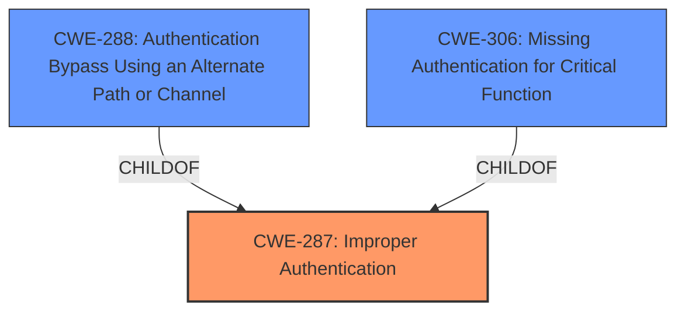

# Raw Analyzer Response for CVE-2024-38650

# Summary
| CWE ID | CWE Name | Confidence | CWE Abstraction Level | CWE Vulnerability Mapping Label | CWE-Vulnerability Mapping Notes |
|---|---|---|---|---|---|
| CWE-287 | Improper Authentication | 0.8 | Class | Primary | Discouraged |
| CWE-288 | Authentication Bypass Using an Alternate Path or Channel | 0.7 | Base | Secondary | Allowed |
| CWE-306 | Missing Authentication for Critical Function | 0.6 | Base | Secondary | Allowed |

## Evidence and Confidence

*   **Confidence Score:** 0.8
*   **Evidence Strength:** MEDIUM

## Relationship Analysis
The primary CWE is CWE-287, Improper Authentication, which is a Class-level CWE. CWE-287 has child relationships to CWE-306 (Missing Authentication for Critical Function) and CWE-288 (Authentication Bypass Using an Alternate Path or Channel). Given the description of the vulnerability as an "authentication bypass" on the VSPC server, both CWE-288 and CWE-306 are considered, but CWE-288 seems to better fit as an alternate path or channel is likely being used, whereas CWE-306 may be too broad.

## Vulnerability Chain
The vulnerability chain starts with a **lack of proper authentication**, leading to the **bypass** and ultimately granting a low-privileged attacker access to sensitive information (NTLM hash).
  - Root Cause: **Improper Authentication** (CWE-287)
  - Weakness: Authentication Bypass (CWE-288 or CWE-306)
  - Impact: Access to NTLM hash of the service account.

## Summary of Analysis
The initial assessment focused on identifying the root cause of the authentication bypass. The evidence strongly suggests that the VSPC server has an authentication **weakness** that enables a low-privileged attacker to access the NTLM hash.

The selection of CWE-287 (Improper Authentication) as the primary CWE is based on the vulnerability description explicitly stating an "authentication bypass vulnerability." While CWE-285 (Improper Authorization) was considered, the core issue is not an authorization flaw, but a **failure in authentication** itself. The retriever results also suggest CWE-289 (Authentication Bypass by Alternate Name) but without knowing the name, CWE-288 is a better fit. CWE-306 (Missing Authentication) is also considered but the description has a bypass already and that is better reflected in CWE-288.

The decision to map CWE-287 at the Class level is a compromise. While a more specific Base or Variant CWE would be ideal, the available information doesn't pinpoint the exact mechanism of the **authentication failure**. However, the mapping guidance recommends against using discouraged CWEs, but in this instance it is better to use it until more information is available.

Relevant CWE Information:

# Enhanced Context (25 CWEs)
The following CWEs were identified as potentially relevant to this vulnerability:

## CWE-288: Authentication Bypass Using an Alternate Path or Channel
**Abstraction Level**: Base
**Similarity Score**: 0.75
**Source**: dense

**Description**:
The product requires authentication, but the product has an alternate path or channel that does not require authentication.

**Mapping Guidance**:
- Usage: Allowed
- Rationale: This CWE entry is at the Base level of abstraction, which is a preferred level of abstraction for mapping to the root causes of vulnerabilities.

## CWE-306: Missing Authentication for Critical Function
**Abstraction Level**: Base
**Similarity Score**: 1211.74
**Source**: sparse

**Description**:
The product does not perform any authentication for functionality that requires a provable user identity or consumes a significant amount of resources.

**Mapping Guidance**:
- Usage: Allowed
- Rationale: This CWE entry is at the Base level of abstraction, which is a preferred level of abstraction for mapping to the root causes of vulnerabilities.