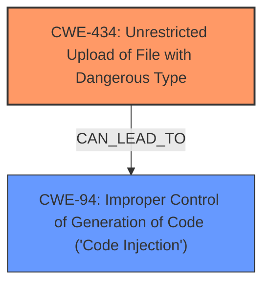

# Enhanced Analysis for CVE-2024-38736

# Summary

| CWE ID | CWE Name | Confidence | CWE Abstraction Level | CWE Vulnerability Mapping Label | CWE-Vulnerability Mapping Notes |
|---|---|---|---|---|---|
| CWE-434 | Unrestricted Upload of File with Dangerous Type | 1.0 | Base | Allowed | Primary CWE: The plugin allows uploading of any file type, including malicious files such as backdoors. |
| CWE-94 | Improper Control of Generation of Code ('Code Injection') | 0.7 | Base | Allowed-with-Review | Secondary Candidate: Successful exploitation could allow a malicious actor to upload arbitrary files, including backdoors, which could lead to code injection and complete website compromise. |

## Evidence and Confidence

*   **Confidence Score:** 0.9
*   **Evidence Strength:** HIGH

## Relationship Analysis
The primary relationship is between CWE-434 and its potential impact. The **unrestricted file upload** (CWE-434) can lead to code injection (CWE-94) if the uploaded file is a malicious script or executable. CWE-434 is a base-level CWE, which is the preferred level of abstraction. CWE-94 is also a base-level CWE, but is used with review, as it is frequently misused for vulnerabilities with a technical impact of "code execution,".



## Vulnerability Chain
The vulnerability chain starts with the **unrestricted upload** of a file (CWE-434). This leads to the ability to inject code (CWE-94), which can compromise the website.

## Summary of Analysis
The primary weakness is the **unrestricted upload** of files with dangerous types (CWE-434). The evidence from "CVE Reference Links Content Summary" states: "The Realtyna Organic IDX plugin for WordPress is vulnerable to arbitrary file upload" and "The plugin allows uploading of any file type, including malicious files such as backdoors." The impact of this vulnerability is code injection (CWE-94) as the successful exploitation "could allow a malicious actor to upload arbitrary files, including backdoors, which could lead to complete website compromise." CWE-434 is at the Base level of abstraction, which is the preferred level.

CWE-79, CWE-22, CWE-113, CWE-306, CWE-425, CWE-1336, CWE-116 were considered but not used.
*   CWE-79 (Improper Neutralization of Input During Web Page Generation ('Cross-site Scripting')): Not applicable because the vulnerability is about uploading dangerous file types, not about neutralizing input during web page generation.
*   CWE-22 (Improper Limitation of a Pathname to a Restricted Directory ('Path Traversal')): Not directly applicable because the core issue is not about path traversal, but about unrestricted file upload.
*   CWE-113 (Improper Neutralization of CRLF Sequences in HTTP Headers ('HTTP Request/Response Splitting')): Not relevant as the vulnerability does not involve CRLF sequences in HTTP headers.
*   CWE-306 (Missing Authentication for Critical Function): While missing authentication *could* be a contributing factor, the primary issue is the **unrestricted upload**, regardless of authentication.
*   CWE-425 (Direct Request ('Forced Browsing')): Not applicable. This is about lack of authorization checks on URLs, not file uploads.
*   CWE-1336 (Improper Neutralization of Special Elements Used in a Template Engine): Not relevant. The vulnerability is not related to template engine issues.
*   CWE-116 (Improper Encoding or Escaping of Output): Not relevant as the vulnerability is not about encoding or escaping of output.


## CWE Relationship Analysis

Current CWEs represent these abstraction levels: .


### Vulnerability Chain Analysis

**Chain starting from CWE-94:**
- 94 (Improper Control of Generation of Code ('Code Injection')) - ROOT


**Chain starting from CWE-116:**
- 116 (Improper Encoding or Escaping of Output) - ROOT


### CWE Relationship Diagram

```mermaid
graph TD
    classDef primary fill:#f96,stroke:#333,stroke-width:2px
    classDef secondary fill:#69f,stroke:#333
    classDef tertiary fill:#9e9,stroke:#333
```