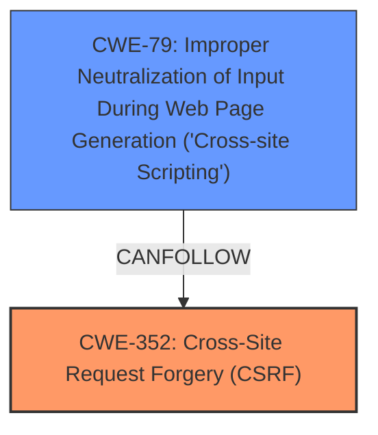

# Analysis Report for CVE-2024-38776

# Vulnerability Analysis Report: CVE-2024-38776

## Description

Cross-Site Request Forgery (CSRF) vulnerability in Martin Gibson WP GoToWebinar allows **Cross-Site Scripting** (XSS).This issue affects WP GoToWebinar from n/a through 15.7.

## Vulnerability Description Key Phrases

- **Rootcause:** lack of CSRF protection
- **Weakness:** Cross-Site Scripting
- **Impact:** cross-site scripting
- **Product:** Martin Gibson WP GoToWebinar
- **Version:** n/a through 15.7

## Analysis (with Relationship Data)

# Summary

| CWE ID  | CWE Name                                                                  | Confidence | CWE Abstraction Level | CWE Vulnerability Mapping Label | CWE-Vulnerability Mapping Notes |
|---------|---------------------------------------------------------------------------|------------|-----------------------|---------------------------------|---------------------------------|
| CWE-352 | Cross-Site Request Forgery (CSRF)                                         | 0.9        | Compound              | Primary                           | Allowed                         |
| CWE-79  | Improper Neutralization of Input During Web Page Generation ('Cross-site Scripting') | 0.9        | Base                  | Secondary                         | Allowed                         |

## Evidence and Confidence

*   **Confidence Score:** 0.9
*   **Evidence Strength:** HIGH

## Relationship Analysis
The primary relationship influencing my decision is the co-occurrence of CWE-352 [CWE-352: Cross-Site Request Forgery (CSRF)] and CWE-79 [CWE-79: Improper Neutralization of Input During Web Page Generation ('Cross-site Scripting')]. The description indicates a **lack of CSRF protection**, leading to a **Cross-Site Scripting** vulnerability. CWE-352 is a compound weakness that often allows for other vulnerabilities like XSS.



## Vulnerability Chain
The vulnerability chain starts with the **lack of CSRF protection** (CWE-352), which then allows for the injection of malicious scripts, leading to **Cross-Site Scripting** (CWE-79).
  - **Root Cause:** CWE-352 [CWE-352: Cross-Site Request Forgery (CSRF)] (**lack of CSRF protection**)
  - **Weakness:** CWE-79 [CWE-79: Improper Neutralization of Input During Web Page Generation ('Cross-site Scripting')] (**Cross-Site Scripting**)
  - **Impact:** Cross-site scripting leading to malicious script execution

## Summary of Analysis
The vulnerability description explicitly mentions a **lack of CSRF protection** leading to XSS. The CVE Reference Links Content Summary states, "The WordPress WP GoToWebinar Plugin <= 15.7 is vulnerable to Cross-Site Scripting (XSS)." The key phrase also denotes both the **lack of CSRF protection** and **Cross-Site Scripting**.

CWE-352 [CWE-352: Cross-Site Request Forgery (CSRF)] is chosen as the primary CWE because the **lack of CSRF protection** is the root cause that enables the XSS vulnerability. CWE-79 [CWE-79: Improper Neutralization of Input During Web Page Generation ('Cross-site Scripting')] is the secondary CWE because it describes the specific vulnerability that is enabled by the **lack of CSRF protection**.

The retriever results support these choices, listing CWE-352 [CWE-352: Cross-Site Request Forgery (CSRF)] and CWE-79 [CWE-79: Improper Neutralization of Input During Web Page Generation ('Cross-site Scripting')] as top candidates. The relationships identified in the graph also support the chain of events, where the **lack of CSRF protection** allows for XSS.

The selected CWEs are at the optimal level of specificity, with CWE-352 [CWE-352: Cross-Site Request Forgery (CSRF)] being a compound weakness and CWE-79 [CWE-79: Improper Neutralization of Input During Web Page Generation ('Cross-site Scripting')] being a base weakness, accurately reflecting the nature of the vulnerability.

Other CWEs Considered but Not Used:
* CWE-434 [CWE-434: Unrestricted Upload of File with Dangerous Type]: This CWE was considered due to its presence in the retriever results, but it does not align with the vulnerability description, which focuses on CSRF and XSS.
* CWE-89 [CWE-89: Improper Neutralization of Special Elements used in an SQL Command ('SQL Injection')]: This CWE was considered because it appeared in the retriever results, but there is no evidence of SQL injection in the vulnerability description.


## CWE Relationship Analysis

Current CWEs represent these abstraction levels: .


### Vulnerability Chain Analysis

**Chain starting from CWE-352:**
- 352 (Cross-Site Request Forgery (CSRF)) - ROOT


**Chain starting from CWE-79:**
- 79 (Improper Neutralization of Input During Web Page Generation ('Cross-site Scripting')) - ROOT


### CWE Relationship Diagram

```mermaid
graph TD
    classDef primary fill:#f96,stroke:#333,stroke-width:2px
    classDef secondary fill:#69f,stroke:#333
    classDef tertiary fill:#9e9,stroke:#333
```


*Report generated on 2025-07-13 10:54:03*
