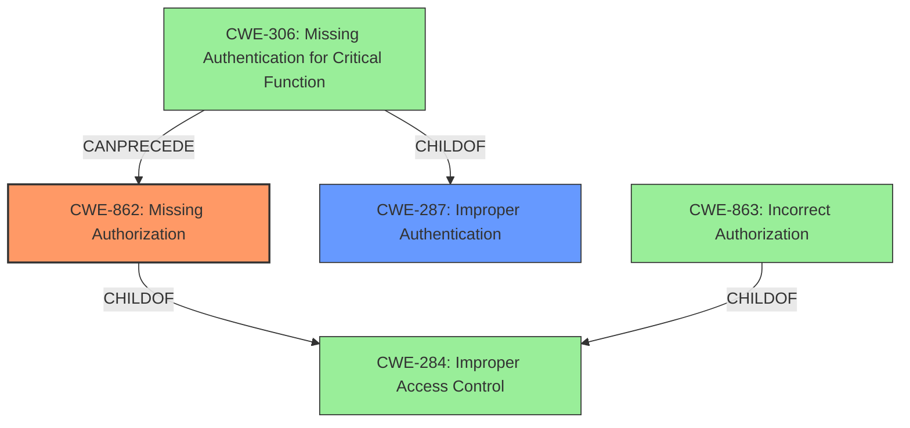

# Enhanced Analysis for CVE-2024-38810

# Summary
| CWE ID | CWE Name | Confidence | CWE Abstraction Level | CWE Vulnerability Mapping Label | CWE-Vulnerability Mapping Notes |
|---|---|---|---|---|---|
| CWE-862 | Missing Authorization | 0.9 | Class | Primary | Allowed-with-Review |
| CWE-287 | Improper Authentication | 0.5 | Class | Secondary | Discouraged |

## Evidence and Confidence

*   **Confidence Score:** 0.9
*   **Evidence Strength:** HIGH

## Relationship Analysis
The primary relationship impacting the decision is the parent-child relationship between CWE-287 (Improper Authentication) and CWE-306 (Missing Authentication for Critical Function), and the relationship between CWE-284 (Improper Access Control), CWE-862 (Missing Authorization) and CWE-863 (Incorrect Authorization). The vulnerability description explicitly mentions **Missing Authorization**, which aligns directly with CWE-862. While authentication might play a role, the core issue is the absence of authorization checks after a user is authenticated (or assumed to be). The abstraction level was considered, and CWE-862 at the Class level, is more specific than the Pillar CWE-284. The presence of the `@AuthorizeReturnObject` annotation also suggests the intent to authorize access, making CWE-862 a fitting choice.



## Vulnerability Chain
The vulnerability chain starts with a **missing authorization** check within Spring Security's `@AuthorizeReturnObject` functionality. This leads to security annotations being ineffective, allowing an attacker to potentially bypass intended security controls and gain unauthorized access to or manipulation of data.

Initial Flaw: **Missing Authorization** (CWE-862)
|
V
Impact: Security annotations ineffective, leading to potential unauthorized access.

## Summary of Analysis
The initial analysis focused on identifying the root cause of the vulnerability based on the provided description and CVE reference. The description explicitly mentions "**Missing Authorization**" which immediately points to CWE-862. The CVE reference further clarifies that method security advice is not being applied correctly, confirming the absence of proper authorization checks.

The graph relationships influenced the selection by highlighting the connection between authentication and authorization. While **Improper Authentication** (CWE-287) was considered, the evidence strongly suggests that the core issue is the lack of authorization after authentication (or assumed authentication).

The selected CWEs are at the optimal level of specificity because CWE-862 accurately reflects the **missing authorization** and the description lacks any indication of incorrect authorization logic that would make CWE-863 more appropriate. While CWE-284 (Improper Access Control) could be a high-level fit, CWE-862 is more precise.

Relevant CWE Information:

## Enhanced Context (25 CWEs)
The following CWEs were identified as potentially relevant to this vulnerability:

## CWE-668: Exposure of Resource to Wrong Sphere
**Abstraction Level**: Class
**Similarity Score**: 0.73
**Source**: dense

**Description**:
The product exposes a resource to the wrong control sphere, providing unintended actors with inappropriate access to the resource.

**Mapping Guidance**:
- Usage: Discouraged
- Rationale: CWE-668 is high-level and is often misused as a catch-all when lower-level CWE IDs might be applicable. It is sometimes used for low-information vulnerability reports [REF-1287]. It is a level-1 Class (i.e., a child of a Pillar). It is not useful for trend analysis.

*This CWE was considered but deemed less appropriate than CWE-862 as the root cause is specifically a **missing authorization** check rather than a general exposure of resources.*

## CWE-639: Authorization Bypass Through User-Controlled Key
**Abstraction Level**: Base
**Similarity Score**: 0.73
**Source**: dense

**Description**:
The system's authorization functionality does not prevent one user from gaining access to another user's data or record by modifying the key value identifying the data.

**Mapping Guidance**:
- Usage: Allowed
- Rationale: This CWE entry is at the Base level of abstraction, which is a preferred level of abstraction for mapping to the root causes of vulnerabilities.

*This CWE was considered but not selected because the vulnerability does not seem to be related to user-controlled keys. The problem is a **missing authorization** check.*

## CWE-807: Reliance on Untrusted Inputs in a Security Decision
**Abstraction Level**: Base
**Similarity Score**: 0.72
**Source**: dense

**Description**:
The product uses a protection mechanism that relies on the existence or values of an input, but the input can be modified by an untrusted actor in a way that bypasses the protection mechanism.

*This CWE was considered but rejected because the vulnerability is not directly related to reliance on untrusted inputs but on **missing authorization**.*

## CWE-41: Improper Resolution of Path Equivalence
**Abstraction Level**: Base
**Similarity Score**: 0.72
**Source**: dense

**Description**:
The product is vulnerable to file system contents disclosure through path equivalence. Path equivalence involves the use of special characters in file and directory names. The associated manipulations are intended to generate multiple names for the same object.

*This CWE was considered and rejected because the vulnerability is not related to file system path equivalence.*

## CWE-303: Incorrect Implementation of Authentication Algorithm
**Abstraction Level**: Base
**Similarity Score**: 0.72
**Source**: dense

**Description**:
The requirements for the product dictate the use of an established authentication algorithm, but the implementation of the algorithm is incorrect.

*This CWE was considered and rejected because the vulnerability is not about incorrect authentication, but about **missing authorization**.*

## CWE-472: External Control of Assumed-Immutable Web Parameter
**Abstraction Level**: Base
**Similarity Score**: 0.72
**Source**: dense

**Description**:
The web application does not sufficiently verify inputs that are assumed to be immutable but are actually externally controllable, such as hidden form fields.

*This CWE was considered and rejected as the vulnerability is not about external control of immutable parameters, but about **missing authorization**.*

## CWE-183: Permissive List of Allowed Inputs
**Abstraction Level**: Base
**Similarity Score**: 0.72
**Source**: dense

**Description**:
The product implements a protection mechanism that relies on a list of inputs (or properties of inputs) that are explicitly allowed by policy because the inputs are assumed to be safe, but the list is too permissive - that is, it allows an input that is unsafe, leading to resultant weaknesses.

*This CWE was considered and rejected as it is not related to a permissive list of allowed inputs, but to **missing authorization**.*

## CWE-1390: Weak Authentication
**Abstraction Level**: Class
**Similarity Score**: 0.72
**Source**: dense

**Description**:
The product uses an authentication mechanism to restrict access to specific users or identities, but the mechanism does not sufficiently prove that the claimed identity is correct.

*This CWE was considered but deemed less relevant because the primary issue is the **missing authorization** checks, not the weakness of the authentication mechanism itself.*

## CWE-267: Privilege Defined With Unsafe Actions
**Abstraction Level**: Base
**Similarity Score**: 0.72
**Source**: dense

**Description**:
A particular privilege, role, capability, or right can be used to perform unsafe actions that were not intended, even when it is assigned to the correct entity.

*This CWE was considered but rejected as the vulnerability is not related to privilege defined with unsafe actions, but about **missing authorization**.*

## CWE-703: Improper Check or Handling of Exceptional Conditions
**Abstraction Level**: Pillar
**Similarity Score**: 0.71
**Source**: dense

**Description**:
The product does not properly anticipate or handle exceptional conditions that rarely occur during normal operation of the product.

*This CWE was considered and rejected as the vulnerability is not related to improper handling of exceptional conditions, but about **missing authorization**.*

## CWE-863: Incorrect Authorization
**Abstraction Level**: Class
**Similarity Score**: 1434.99
**Source**: sparse


## CWE Relationship Analysis

Current CWEs represent these abstraction levels: .


### Vulnerability Chain Analysis

**Chain starting from CWE-183:**
- 183 (Permissive List of Allowed Inputs) - ROOT


**Chain starting from CWE-863:**
- 863 (Incorrect Authorization) - ROOT


### CWE Relationship Diagram

```mermaid
graph TD
    classDef primary fill:#f96,stroke:#333,stroke-width:2px
    classDef secondary fill:#69f,stroke:#333
    classDef tertiary fill:#9e9,stroke:#333
```