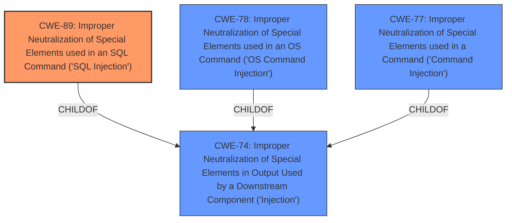

# Raw Analyzer Response for CVE-2024-38882

# Summary
| CWE ID | CWE Name | Confidence | CWE Abstraction Level | CWE Vulnerability Mapping Label | CWE-Vulnerability Mapping Notes |
|---|---|---|---|---|---|
| CWE-89 | Improper Neutralization of Special Elements used in an SQL Command ('SQL Injection') | 1.0 | Base | Primary | Allowed |
| CWE-78 | Improper Neutralization of Special Elements used in an OS Command ('OS Command Injection') | 0.8 | Base | Secondary | Allowed |
| CWE-77 | Improper Neutralization of Special Elements used in a Command ('Command Injection') | 0.7 | Base | Secondary | Allowed |
| CWE-74 | Improper Neutralization of Special Elements in Output Used by a Downstream Component ('Injection') | 0.6 | Class | Secondary | Discouraged |

## Evidence and Confidence

*   **Confidence Score:** 0.9
*   **Evidence Strength:** HIGH

## Relationship Analysis
The primary weakness is CWE-89, as the vulnerability description explicitly mentions SQL Injection. The description also mentions command line execution, which could be achieved through OS Command Injection (CWE-78) or Command Injection (CWE-77). CWE-78 and CWE-77 are children of CWE-74. CWE-74 is a high-level class, and it's generally better to use base-level CWEs like CWE-78, CWE-77, and CWE-89.

## Vulnerability Chain
The vulnerability chain starts with **improper neutralization of special elements**, leading to SQL injection. Through SQL injection, an attacker can achieve command line execution.
- **Root Cause:** **Improper neutralization of special elements** (CWE-89, CWE-78, CWE-77)
- **Impact:** Command line execution

## Summary of Analysis
The vulnerability description clearly states that the application is vulnerable to SQL Injection due to **improper neutralization of special elements**. The description also states "command line execution through SQL Injection due to **improper neutralization of special elements** used in an OS command." This suggests that exploiting the SQL Injection vulnerability allows for OS command execution, indicating a potential chain of weaknesses.

The primary CWE is CWE-89 (SQL Injection), as this is the most direct and specific weakness mentioned in the vulnerability description. The secondary CWEs (CWE-78 and CWE-77) reflect the impact of the SQL Injection, where successful exploitation leads to command line execution. CWE-74 is a more general injection CWE, and it is discouraged when more specific CWEs like CWE-78, CWE-77, and CWE-89 are available.

The selection of CWEs is based on the provided evidence and the principle of selecting the most specific CWE possible.

Relevant CWE Information:
# Enhanced Context (25 CWEs)

## CWE-89: Improper Neutralization of Special Elements used in an SQL Command ('SQL Injection')
**Abstraction Level**: base
**Similarity Score**: 3.35
**Source**: graph

**Description**:
CWE-89: Improper Neutralization of Special Elements used in an SQL Command ('SQL Injection')

**Mapping Guidance**:
- Usage: Allowed
- Rationale: This CWE entry is at the Base level of abstraction, which is a preferred level of abstraction for mapping to the root causes of vulnerabilities.

**Relationships**:
- PARENTOF -> CWE-564
- CANFOLLOW -> CWE-456
- CHILDOF -> CWE-74
- CHILDOF -> CWE-943
- PARENTOF -> CWE-89