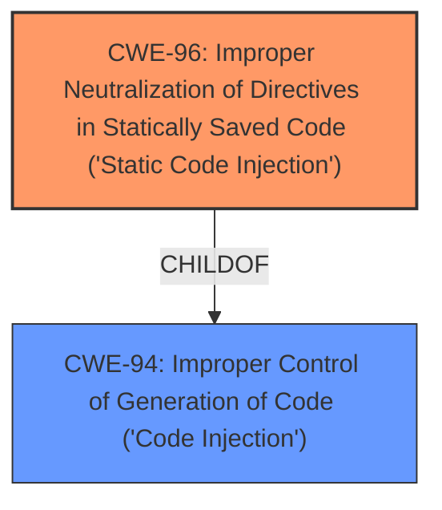

# Enhanced Analysis for CVE-2024-39028

# Summary
| CWE ID | CWE Name | Confidence | CWE Abstraction Level | CWE Vulnerability Mapping Label | CWE-Vulnerability Mapping Notes |
|---|---|---|---|---|---|
| CWE-96 | Improper Neutralization of Directives in Statically Saved Code ('Static Code Injection') | 0.9 | Base | Allowed | Primary CWE: The root cause is the **improper neutralization** of code syntax before inserting it into a statically saved code file. |
| CWE-94 | Improper Control of Generation of Code ('Code Injection') | 0.7 | Base | Allowed-with-Review | Secondary CWE: The vulnerability results in code injection due to the **improper control** over code generation. |

## Evidence and Confidence

*   **Confidence Score:** 0.8
*   **Evidence Strength:** HIGH

## Relationship Analysis
The primary weakness is CWE-96, which represents the **improper neutralization** of directives in statically saved code. CWE-94 (Improper Control of Generation of Code) is a parent of CWE-96 and represents a broader category of code injection vulnerabilities. The vulnerability involves injecting code into a statically saved file (`ping.php`), making CWE-96 the more specific and appropriate choice.



## Vulnerability Chain
The vulnerability chain starts with the **lack of sanitization** of user-supplied inputs (`weburl`, `token`). This leads to **improper neutralization** (CWE-96) when the unsanitized input is written into the `ping.php` file. This results in **remote code execution**, which is the impact of the vulnerability.

## Summary of Analysis
The analysis is based on the provided vulnerability description and CVE reference summary. The key evidence lies in the fact that the script directly concatenates user-provided parameters into a string, which is then written into a PHP file without sanitization, leading to **static code injection**. This directly matches the description of CWE-96.

The retriever results also suggest CWE-96 as a potential candidate. While other CWEs such as CWE-78 (OS Command Injection) and CWE-89 (SQL Injection) were considered, they were deemed less relevant as the vulnerability involves injecting code directly into a PHP file, rather than injecting commands into an operating system or SQL queries.

CWE-96 is the optimal level of specificity as it accurately describes the **root cause** of the vulnerability, which is the **improper neutralization** of directives in statically saved code.

Relevant CWE Information:

# Enhanced Context (25 CWEs)
The following CWEs were identified as potentially relevant to this vulnerability:

## CWE-96: Improper Neutralization of Directives in Statically Saved Code ('Static Code Injection')
**Abstraction Level**: Base
**Similarity Score**: 0.81
**Source**: dense

**Description**:
The product receives input from an upstream component, but it does not neutralize or incorrectly neutralizes code syntax before inserting the input into an executable resource, such as a library, configuration file, or template.

**Mapping Guidance**:
- Usage: Allowed
- Rationale: This CWE entry is at the Base level of abstraction, which is a preferred level of abstraction for mapping to the root causes of vulnerabilities.

## CWE-94: Improper Control of Generation of Code ('Code Injection')
**Abstraction Level**: base
**Similarity Score**: 3.30
**Source**: graph

**Description**:
CWE-94: Improper Control of Generation of Code ('Code Injection')

**Mapping Guidance**:
- Usage: Allowed-with-Review
- Rationale: This entry is frequently misused for vulnerabilities with a technical impact of "code execution," which does not by itself indicate a root cause weakness, since dozens of weaknesses can enable code execution.

**Relationships**:
- CANFOLLOW -> CWE-98
- PARENTOF -> CWE-96
- PARENTOF -> CWE-95
- PARENTOF -> CWE-1336
- CHILDOF -> CWE-913


## CWE Relationship Analysis

Current CWEs represent these abstraction levels: .


### Vulnerability Chain Analysis

**Chain starting from CWE-89:**
- 89 (Improper Neutralization of Special Elements used in an SQL Command ('SQL Injection')) - ROOT


**Chain starting from CWE-94:**
- 94 (Improper Control of Generation of Code ('Code Injection')) - ROOT


### CWE Relationship Diagram

```mermaid
graph TD
    classDef primary fill:#f96,stroke:#333,stroke-width:2px
    classDef secondary fill:#69f,stroke:#333
    classDef tertiary fill:#9e9,stroke:#333
```