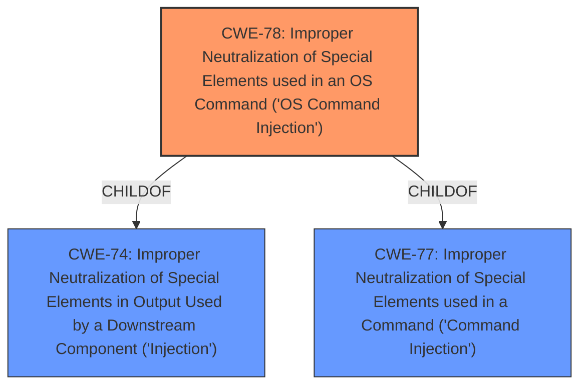

# Enhanced Analysis for CVE-2024-39209

# Summary

| CWE ID   | CWE Name                                                                                     | Confidence | CWE Abstraction Level | CWE Vulnerability Mapping Label | CWE-Vulnerability Mapping Notes |
| :--------- | :------------------------------------------------------------------------------------------- | :--------- | :---------------------- | :------------------------------ | :-------------------------------- |
| **CWE-78** | **Improper Neutralization of Special Elements used in an OS Command ('OS Command Injection')** | 1          | Base                    | Primary                         | Allowed                           |

## Evidence and Confidence

*   **Confidence Score:** 1
*   **Evidence Strength:** HIGH

## Relationship Analysis

The primary CWE is CWE-78, which is a base-level CWE. CWE-78 is a child of the class-level CWE-74 (Improper Neutralization of Special Elements in Output Used by a Downstream Component ('Injection')) and CWE-77 (Improper Neutralization of Special Elements used in a Command ('Command Injection')). No other relationships significantly influenced the selection of CWE-78.



## Vulnerability Chain

The vulnerability chain starts with the application's failure to properly neutralize special elements in user-supplied input. This leads to **command injection**, where an attacker can inject arbitrary OS commands. The ultimate impact is arbitrary code execution and potential system compromise.

## Summary of Analysis

The analysis is based on the provided vulnerability description and the CVE Reference Links Content Summary, which provides clear evidence of a **command injection** vulnerability due to improper neutralization of special elements in the `scode` parameter. The selection of CWE-78 is strongly supported by the evidence, as it accurately describes the root cause of the vulnerability.

The `scode` parameter in the `run_sms` request is vulnerable to **command injection** because the application fails to properly sanitize or validate user-supplied input before passing it to the underlying operating system.

CWE-77 was considered, but CWE-78 is more specific because the commands are OS commands. Other CWEs like CWE-89 (SQL Injection), CWE-79 (Cross-site Scripting), CWE-94 (Code Injection), and CWE-1336 (Improper Neutralization of Special Elements Used in a Template Engine) were not selected because the vulnerability is specifically related to OS command injection, not SQL queries, web page generation, general code, or template engines. CWE-74 is a class-level CWE, and more specific CWEs are preferrable.


## CWE Relationship Analysis

Current CWEs represent these abstraction levels: .


### Vulnerability Chain Analysis

**Chain starting from CWE-89:**
- 89 (Improper Neutralization of Special Elements used in an SQL Command ('SQL Injection')) - ROOT


**Chain starting from CWE-94:**
- 94 (Improper Control of Generation of Code ('Code Injection')) - ROOT


### CWE Relationship Diagram

```mermaid
graph TD
    classDef primary fill:#f96,stroke:#333,stroke-width:2px
    classDef secondary fill:#69f,stroke:#333
    classDef tertiary fill:#9e9,stroke:#333
```