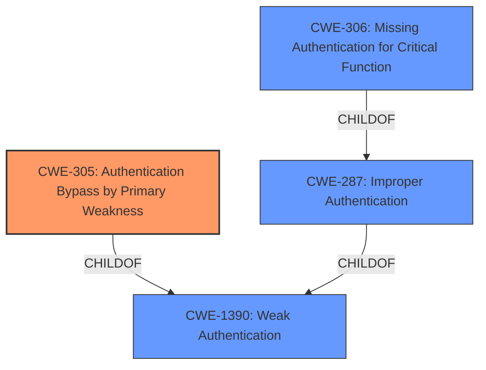

# Analysis Report for CVE-2024-39223

# Vulnerability Analysis Report: CVE-2024-39223

## Description

An **authentication bypass** in the SSH service of gost v2.11.5 allows attackers to intercept communications via setting the HostKeyCallback function to ssh.InsecureIgnoreHostKey

## Vulnerability Description Key Phrases

- **Rootcause:** authentication bypass
- **Impact:** intercept communications
- **Vector:** setting HostKeyCallback function
- **Attacker:** attackers
- **Product:** gost
- **Version:** 2.11.5
- **Component:** SSH service

## Analysis (with Relationship Data)

# Summary
| CWE ID | CWE Name | Confidence | CWE Abstraction Level | CWE Vulnerability Mapping Label | CWE-Vulnerability Mapping Notes |
|---|---|---|---|---|---|
| CWE-305 | Authentication Bypass by Primary Weakness | 1.0 | Base | Allowed | Primary CWE |
| CWE-306 | Missing Authentication for Critical Function | 0.8 | Base | Allowed | Secondary Candidate |
| CWE-287 | Improper Authentication | 0.6 | Class | Discouraged | Secondary Candidate |
| CWE-1390 | Weak Authentication | 0.5 | Class | Allowed-with-Review | Secondary Candidate |

## Evidence and Confidence

*   **Confidence Score:** 0.9
*   **Evidence Strength:** HIGH

## Relationship Analysis
The primary CWE is CWE-305, which is a Base level CWE indicating a direct authentication bypass due to another weakness. Several other CWEs were considered, particularly those related to authentication and weak security practices. CWE-306 was considered because the HostKeyCallback was set to ssh.InsecureIgnoreHostKey which is a **missing authentication** for the SSH connection. The relationships between CWEs, especially the parent-child and chain relationships involving authentication bypass and weak authentication, helped refine the selection towards the most specific and accurate representation of the vulnerability.



## Vulnerability Chain
The vulnerability chain starts with the **insecure configuration** of the `HostKeyCallback` function, which leads to **missing host key verification**. This **missing verification** directly results in an **authentication bypass**, enabling man-in-the-middle attacks, data theft, and unauthorized access. The chain highlights how a single configuration error can compromise the entire security posture of the SSH connection.

## Summary of Analysis
The analysis is heavily based on the provided evidence, particularly the "CVE Reference Links Content Summary" which clearly states that the root cause is the insecure configuration of the SSH client, specifically the `HostKeyCallback` being set to `ssh.InsecureIgnoreHostKey()`. This directly leads to **missing host key verification**, which is the **primary weakness** that allows the authentication bypass. The evidence also mentions that "The gist identifies this as CWE-305, which refers to Authentication Bypass by Primary Weakness."

The selection of CWE-305 as the primary CWE is justified because it accurately represents the vulnerability where the primary weakness of skipping host key verification directly leads to the ability to bypass authentication. The other CWEs were considered but ultimately deemed less specific or less representative of the core issue.

Relevant CWE Information:

# Enhanced Context (25 CWEs)
The following CWEs were identified as potentially relevant to this vulnerability:

## CWE-1391: Use of Weak Credentials
**Abstraction Level**: Class
**Similarity Score**: 0.76
**Source**: dense

**Description**:
The product uses weak credentials (such as a default key or hard-coded password) that can be calculated, derived, reused, or guessed by an attacker.

**Mapping Guidance**:
- Usage: Allowed-with-Review
- Rationale: This CWE entry is a Class and might have Base-level children that would be more appropriate

*Not Used:* This CWE is not appropriate as the vulnerability is not related to the use of weak credentials but rather to the **missing host key verification**.

## CWE-305: Authentication Bypass by Primary Weakness
**Abstraction Level**: Base
**Similarity Score**: 0.75
**Source**: dense

**Description**:
The authentication algorithm is sound, but the implemented mechanism can be bypassed as the result of a separate weakness that is primary to the authentication error.

**Mapping Guidance**:
- Usage: Allowed
- Rationale: This CWE entry is at the Base level of abstraction, which is a preferred level of abstraction for mapping to the root causes of vulnerabilities.

*Used:* This is the primary CWE. The `HostKeyCallback` being set to `ssh.InsecureIgnoreHostKey()` is the "separate weakness" allowing the **authentication bypass**.

## CWE-1390: Weak Authentication
**Abstraction Level**: Class
**Similarity Score**: 0.75
**Source**: dense

**Description**:
The product uses an authentication mechanism to restrict access to specific users or identities, but the mechanism does not sufficiently prove that the claimed identity is correct.

**Mapping Guidance**:
- Usage: Allowed-with-Review
- Rationale: This CWE entry is a Class and might have Base-level children that would be more appropriate

*Not Used as Primary:* While related, this is a more general description. The **missing host key verification** is the root cause, making CWE-305 more accurate.

## CWE-303: Incorrect Implementation of Authentication Algorithm
**Abstraction Level**: Base
**Similarity Score**: 0.75
**Source**: dense

**Description**:
The requirements for the product dictate the use of an established authentication algorithm, but the implementation of the algorithm is incorrect.

**Mapping Guidance**:
- Usage: Allowed
- Rationale: This CWE entry is at the Base level of abstraction, which is a preferred level of abstraction for mapping to the root causes of vulnerabilities.

*Not Used:* The vulnerability is not due to the incorrect implementation of an authentication algorithm but rather due to the **missing host key verification**.

## CWE-288: Authentication Bypass Using an Alternate Path or Channel
**Abstraction Level**: Base
**Similarity Score**: 0.75
**Source**: dense

**Description**:
The product requires authentication, but the product has an alternate path or channel that does not require authentication.

**Mapping Guidance**:
- Usage: Allowed
- Rationale: This CWE entry is at the Base level of abstraction, which is a preferred level of abstraction for mapping to the root causes of vulnerabilities.

*Not Used:* The vulnerability does not involve an alternate path or channel but rather the **missing host key verification**.

## CWE-212: Improper Removal of Sensitive Information Before Storage or Transfer
**Abstraction Level**: Base
**Similarity Score**: 0.74
**Source**: dense

**Description**:
The product stores, transfers, or shares a resource that contains sensitive information, but it does not properly remove that information before the product makes the resource available to unauthorized actors.

**Mapping Guidance**:
- Usage: Allowed
- Rationale: This CWE entry is at the Base level of abstraction, which is a preferred level of abstraction for mapping to the root causes of vulnerabilities.

*Not Used:* This CWE is not relevant as the vulnerability is not related to the removal of sensitive information.

## CWE-41: Improper Resolution of Path Equivalence
**Abstraction Level**: Base
**Similarity Score**: 0.74
**Source**: dense

**Description**:
The product is vulnerable to file system contents disclosure through path equivalence. Path equivalence involves the use of special characters in file and directory names. The associated manipulations are intended to generate multiple names for the same object.

**Mapping Guidance**:
- Usage: Allowed
- Rationale: This CWE entry is at the Base level of abstraction, which is a preferred level of abstraction for mapping to the root causes of vulnerabilities.

*Not Used:* This CWE is not relevant as the vulnerability is not related to file system path equivalence.

## CWE-330: Use of Insufficiently Random Values
**Abstraction Level**: Class
**Similarity Score**: 0.74
**Source**: dense

**Description**:
The product uses insufficiently random numbers or values in a security context that depends on unpredictable numbers.

**Mapping Guidance**:
- Usage: Discouraged
- Rationale: This CWE entry is a level-1 Class (i.e., a child of a Pillar). It might have lower-level children that would be more appropriate

*Not Used:* The vulnerability is not related to the use of insufficiently random values.

## CWE-290: Authentication Bypass by Spoofing
**Abstraction Level**: Base
**Similarity Score**: 0.73
**Source**: dense

**Description**:
This attack-focused weakness is caused by incorrectly implemented authentication schemes that are subject to spoofing attacks.

**Mapping Guidance**:
- Usage: Allowed
- Rationale: This CWE entry is at the Base level of abstraction, which is a preferred level of abstraction for mapping to the root causes of vulnerabilities.

*Not Used:* While the vulnerability allows for spoofing, the root cause is the **missing host key verification**.

## CWE-345: Insufficient Verification of Data Authenticity
**Abstraction Level


## CWE Relationship Analysis

Current CWEs represent these abstraction levels: .


### Vulnerability Chain Analysis

**Chain starting from CWE-1390:**
- 1390 (Weak Authentication) - ROOT


**Chain starting from CWE-288:**
- 288 (Authentication Bypass Using an Alternate Path or Channel) - ROOT


### CWE Relationship Diagram

```mermaid
graph TD
    classDef primary fill:#f96,stroke:#333,stroke-width:2px
    classDef secondary fill:#69f,stroke:#333
    classDef tertiary fill:#9e9,stroke:#333
```


*Report generated on 2025-07-13 11:08:28*
