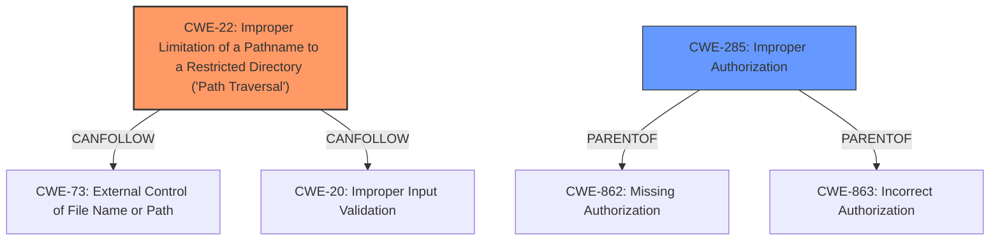

# Analysis Report for CVE-2024-39227

# Vulnerability Analysis Report: CVE-2024-39227

## Description

GL-iNet products AR750/AR750S/AR300M/AR300M16/MT300N-V2/B1300/MT1300/SFT1200/X750 v4.3.11, MT3000/MT2500/AXT1800/AX1800/A1300/X300B v4.5.16, XE300 v4.3.16, E750 v4.3.12, AP1300/S1300 v4.3.13, and XE3000/X3000 v4.4 were discovered to contain **insecure permissions** in the endpoint /cgi-bin/glc. This vulnerability allows unauthenticated attackers to execute arbitrary code or possibly a **directory traversal** via crafted JSON data.

## Vulnerability Description Key Phrases

- **Rootcause:** insecure permissions
- **Weakness:** directory traversal
- **Impact:** execute arbitrary code
- **Vector:** crafted JSON data
- **Attacker:** unauthenticated attackers
- **Product:** GL-iNet products
- **Version:** ["['v4.3.11'", "'v4.5.16'", "'v4.3.16'", "'v4.3.12'", "'v4.3.13'", "'v4.4']"]
- **Component:** /cgi-bin/glc endpoint

## Analysis (with Relationship Data)

# Summary
| CWE ID | CWE Name | Confidence | CWE Abstraction Level | CWE Vulnerability Mapping Label | CWE-Vulnerability Mapping Notes |
|---|---|---|---|---|---|
| CWE-22 | Improper Limitation of a Pathname to a Restricted Directory ('Path Traversal') | 1.0 | Base | Primary | Allowed |
| CWE-285 | Improper Authorization | 0.6 | Class | Secondary | Discouraged |

## Evidence and Confidence

*   **Confidence Score:** 0.8
*   **Evidence Strength:** HIGH

## Relationship Analysis
The primary CWE, CWE-22, is a Base level CWE and a child of CWE-119 (Improper Restriction of Operations within the Bounds of a Memory Buffer). It also has a CANFOLLOW relationship with CWE-73 (External Control of File Name or Path) and CWE-20 (Improper Input Validation).
CWE-285 is a class level CWE and is a parent of CWE-862 (Missing Authorization) and CWE-863 (Incorrect Authorization).



## Vulnerability Chain
The vulnerability chain starts with **insecure permissions**, leading to a **directory traversal** vulnerability, and ultimately resulting in the ability to execute arbitrary code.
1.  **Insecure Permissions**: The /cgi-bin/glc endpoint has **insecure permissions**.
2.  **Path Traversal**: The `glc` binary does not properly sanitize the JSON data, allowing path traversal sequences.
3.  **Arbitrary Code Execution**: Exploitation of the path traversal vulnerability can lead to arbitrary code execution.

## Summary of Analysis
The primary weakness is CWE-22 (Improper Limitation of a Pathname to a Restricted Directory ('Path Traversal')). The vulnerability description explicitly mentions "directory traversal", and the CVE reference summary confirms that the `glc` binary does not properly sanitize the JSON data, allowing path traversal sequences.
The secondary weakness is CWE-285 (Improper Authorization). The vulnerability description mentions "**insecure permissions** in the endpoint /cgi-bin/glc" which indicates an authorization issue. The "Privileges vs Permissions Guidance" section suggests CWE-285 when "Permissions are improperly checked" but this is a class level CWE and is discouraged.
The retriever results listed several other CWEs, but they were not as strong a match as CWE-22. For example, CWE-78 (Improper Neutralization of Special Elements used in an OS Command ('OS Command Injection')) was considered but the vulnerability is specifically related to path traversal rather than OS command injection.

Relevant CWE Information:

# Enhanced Context (25 CWEs)
The following CWEs were identified as potentially relevant to this vulnerability:

## CWE-41: Improper Resolution of Path Equivalence
**Abstraction Level**: Base
**Similarity Score**: 0.80
**Source**: dense

**Description**:
The product is vulnerable to file system contents disclosure through path equivalence. Path equivalence involves the use of special characters in file and directory names. The associated manipulations are intended to generate multiple names for the same object.

**Mapping Guidance**:
- Usage: Allowed
- Rationale: This CWE entry is at the Base level of abstraction, which is a preferred level of abstraction for mapping to the root causes of vulnerabilities.

## CWE-280: Improper Handling of Insufficient Permissions or Privileges 
**Abstraction Level**: Base
**Similarity Score**: 0.79
**Source**: dense

**Description**:
The product does not handle or incorrectly handles when it has insufficient privileges to access resources or functionality as specified by their permissions. This may cause it to follow unexpected code paths that may leave the product in an invalid state.

**Mapping Guidance**:
- Usage: Allowed
- Rationale: This CWE entry is at the Base level of abstraction, which is a preferred level of abstraction for mapping to the root causes of vulnerabilities.

## CWE-267: Privilege Defined With Unsafe Actions
**Abstraction Level**: Base
**Similarity Score**: 0.79
**Source**: dense

**Description**:
A particular privilege, role, capability, or right can be used to perform unsafe actions that were not intended, even when it is assigned to the correct entity.

**Mapping Guidance**:
- Usage: Allowed
- Rationale: This CWE entry is at the Base level of abstraction, which is a preferred level of abstraction for mapping to the root causes of vulnerabilities.

## CWE-266: Incorrect Privilege Assignment
**Abstraction Level**: Base
**Similarity Score**: 0.78
**Source**: dense

**Description**:
A product incorrectly assigns a privilege to a particular actor, creating an unintended sphere of control for that actor.

**Mapping Guidance**:
- Usage: Allowed
- Rationale: This CWE entry is at the Base level of abstraction, which is a preferred level of abstraction for mapping to the root causes of vulnerabilities.

## CWE-23: Relative Path Traversal
**Abstraction Level**: Base
**Similarity Score**: 0.78
**Source**: dense

**Description**:
The product uses external input to construct a pathname that should be within a restricted directory, but it does not properly neutralize sequences such as ".." that can resolve to a location that is outside of that directory.

**Mapping Guidance**:
- Usage: Allowed
- Rationale: This CWE entry is at the Base level of abstraction, which is a preferred level of abstraction for mapping to the root causes of vulnerabilities.

## CWE-668: Exposure of Resource to Wrong Sphere
**Abstraction Level**: Class
**Similarity Score**: 0.78
**Source**: dense

**Description**:
The product exposes a resource to the wrong control sphere, providing unintended actors with inappropriate access to the resource.

**Mapping Guidance**:
- Usage: Discouraged
- Rationale: CWE-668 is high-level and is often misused as a catch-all when lower-level CWE IDs might be applicable. It is sometimes used for low-information vulnerability reports [REF-1287]. It is a level-1 Class (i.e., a child of a Pillar). It is not useful for trend analysis.

## CWE-274: Improper Handling of Insufficient Privileges
**Abstraction Level**: Base
**Similarity Score**: 0.78
**Source**: dense

**Description**:
The product does not handle or incorrectly handles when it has insufficient privileges to perform an operation, leading to resultant weaknesses.

**Mapping Guidance**:
- Usage: Discouraged
- Rationale: This CWE entry could be deprecated in a future version of CWE.

## CWE-425: Direct Request ('Forced Browsing')
**Abstraction Level**: Base
**Similarity Score**: 0.78
**Source**: dense

**Description**:
The web application does not adequately enforce appropriate authorization on all restricted URLs, scripts, or files.

**Mapping Guidance**:
- Usage: Allowed
- Rationale: This CWE entry is at the Base level of abstraction, which is a preferred level of abstraction for mapping to the root causes of vulnerabilities.

## CWE-73: External Control of File Name or Path
**Abstraction Level**: Base
**Similarity Score**: 0.78
**Source**: dense

**Description**:
The product allows user input to control or influence paths or file names that are used in filesystem operations.

**Mapping Guidance**:
- Usage: Allowed
- Rationale: This CWE entry is at the Base level of abstraction, which is a preferred level of abstraction for mapping to the root causes of vulnerabilities.

## CWE-212: Improper Removal of Sensitive Information Before Storage or Transfer
**Abstraction Level**: Base
**Similarity Score**: 0.77
**Source**: dense

**Description**:
The product stores, transfers, or shares a resource that contains sensitive information, but it does not properly remove that information before the product makes the resource available to unauthorized actors.

**Mapping Guidance**:
- Usage: Allowed
- Rationale: This CWE entry is at the Base level of abstraction, which is a preferred level of abstraction for mapping to the root causes of vulnerabilities.

## CWE-863: Incorrect Authorization
**Abstraction Level**: Class
**Similarity Score**: 1500.80
**Source**: sparse

**Description**:
The product performs an authorization check when an actor attempts to access a resource or perform an action, but it does not correctly perform the check.


## CWE Relationship Analysis

Current CWEs represent these abstraction levels: .


### Vulnerability Chain Analysis

**Chain starting from CWE-274:**
- 274 (Improper Handling of Insufficient Privileges) - ROOT


**Chain starting from CWE-863:**
- 863 (Incorrect Authorization) - ROOT


### CWE Relationship Diagram

```mermaid
graph TD
    classDef primary fill:#f96,stroke:#333,stroke-width:2px
    classDef secondary fill:#69f,stroke:#333
    classDef tertiary fill:#9e9,stroke:#333
```


*Report generated on 2025-07-13 11:09:07*
