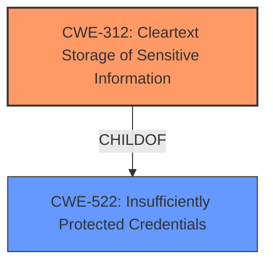

# Enhanced Analysis for CVE-2024-39278

# Summary
| CWE ID | CWE Name | Confidence | CWE Abstraction Level | CWE Vulnerability Mapping Label | CWE-Vulnerability Mapping Notes |
|---|---|---|---|---|---|
| CWE-312 | Cleartext Storage of Sensitive Information | 1.0 | Base | Allowed | Primary CWE: The credentials are stored **unencrypted** in flash memory. |
| CWE-522 | Insufficiently Protected Credentials | 0.7 | Class | Allowed-with-Review | Secondary: The credentials are not sufficiently protected, leading to potential unauthorized access. |

## Evidence and Confidence

*   **Confidence Score:** 0.9
*   **Evidence Strength:** HIGH

## Relationship Analysis
The primary relationship impacting the decision is the parent-child relationship between CWE-522 (Class) and CWE-312 (Base). CWE-312 is a more specific form of CWE-522, as the credentials are not just insufficiently protected, but stored in cleartext.



## Vulnerability Chain
The vulnerability chain consists of:
1.  Root Cause: **Unencrypted storage** of credentials in flash memory (CWE-312).
2.  Impact: Read-only access to network and terminal configuration data.

## Summary of Analysis
The initial analysis, based on the vulnerability description, points to **unencrypted storage** of sensitive information. This aligns with CWE-312 (Cleartext Storage of Sensitive Information). The CVE Reference Links Content Summary reinforces this by explicitly stating that the root cause is the storage of credentials in an **unencrypted** manner. It also mentions CWE-522, which is a broader category.

The graph relationships highlight that CWE-312 is a child of CWE-522, making it a more specific and appropriate choice.

The decision to use CWE-312 is strongly supported by the evidence: "Credentials to access device configuration information stored **unencrypted** in flash memory." This directly matches the description of CWE-312.

CWE-522 is considered a secondary weakness, as it represents the broader category of insufficiently protected credentials, while CWE-312 pinpoints the specific issue of cleartext storage.

Other CWEs considered but not used:

*   CWE-256 (Plaintext Storage of a Password): While similar, the vulnerability description refers to credentials in general, not specifically passwords.
*   CWE-311 (Missing Encryption of Sensitive Data): This is a higher-level class, and CWE-312 is more specific. Also, the summary mapped CWE-311 to another CVE.
*   CWE-798 (Use of Hard-coded Credentials): This CWE is not applicable as the credentials aren't explicitly stated as hard-coded.
*   CWE-257 (Storing Passwords in a Recoverable Format): This CWE is not applicable as it focuses on recoverable formats, not cleartext storage.


## CWE Relationship Analysis

Current CWEs represent these abstraction levels: .


### Vulnerability Chain Analysis

**Chain starting from CWE-257:**
- 257 (Storing Passwords in a Recoverable Format) - ROOT


**Chain starting from CWE-256:**
- 256 (Plaintext Storage of a Password) - ROOT


### CWE Relationship Diagram

```mermaid
graph TD
    classDef primary fill:#f96,stroke:#333,stroke-width:2px
    classDef secondary fill:#69f,stroke:#333
    classDef tertiary fill:#9e9,stroke:#333
```