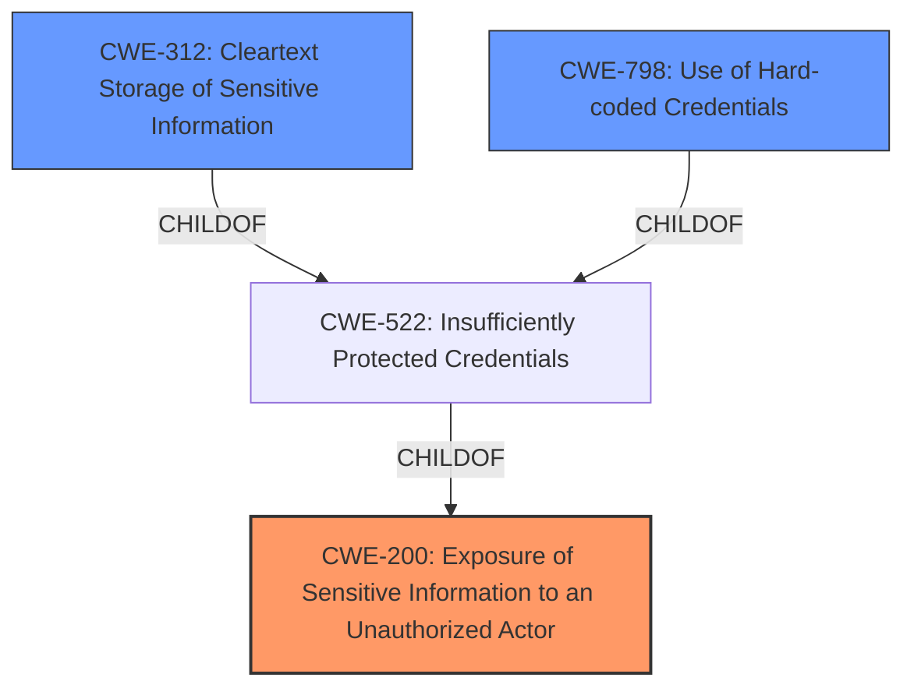

# Analysis Report for CVE-2024-39287

# Vulnerability Analysis Report: CVE-2024-39287

## Description

Dorsett Controls Central Server update server has potential **information leaks** with an unprotected file that contains passwords and API keys.

## Vulnerability Description Key Phrases

- **Weakness:** information leaks
- **Vector:** unprotected file
- **Product:** Dorsett Controls Central Server
- **Version:** update server

## Analysis (with Relationship Data)

# Summary

| CWE ID | CWE Name | Confidence | CWE Abstraction Level | CWE Vulnerability Mapping Label | CWE-Vulnerability Mapping Notes |
|---|---|---|---|---|---|
| CWE-200 | Exposure of Sensitive Information to an Unauthorized Actor | 1.0 | Class | Primary CWE | Allowed, The vulnerability is due to an unprotected file containing passwords and API keys, leading to potential **information leaks**. |
| CWE-312 | Cleartext Storage of Sensitive Information | 0.75 | Base | Secondary Candidate | Allowed, The passwords and API keys being stored in an unprotected file suggests they are stored in cleartext. |
| CWE-798 | Use of Hard-coded Credentials | 0.60 | Base | Secondary Candidate | Allowed, The unprotected file contains passwords and API keys, which could potentially be hard-coded credentials. |

## Evidence and Confidence

*   **Confidence Score:** 0.90
*   **Evidence Strength:** HIGH

## Relationship Analysis

The primary CWE, CWE-200 [Exposure of Sensitive Information to an Unauthorized Actor], is a class-level CWE. The analysis also considered more specific, base-level CWEs like CWE-312 [Cleartext Storage of Sensitive Information] and CWE-798 [Use of Hard-coded Credentials]. CWE-200 is chosen as primary since the key issue is the exposure, regardless of the storage method. CWE-312 and CWE-798 are secondary candidates because the file containing passwords and API keys is unprotected and may be stored in cleartext, or be hardcoded.



## Vulnerability Chain

The vulnerability chain starts with the **unprotected file** which contains passwords and API keys, leading to the **exposure of sensitive information**.

`Unprotected File` -> `CWE-200: Exposure of Sensitive Information to an Unauthorized Actor`

## Summary of Analysis

The primary assessment is based on the evidence provided in the vulnerability description and the CVE Reference Links Content Summary, which explicitly states that the Dorsett Controls Central Server update server has potential **information leaks** due to an **unprotected file** that contains passwords and API keys.

> "Dorsett Controls Central Server update server has potential **information leaks** with an **unprotected file** that contains passwords and API keys."

The retriever results also support this, with CWE-200 [Exposure of Sensitive Information to an Unauthorized Actor] being the top result. The graph relationships show that CWE-200 [Exposure of Sensitive Information to an Unauthorized Actor] is a parent of CWE-522 [Insufficiently Protected Credentials], which in turn has children CWE-312 [Cleartext Storage of Sensitive Information] and CWE-798 [Use of Hard-coded Credentials].

CWE-200 [Exposure of Sensitive Information to an Unauthorized Actor] is selected as the primary CWE because it directly addresses the **information leak** resulting from the **unprotected file**. While CWE-312 [Cleartext Storage of Sensitive Information] and CWE-798 [Use of Hard-coded Credentials] may be contributing factors, the core issue is the exposure itself.

CWE-311 [Missing Encryption of Sensitive Data], CWE-497 [Exposure of Sensitive System Information to an Unauthorized Control Sphere], CWE-538 [Insertion of Sensitive Information into Externally-Accessible File or Directory], CWE-1391 [Use of Weak Credentials], CWE-319 [Cleartext Transmission of Sensitive Information], CWE-212 [Improper Removal of Sensitive Information Before Storage or Transfer], CWE-303 [Incorrect Implementation of Authentication Algorithm], CWE-522 [Insufficiently Protected Credentials], CWE-327 [Use of a Broken or Risky Cryptographic Algorithm], CWE-22 [Improper Limitation of a Pathname to a Restricted Directory ('Path Traversal')], CWE-173 [Improper Handling of Alternate Encoding], CWE-347 [Improper Verification of Cryptographic Signature], CWE-611 [Improper Restriction of XML External Entity Reference], CWE-201 [Insertion of Sensitive Information Into Sent Data], CWE-208 [Observable Timing Discrepancy], CWE-226 [Sensitive Information in Resource Not Removed Before Reuse], CWE-1272 [Sensitive Information Uncleared Before Debug/Power State Transition], CWE-611 [Improper Restriction of XML External Entity Reference], CWE-209 [Generation of Error Message Containing Sensitive Information], CWE-256 [Plaintext Storage of a Password], CWE-22 [Improper Limitation of a Pathname to a Restricted Directory ('Path Traversal')] were considered but not used because the root cause is simply that the file was unprotected allowing unauthorized access to sensitive information.


## CWE Relationship Analysis

Current CWEs represent these abstraction levels: .


### Vulnerability Chain Analysis

**Chain starting from CWE-611:**
- 611 (Improper Restriction of XML External Entity Reference) - ROOT


**Chain starting from CWE-173:**
- 173 (Improper Handling of Alternate Encoding) - ROOT


### CWE Relationship Diagram

```mermaid
graph TD
    classDef primary fill:#f96,stroke:#333,stroke-width:2px
    classDef secondary fill:#69f,stroke:#333
    classDef tertiary fill:#9e9,stroke:#333
```


*Report generated on 2025-07-13 11:10:55*
