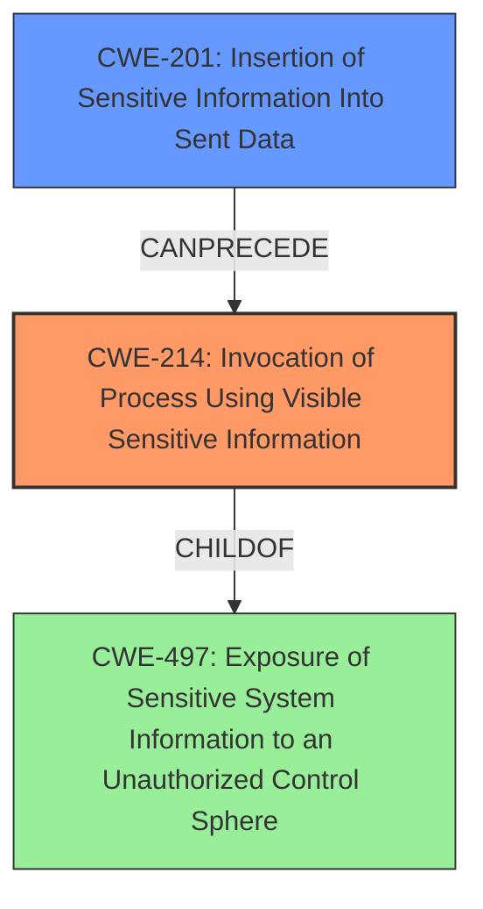

# Enhanced Analysis for CVE-2024-39314

# Summary

| CWE ID | CWE Name | Confidence | CWE Abstraction Level | CWE Vulnerability Mapping Label | CWE-Vulnerability Mapping Notes |
|---|---|---|---|---|---|
| CWE-214 | Invocation of Process Using Visible Sensitive Information | 1.0 | Base | Allowed | Primary CWE. The **administrative password was leaked** through the command line parameter. |
| CWE-201 | Insertion of Sensitive Information Into Sent Data | 0.7 | Base | Allowed | Secondary CWE. The administrative token (bearer token) was being passed as a command-line parameter. |

## Evidence and Confidence

*   **Confidence Score:** 1.0
*   **Evidence Strength:** HIGH

## Relationship Analysis

The primary CWE is CWE-214, which represents the **invocation of a process using visible sensitive information**. CWE-201 is a secondary CWE because the sensitive information (the administrative password) was inserted into data that was sent (in this case, the command-line arguments). CWE-214 is a child of CWE-497 (Exposure of Sensitive System Information to an Unauthorized Control Sphere), reflecting that the vulnerability exposes system-level information. CWE-201 can precede CWE-226 (Sensitive Information in Resource Not Removed Before Reuse) or CWE-212 (Improper Removal of Sensitive Information Before Storage or Transfer), indicating that the exposed data might later be stored or transferred insecurely.



## Vulnerability Chain

The vulnerability chain starts with the **leakage of the administrative password** by passing it as a command-line parameter (CWE-214). This leads to the **insertion of sensitive information into sent data** (CWE-201) because the password becomes visible in the command-line arguments. The exposure can then lead to a confidentiality breach.

## Summary of Analysis

The analysis is based on the vulnerability description stating the **administrative password was leaked** through the command line parameter, and the CVE reference links content summary, which identifies the root cause as passing the administrative token as a command-line parameter, thus exposing it to local users.
The primary CWE, CWE-214, is the most specific and relevant because it accurately describes how the sensitive information was exposed. CWE-201 is included as a secondary CWE to further clarify that the sensitive information was included in data that was sent (the command-line arguments).
Other CWEs like CWE-287 (Improper Authentication) and CWE-863 (Incorrect Authorization) were considered but not selected because they describe authorization and authentication issues, which are consequences of the vulnerability being exploited, but do not accurately describe the root cause of the **password** being **leaked** via command line.
The selected CWEs are at the optimal level of specificity because they provide a clear and accurate description of the vulnerability based on the evidence provided.


## CWE Relationship Analysis

Current CWEs represent these abstraction levels: .


### Vulnerability Chain Analysis

**Chain starting from CWE-863:**
- 863 (Incorrect Authorization) - ROOT


**Chain starting from CWE-226:**
- 226 (Sensitive Information in Resource Not Removed Before Reuse) - ROOT


### CWE Relationship Diagram

```mermaid
graph TD
    classDef primary fill:#f96,stroke:#333,stroke-width:2px
    classDef secondary fill:#69f,stroke:#333
    classDef tertiary fill:#9e9,stroke:#333
```