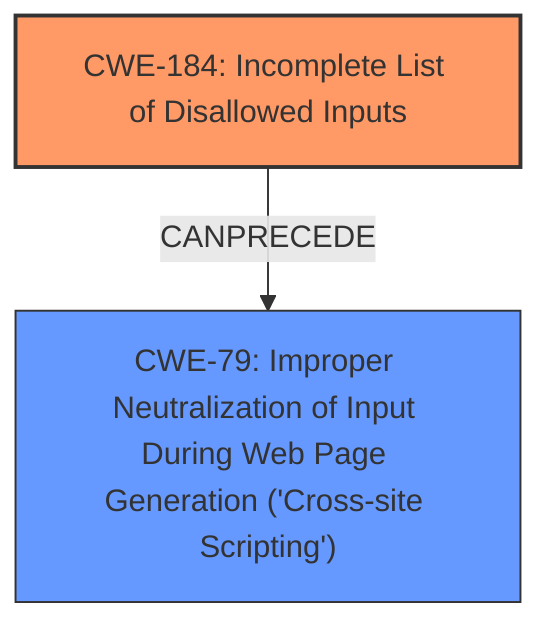

# Raw Analyzer Response for CVE-2024-39320

# Summary
| CWE ID | CWE Name | Confidence | CWE Abstraction Level | CWE Vulnerability Mapping Label | CWE-Vulnerability Mapping Notes |
|---|---|---|---|---|---|
| CWE-184 | Incomplete List of Disallowed Inputs | 0.8 | Base | Allowed | Primary CWE |
| CWE-79 | Improper Neutralization of Input During Web Page Generation ('Cross-site Scripting') | 0.6 | Base | Allowed | Secondary Candidate |

## Evidence and Confidence

*   **Confidence Score:** 0.7
*   **Evidence Strength:** MEDIUM

## Relationship Analysis
The primary weakness is **CWE-184: Incomplete List of Disallowed Inputs**. This weakness occurs because the `allowed_iframes` setting does not enforce strict URL formatting, specifically the presence of a trailing slash. This leads to bypasses where attackers can inject iframes from unintended domains. **CWE-79: Improper Neutralization of Input During Web Page Generation ('Cross-site Scripting')** is a potential secondary weakness if the injected iframes contain malicious scripts.

## Vulnerability Chain
1.  **Root Cause:** **CWE-184: Incomplete List of Disallowed Inputs** - The `allowed_iframes` setting in Discourse does not properly validate or enforce the format of URLs, specifically the requirement of a trailing slash.
2.  **Weakness:** The application **fails to properly neutralize input** when constructing the list of allowed iframe sources.
3.  **Impact:** Attackers can inject iframes from arbitrary domains. This could potentially lead to **CWE-79: Improper Neutralization of Input During Web Page Generation ('Cross-site Scripting')** or other malicious activities if the injected content is not properly handled by the application after injection.

## Summary of Analysis
The primary weakness is **CWE-184: Incomplete List of Disallowed Inputs**. The CVE description clearly states that the vulnerability arises from the **lack of enforcement** of a strict URL format in the `allowed_iframes` setting: "It was discovered that the application **did not enforce a strict format for URLs** listed in this setting, specifically not requiring a trailing slash in the URL. This **lack of enforcement allowed an attacker to bypass the intended restrictions**". This aligns perfectly with the definition of CWE-184, where a protection mechanism relies on a list of inputs, but the list is incomplete.

I considered **CWE-79: Improper Neutralization of Input During Web Page Generation ('Cross-site Scripting')** as a potential primary weakness, since the **impact** listed in the CVE description is that "An attacker could inject iframes from arbitrary domains, which could potentially lead to various malicious activities, such as phishing, cross-site scripting (XSS), or other forms of attacks, by embedding malicious content within iframes." However, CWE-79 is more about the **output** stage where the application fails to neutralize user-controllable input when generating a web page. In this case, the **root cause** is that the application is failing to properly validate the *input* it receives for the `allowed_iframes` setting, which is **CWE-184**. The resulting injection of iframes *could* lead to XSS (CWE-79), but that's a *secondary* consequence, not the primary weakness.

The retriever results suggested **CWE-79** and **CWE-352: Cross-Site Request Forgery (CSRF)**, but these are not the primary causes of the vulnerability. The root cause is the **incomplete list of disallowed inputs** (CWE-184) in the `allowed_iframes` setting. The relationship data shows that CWE-184 can precede CWE-79, supporting the idea that the incomplete list is the root cause, and XSS is a potential consequence.

I also considered **CWE-472: External Control of Assumed-Immutable Web Parameter** since the `allowed_iframes` setting could be considered an "assumed-immutable web parameter". However, CWE-472 applies when an application doesn't sufficiently verify inputs that are *assumed* to be immutable but are externally controllable. In this case, the problem isn't that the parameter is assumed to be immutable, but that the *validation of the input itself is incomplete*, making **CWE-184** a more accurate fit.

Based on the evidence and the relationship analysis, **CWE-184** is the most appropriate primary CWE at the Base level of abstraction because it accurately describes the **root cause of the vulnerability**: the **incomplete list of disallowed inputs**.