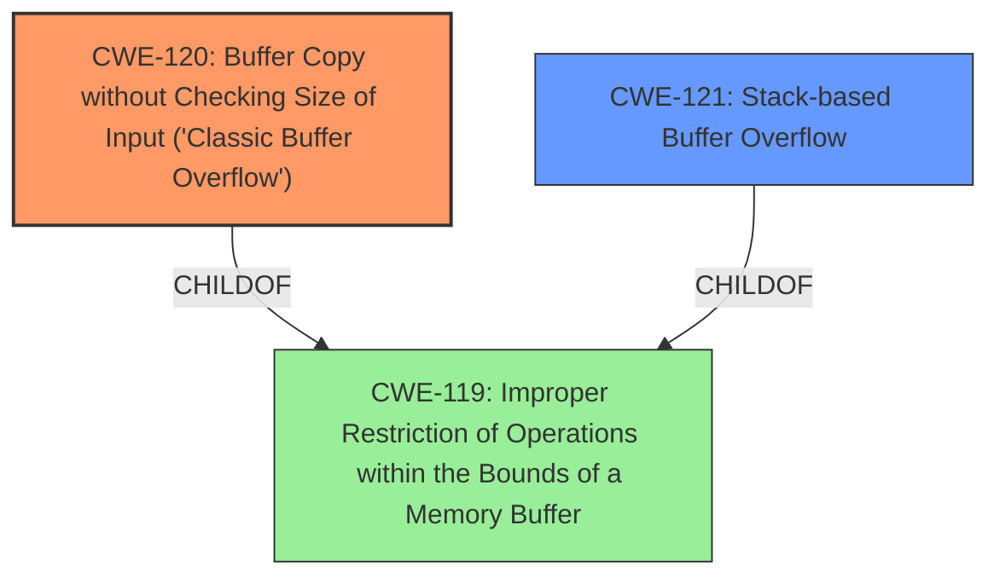

# Raw Analyzer Response for CVE-2024-39358

# Summary
| CWE ID | CWE Name | Confidence | CWE Abstraction Level | CWE Vulnerability Mapping Label | CWE-Vulnerability Mapping Notes |
|---|---|---|---|---|---|
| CWE-120 | Buffer Copy without Checking Size of Input ('Classic Buffer Overflow') | 1.0 | Base | Allowed-with-Review | Primary CWE. The vulnerability description and CVE analysis clearly indicate a buffer copy without size checking. |
| CWE-121 | Stack-based Buffer Overflow | 0.9 | Variant | Allowed | Secondary. This CWE specifies the location of the buffer, providing more specific context. |
| CWE-119 | Improper Restriction of Operations within the Bounds of a Memory Buffer | 0.6 | Class | Discouraged | Secondary. Considered, but too abstract. |

## Evidence and Confidence

*   **Confidence Score:** 0.9
*   **Evidence Strength:** HIGH

## Relationship Analysis
The primary weakness is CWE-120 [Buffer Copy without Checking Size of Input ('Classic Buffer Overflow')], which is a base-level CWE. CWE-121 [Stack-based Buffer Overflow] is a variant of a buffer overflow and specifies that the buffer is on the stack, providing more specific information. CWE-119 [Improper Restriction of Operations within the Bounds of a Memory Buffer] is a class-level CWE and is a parent of both CWE-120 and CWE-121. The relationship between these CWEs helped identify the most specific and accurate classification.

## Vulnerability Chain
The vulnerability chain starts with **improper handling of input size** (CWE-120), leading to a **stack-based buffer overflow** (CWE-121), which can then lead to arbitrary code execution.

## Summary of Analysis
The initial assessment strongly indicated CWE-120 as the primary weakness due to the **lack of size checking** during the buffer copy operation. This is supported by the vulnerability description, which mentions a **stack-based buffer overflow** due to a **specially crafted HTTP request**. The CVE analysis confirms this by stating that the vulnerability is due to a **lack of length checking on input buffers** when processing HTTP POST requests, and specifically the `wlan_ssid2g` parameter is copied to the stack without size validation.

CWE-121 was added as a secondary CWE because it gives the location of the buffer as the Stack.

CWE-119 was considered, as it broadly covers memory buffer errors. However, the evidence allows for a more specific mapping to CWE-120 and CWE-121. Therefore, CWE-119 is less suitable due to its higher abstraction level.

The final selection of CWE-120 and CWE-121 provides a clear and specific representation of the vulnerability based on the available evidence.

**Supporting Evidence:**

*   "A buffer overflow vulnerability exists in the adm.cgi set_wzap() functionality of Wavlink AC3000 M33A8.V5030.210505. A specially crafted HTTP request can lead to **stack-based buffer overflow**."
*   "The vulnerability is due to a lack of length checking on input buffers when processing HTTP POST requests. Specifically, the `wlan_ssid2g` parameter is copied to the stack without size validation."

Other CWEs Considered but Not Used:

*   CWE-131: Incorrect Calculation of Buffer Size - Considered but not selected because the core issue is not the incorrect calculation of the buffer size but the absence of size checking before copying data into the buffer.
*   CWE-130: Improper Handling of Length Parameter Inconsistency - While length is a factor, the primary issue is the absence of any size check, not the inconsistency of a length parameter.
*   CWE-805: Buffer Access with Incorrect Length Value - Similar to CWE-130, this focuses on incorrect length values, whereas the provided context emphasizes the complete absence of length validation.
*   CWE-1284: Improper Validation of Specified Quantity in Input - This CWE is similar to CWE-120 but less specific. It focuses on improper validation of a quantity, while CWE-120 specifically addresses buffer copies without checking size.
*   CWE-190: Integer Overflow or Wraparound - This is not relevant as the vulnerability is not directly related to integer overflows.
*   CWE-195: Signed to Unsigned Conversion Error - This is not relevant as the vulnerability is not related to signed to unsigned conversion errors.
*   CWE-425: Direct Request ('Forced Browsing') - This is not relevant, as the vulnerability is not about authorization bypass but about memory corruption due to improper handling of input size.
*   CWE-497: Exposure of Sensitive System Information to an Unauthorized Control Sphere - This is not relevant, as the vulnerability is not about information exposure.
*   CWE-790: Improper Filtering of Special Elements - This is not relevant, as the vulnerability is not about filtering special elements.