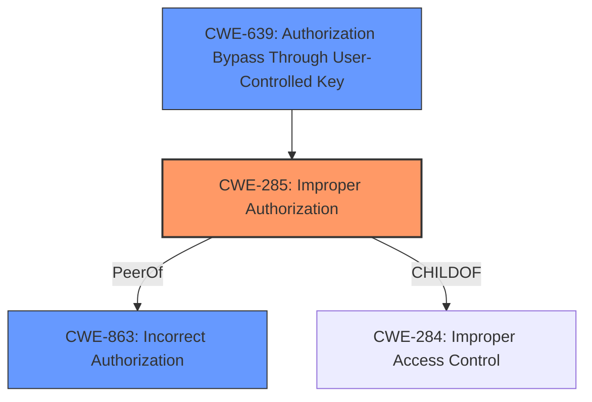

# Raw Analyzer Response for CVE-2024-39416

# Summary
| CWE ID  | CWE Name                                      | Confidence | CWE Abstraction Level | CWE Vulnerability Mapping Label | CWE-Vulnerability Mapping Notes |
| :-------- | :-------------------------------------------- | :---------- | :-------------------- | :------------------------------ | :------------------------------ |
| CWE-285   | Improper Authorization                      | 0.9         | Class                 | Primary                         | Allowed                         |
| CWE-863   | Incorrect Authorization                     | 0.7         | Class                 | Secondary                       | Allowed-with-Review           |
| CWE-639   | Authorization Bypass Through User-Controlled Key | 0.6         | Base                  | Secondary                       | Allowed                         |

## Evidence and Confidence

*   **Confidence Score:** 0.9
*   **Evidence Strength:** HIGH

## Relationship Analysis

The primary relationship influencing the CWE selection is the parent-child relationship between CWE-287 (Improper Authentication) and CWE-285 (Improper Authorization). CWE-863 (Incorrect Authorization) is a peer of CWE-285. CWE-639 (Authorization Bypass Through User-Controlled Key) is related to authorization bypass. The abstraction levels guided the selection of CWE-285 as a Class, with the consideration of more specific base-level CWEs where applicable.

## Vulnerability Chain

The vulnerability chain starts with an **Improper Authorization vulnerability** (CWE-285), leading to a Security feature bypass. A low-privileged attacker can exploit this to disclose minor information. The root cause is the **improper authorization**, and the impact is the security feature bypass.

## Summary of Analysis

The analysis is strongly based on the provided evidence, particularly the vulnerability description that explicitly mentions "**Improper Authorization vulnerability**". The CVE Reference Links Content Summary reinforces this by stating "**Root Cause: Improper Authorization (CWE-285)**". The retriever results also list CWE-285 as a candidate.

The graph relationships show that CWE-285 is a class-level CWE, and there might be more specific base-level CWEs. The CWE-863 (Incorrect Authorization) is considered because it's a peer of CWE-285 and represents a slightly more specific scenario where authorization checks are performed incorrectly. CWE-639 (Authorization Bypass Through User-Controlled Key) is also a possibility if the authorization bypass is happening through a user-controlled key.

The selected CWEs are at the optimal level of specificity based on the available evidence. CWE-285 is chosen as the primary because it directly reflects the stated root cause. CWE-863 and CWE-639 are added as secondary CWEs because they give more information on the kind of authorization issue.

Relevant CWE Information:

# Enhanced Context (25 CWEs)

## CWE-639: Authorization Bypass Through User-Controlled Key
**Abstraction Level**: Base
**Similarity Score**: 0.75
**Source**: dense

**Description**:
The system's authorization functionality does not prevent one user from gaining access to another user's data or record by modifying the key value identifying the data.

**Mapping Guidance**:
- Usage: Allowed
- Rationale: This CWE entry is at the Base level of abstraction, which is a preferred level of abstraction for mapping to the root causes of vulnerabilities.

## CWE-285: Improper Authorization
**Abstraction Level**: Class
**Similarity Score**: 1440.59
**Source**: sparse

**Description**:
The product does not perform or incorrectly performs an authorization check when an actor attempts to access a resource or perform an action.

**Mapping Guidance**:
- Usage: Discouraged
- Rationale: CWE-285 is high-level and lower-level CWEs can frequently be used instead. It is a level-1 Class (i.e., a child of a Pillar).

## CWE-863: Incorrect Authorization
**Abstraction Level**: Class
**Similarity Score**: 1420.71
**Source**: sparse

**Description**:
The product performs an authorization check when an actor attempts to access a resource or perform an action, but it does not correctly perform the check.

**Mapping Guidance**:
- Usage: Allowed-with-Review
- Rationale: This CWE entry is a Class and might have Base-level children that would be more appropriate

CWE-284: Improper Access Control, was considered but not chosen as the primary CWE because CWE-285 is a more specific class under access control.

CWE-306: Missing Authentication for Critical Function, was considered, but not selected because the issue is authorization, not authentication.

CWE-862: Missing Authorization, was considered, but not selected because the description specified **improper authorization**, implying there is authorization, but it's flawed.

CWE-200: Exposure of Sensitive Information to an Unauthorized Actor was considered, but not selected as the root cause as the identified root cause is **improper authorization**.

CWE-NVD-noinfo was listed as the Primary CWE Match. However, this is a placeholder to indicate that there is no CWE information and is not an appropriate CWE.

CWE-NVD-Other was in the Top CWEs, but this is a placeholder to indicate that there is no other CWE and is not an appropriate CWE.