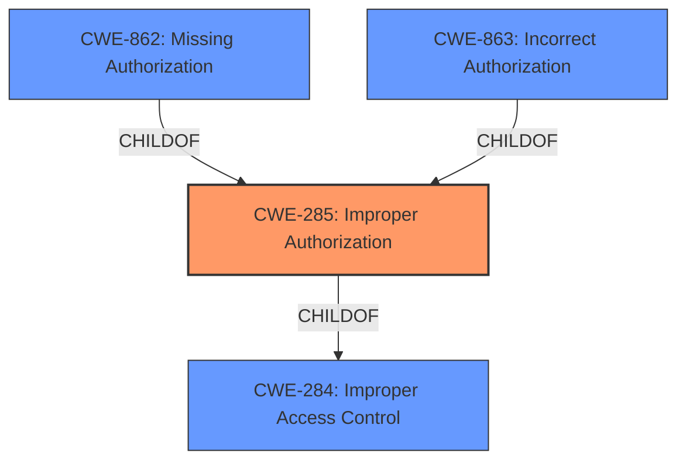

# Analysis Report for CVE-2024-39419

# Vulnerability Analysis Report: CVE-2024-39419

## Description

Adobe Commerce versions 2.4.7-p1, 2.4.6-p6, 2.4.5-p8, 2.4.4-p9 and earlier are affected by an **Improper Authorization** vulnerability that could result in a Security feature bypass. A low-privileged attacker could leverage this vulnerability to bypass security measures and modify minor information. Exploitation of this issue does not require user interaction.

## Vulnerability Description Key Phrases

- **Rootcause:** Improper Authorization
- **Impact:** Security feature bypass
- **Attacker:** low-privileged attacker
- **Product:** Adobe Commerce
- **Version:** 2.4.7-p1, 2.4.6-p6, 2.4.5-p8, 2.4.4-p9 and earlier

## Analysis (with Relationship Data)

# Summary
| CWE ID | CWE Name | Confidence | CWE Abstraction Level | CWE Vulnerability Mapping Label | CWE-Vulnerability Mapping Notes |
|---|---|---|---|---|---|
| CWE-285 | Improper Authorization | 0.85 | Class | Primary | Allowed-with-Review |
| CWE-863 | Incorrect Authorization | 0.70 | Class | Secondary Candidate | Allowed-with-Review |
| CWE-862 | Missing Authorization | 0.60 | Class | Secondary Candidate | Allowed-with-Review |

## Evidence and Confidence

*   **Confidence Score:** 0.80
*   **Evidence Strength:** MEDIUM

## Relationship Analysis
The primary relationship influencing the decision is the hierarchical one between CWE-284 (Improper Access Control), CWE-285 (Improper Authorization), CWE-862 (Missing Authorization), and CWE-863 (Incorrect Authorization). CWE-285 is a child of CWE-284, while CWE-862 and CWE-863 are children of CWE-285. The choice between these CWEs depends on the specifics of the authorization **weakness**. The description points towards an authorization issue, making CWE-285 a strong candidate. The retriever results also suggest CWE-863 and CWE-862 as possibilities.



## Vulnerability Chain
The vulnerability chain starts with the **Improper Authorization**, which leads to a Security Feature Bypass and allows a low-privileged attacker to modify minor information.

Improper Authorization -> Security Feature Bypass -> Information Modification

CWE-285 represents the root cause, while the Security Feature Bypass and information modification are the impacts.

## Summary of Analysis
The initial assessment considered the retriever results and the primary CWE match of CWE-NVD-noinfo. However, after reviewing the CVE Reference Links Content Summary, it became clear that the root cause is an **Improper Access Control** issue (CWE-284) because the vulnerability is due to insufficient access control mechanisms, potentially allowing unauthorized actions. Further examination of the Authentication vs Authorization vs Access Control Guidance section highlights the distinctions between CWE-306 (authentication), CWE-862 (missing authorization), CWE-863 (incorrect authorization), and CWE-285 (improper authorization).

The vulnerability description indicates an **Improper Authorization** (**rootcause**) that allows a low-privileged attacker to bypass security measures, modifying minor information. This suggests that an authorization check is either missing or flawed. Given this, CWE-285 (Improper Authorization) is the most appropriate primary CWE. CWE-863 (Incorrect Authorization) and CWE-862 (Missing Authorization) are secondary candidates because they represent more specific cases of **improper authorization**.

The final selection emphasizes the importance of identifying the root cause and selecting the most specific CWE based on available evidence. The chosen CWEs are at the Class level, balancing specificity and broad applicability.

Relevant CWE Information:
*   CWE-285: Improper Authorization
*   CWE-863: Incorrect Authorization
*   CWE-862: Missing Authorization


## CWE Relationship Analysis

Current CWEs represent these abstraction levels: .


### Vulnerability Chain Analysis

**Chain starting from CWE-863:**
- 863 (Incorrect Authorization) - ROOT


**Chain starting from CWE-862:**
- 862 (Missing Authorization) - ROOT


### CWE Relationship Diagram

```mermaid
graph TD
    classDef primary fill:#f96,stroke:#333,stroke-width:2px
    classDef secondary fill:#69f,stroke:#333
    classDef tertiary fill:#9e9,stroke:#333
```


*Report generated on 2025-07-13 11:23:42*
