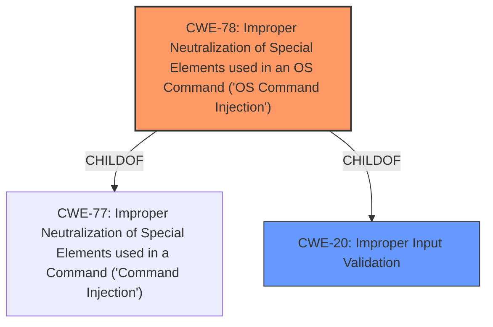

# Raw Analyzer Response for CVE-2024-39438

# Summary
| CWE ID | CWE Name | Confidence | CWE Abstraction Level | CWE Vulnerability Mapping Label | CWE-Vulnerability Mapping Notes |
|---|---|---|---|---|---|
| CWE-78 | Improper Neutralization of Special Elements used in an OS Command ('OS Command Injection') | 0.8 | Base | Primary | Allowed |
| CWE-20 | Improper Input Validation | 0.6 | Class | Secondary | Discouraged |

## Evidence and Confidence

*   **Confidence Score:** 0.7
*   **Evidence Strength:** MEDIUM

## Relationship Analysis
The primary relationship that influenced the decision was the ChildOf relationship between CWE-78 and CWE-77. While CWE-77 (Improper Neutralization of Special Elements used in a Command ('Command Injection')) was the top hit, CWE-78 (Improper Neutralization of Special Elements used in an OS Command ('OS Command Injection')) is a more specific base variant that is more appropriate. CWE-20 (Improper Input Validation) is a class-level weakness that can be a parent of many other CWEs including command injection issues.

## Vulnerability Chain
The vulnerability chain starts with **improper input validation** (CWE-20), which leads to a **command injection** vulnerability (CWE-78). The final impact is local escalation of privilege.

## Summary of Analysis
The vulnerability description indicates a **command injection** due to **improper input validation**.

The primary CWE is CWE-78 Improper Neutralization of Special Elements used in an OS Command ('OS Command Injection'). The vulnerability description explicitly mentions "command injection" as a weakness, which strongly aligns with CWE-78. The description also mentions **improper input validation**, which is often a prerequisite for command injection vulnerabilities, thus relating to CWE-20. The description "In linkturbonative service, there is a possible **command injection** due to **improper input validation**" supports this decision.

CWE-20 Improper Input Validation is selected as a secondary CWE because the vulnerability description identifies **improper input validation** as the root cause. While CWE-20 is a discouraged class-level CWE, it is included because it is directly mentioned in the description as the cause of the vulnerability.

Other CWEs such as CWE-862 (Missing Authorization) were considered based on the "CWE for similar CVE Descriptions". However, the vulnerability description clearly points to **improper input validation** leading to **command injection**, making CWE-78 and CWE-20 more appropriate.