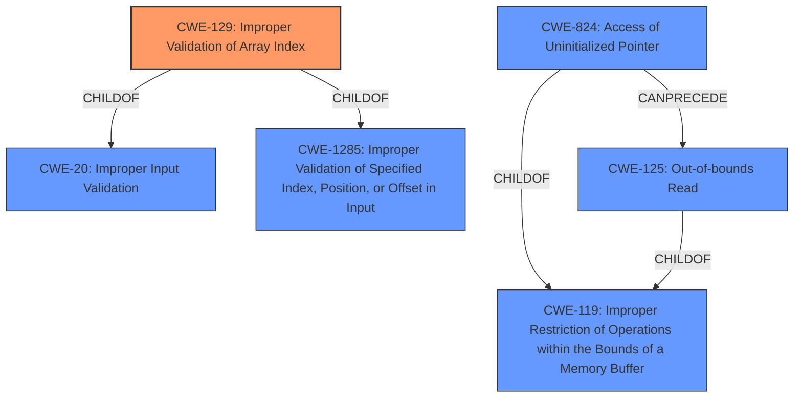

# Analysis for CVE-2024-39462

# Summary
| CWE ID | CWE Name | Confidence | CWE Abstraction Level | CWE Vulnerability Mapping Label | CWE-Vulnerability Mapping Notes |
|---|---|---|---|---|---|
| CWE-129 | Improper Validation of Array Index | 0.8 | Variant | Primary CWE | Allowed |
| CWE-824 | Access of Uninitialized Pointer | 0.6 | Base | Secondary Candidate | Allowed |
| CWE-125 | Out-of-bounds Read | 0.5 | Base | Secondary Candidate | Allowed |

## Evidence and Confidence

*   **Confidence Score:** 0.8
*   **Evidence Strength:** HIGH

## Relationship Analysis
The primary CWE is CWE-129, which is a variant of CWE-20 (Improper Input Validation) and CWE-1285 (Improper Validation of Specified Index, Position, or Offset in Input). The vulnerability involves accessing an array out of bounds due to an uninitialized size, making CWE-129 a suitable choice. CWE-824 and CWE-125 are also considered because the root cause involves accessing memory with an uninitialized pointer and resulting in an out-of-bounds read.

## Vulnerability Chain
The vulnerability chain starts with the **uninitialized __counted_by member**, leading to accessing ->hws out of bounds, and finally resulting in an **array-index-out-of-bounds**.

## Summary of Analysis
The primary vulnerability is classified as CWE-129 (Improper Validation of Array Index) because the code accesses an array using an index without properly validating if the index is within the bounds of the array. This is due to the `num` member, which defines the size of the `hws` array, being assigned after the array is accessed.

The vulnerability description states: "This occurs in clk_dvp_probe() due to ->num being assigned after ->hws has been accessed UBSAN **array-index-out-of-bounds** in drivers/clk/bcm/clk-bcm2711-dvp.c592 index 0 is out of range for type struct clk_hw *[] __counted_by(num) (aka struct clk_hw *[]) Move the ->num initialization to before the first access of ->hws, which clears up the warning."

The CVE Reference Links Content Summary states: "The vulnerability is due to an out-of-bounds access in the `clk_dvp_probe()` function within the Linux kernel's clock framework. The `hws` member of the `struct clk_hw_onecell_data` is accessed before the `num` member, which specifies the size of the `hws` array, is initialized. This leads to a situation where the bounds sanitizer detects that the array is being accessed out of bounds because the size is still zero."

CWE-129 aligns well with this description because it specifically addresses the scenario where an array index is not properly validated. The fix involves initializing the size before the array access, which directly mitigates the improper index validation.

CWE-824 (Access of Uninitialized Pointer) is a secondary consideration because the root cause involves accessing `hws` before `num` is initialized. However, the immediate cause of the vulnerability is the lack of index validation, making CWE-129 a more precise fit. CWE-125 (Out-of-bounds Read) is another secondary consideration as it's the resulting behavior, but not the root cause.

I considered CWE-476 (NULL Pointer Dereference), but it's not applicable because the issue is not about dereferencing a NULL pointer. Similarly, CWE-908 (Use of Uninitialized Resource) is not as precise as CWE-129, although it's related to accessing `hws` before `num` is initialized.

The choice of CWE-129 is made to be specific to the array index validation issue, making it the most appropriate classification based on the available evidence.