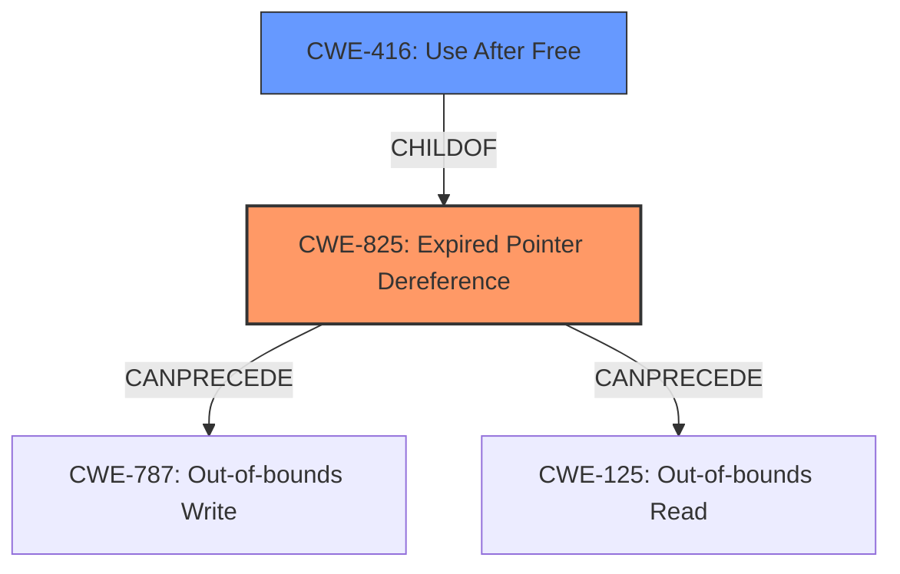

# Enhanced Analysis for CVE-2024-39485

# Summary
| CWE ID | CWE Name | Confidence | CWE Abstraction Level | CWE Vulnerability Mapping Label | CWE-Vulnerability Mapping Notes |
|---|---|---|---|---|---|
| CWE-825 | Expired Pointer Dereference | 0.8 | Base | Primary | Allowed |
| CWE-416 | Use After Free | 0.6 | Variant | Secondary | Allowed |

## Evidence and Confidence

*   **Confidence Score:** 0.7
*   **Evidence Strength:** HIGH

## Relationship Analysis
The primary CWE is CWE-825 (Expired Pointer Dereference), which is a base-level CWE. This CWE can precede CWE-787 (Out-of-bounds Write) and CWE-125 (Out-of-bounds Read). It is a parent of CWE-416 (Use After Free). CWE-416 is a variant-level CWE and a child of CWE-825, representing a more specific case where the expired pointer is dereferenced after the memory has been freed. The relationship analysis indicates a potential vulnerability chain where an expired pointer can lead to memory corruption or other issues.



## Vulnerability Chain
The vulnerability chain starts with the improper handling of the notifier entry during unregistration, leading to a dangling pointer (CWE-825). If this dangling pointer is subsequently dereferenced after the memory is freed, it leads to a use-after-free condition (CWE-416), which can then result in undefined behavior, a system crash, or potential privilege escalation.

Improper Unregistration -> Dangling Pointer (CWE-825) -> Use After Free (CWE-416) -> Undefined Behavior/Crash/Privilege Escalation

## Summary of Analysis
The analysis is based on the provided evidence, which includes the vulnerability description and the CVE reference links content summary. The root cause is identified as **"The notifier_entry of a notifier is not re-initialised after unregistering the notifier"**, which leads to dangling pointers. This aligns with CWE-825 (Expired Pointer Dereference). The CVE reference links content summary confirms this by stating that the `notifier_entry` is not properly re-initialized, leading to a dangling pointer, and the fix involves using `list_del_init()` to re-initialize the list entry.

The retriever results also list CWE-825 (Expired Pointer Dereference) as a potential match. The relationship analysis shows that CWE-825 can lead to CWE-416 (Use After Free). While the primary issue is the dangling pointer, the potential for a use-after-free condition exists if the dangling pointer is dereferenced after the memory is freed.

The selected CWEs are at the optimal level of specificity because CWE-825 accurately represents the root cause of the vulnerability (the dangling pointer), and CWE-416 represents a potential consequence if the dangling pointer is dereferenced after the memory is freed.

Relevant CWE Information:

# Enhanced Context (25 CWEs)
The following CWEs were identified as potentially relevant to this vulnerability:

## CWE-667: Improper Locking
**Abstraction Level**: Class
**Similarity Score**: 0.76
**Source**: dense

**Description**:
The product does not properly acquire or release a lock on a resource, leading to unexpected resource state changes and behaviors.

**Mapping Guidance**:
- Usage: Allowed-with-Review
- Rationale: This CWE entry is a Class and might have Base-level children that would be more appropriate

*Not Selected*: This CWE is not relevant because the vulnerability does not involve improper locking mechanisms.

## CWE-824: Access of Uninitialized Pointer
**Abstraction Level**: Base
**Similarity Score**: 0.75
**Source**: dense

**Description**:
The product accesses or uses a pointer that has not been initialized.

**Mapping Guidance**:
- Usage: Allowed
- Rationale: This CWE entry is at the Base level of abstraction, which is a preferred level of abstraction for mapping to the root causes of vulnerabilities.

*Not Selected*: While pointers are involved, the core issue is not accessing an uninitialized pointer, but rather a pointer that becomes invalid after unregistration.

## CWE-362: Concurrent Execution using Shared Resource with Improper Synchronization ('Race Condition')
**Abstraction Level**: Class
**Similarity Score**: 0.75
**Source**: dense

**Description**:
The product contains a concurrent code sequence that requires temporary, exclusive access to a shared resource, but a timing window exists in which the shared resource can be modified by another code sequence operating concurrently.

**Mapping Guidance**:
- Usage: Allowed-with-Review
- Rationale: This CWE entry is a Class and might have Base-level children that would be more appropriate

*Not Selected*: Concurrency issues are not mentioned in the vulnerability description.

## CWE-252: Unchecked Return Value
**Abstraction Level**: Base
**Similarity Score**: 0.75
**Source**: dense

**Description**:
The product does not check the return value from a method or function, which can prevent it from detecting unexpected states and conditions.

**Mapping Guidance**:
- Usage: Allowed
- Rationale: This CWE entry is at the Base level of abstraction, which is a preferred level of abstraction for mapping to the root causes of vulnerabilities.

*Not Selected*: The problem isn't related to unchecked return values.

## CWE-909: Missing Initialization of Resource
**Abstraction Level**: Class
**Similarity Score**: 0.74
**Source**: dense

**Description**:
The product does not initialize a critical resource.

**Mapping Guidance**:
- Usage: Allowed-with-Review
- Rationale: This CWE entry is a Class and might have Base-level children that would be more appropriate

*Not Selected*: Resource initialization happened at some point, but the resource was not re-initialized upon unregistration.

## CWE-908: Use of Uninitialized Resource
**Abstraction Level**: Base
**Similarity Score**: 0.74
**Source**: dense

**Description**:
The product uses or accesses a resource that has not been initialized.

**Mapping Guidance**:
- Usage: Allowed
- Rationale: This CWE entry is at the Base level of abstraction, which is a preferred level of abstraction for mapping to the root causes of vulnerabilities.

*Not Selected*: The core issue is that the pointer becomes invalid after unregistration, rather than accessing a completely uninitialized resource.

## CWE-754: Improper Check for Unusual or Exceptional Conditions
**Abstraction Level**: Class
**Similarity Score**: 0.74
**Source**: dense

**Description**:
The product does not check or incorrectly checks for unusual or exceptional conditions that are not expected to occur frequently during day to day operation of the product.

**Mapping Guidance**:
- Usage: Allowed-with-Review
- Rationale: This CWE entry is a Class and might have Base-level children that would be more appropriate

*Not Selected*: This is not related to the **rootcause**.

## CWE-665: Improper Initialization
**Abstraction Level**: Class
**Similarity Score**: 0.74
**Source**: dense

**Description**:
The product does not initialize or incorrectly initializes a resource, which might leave the resource in an unexpected state when it is accessed or used.

**Mapping Guidance**:
- Usage: Discouraged
- Rationale: This CWE entry is a level-1 Class (i.e., a child of a Pillar). It might have lower-level children that would be more appropriate

*Not Selected*: While initialization plays a role, the core issue is the lack of re-initialization during unregistration.

## CWE-367: Time-of-check Time-of-use (TOCTOU) Race Condition
**Abstraction Level**: Base
**Similarity Score**: 0.73
**Source**: dense

**Description**:
The product checks the state of a resource before using that resource, but the resource's state can change between the check and the use in a way that invalidates the results of the check. This can cause the product to perform invalid actions when the resource is in an unexpected state.

**Mapping Guidance**:
- Usage: Allowed
- Rationale: This CWE entry is at the Base level of abstraction, which is a preferred level of abstraction for mapping to the root causes of vulnerabilities.

*Not Selected*: This is not related to the **rootcause**.

## CWE-131: Incorrect Calculation of Buffer Size
**Abstraction Level**: Base
**Similarity Score**: 0.


## CWE Relationship Analysis

Current CWEs represent these abstraction levels: .


### Vulnerability Chain Analysis

**Chain starting from CWE-665:**
- 665 (Improper Initialization) - ROOT


**Chain starting from CWE-416:**
- 416 (Use After Free) - ROOT


### CWE Relationship Diagram

```mermaid
graph TD
    classDef primary fill:#f96,stroke:#333,stroke-width:2px
    classDef secondary fill:#69f,stroke:#333
    classDef tertiary fill:#9e9,stroke:#333
```