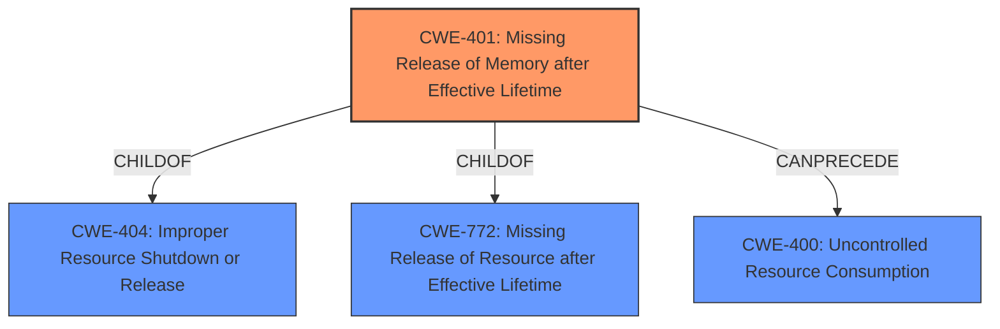

# Analysis Report for CVE-2024-39518

# Vulnerability Analysis Report: CVE-2024-39518

## Description

A **Heap-based Buffer Overflow** vulnerability in the telemetry sensor process (sensord) of Juniper Networks Junos OS on MX240, MX480, MX960 platforms using MPC10E causes a steady increase in memory utilization, ultimately leading to a Denial of Service (DoS). When the device is subscribed to a specific subscription on Junos Telemetry Interface, a slow **memory leak** occurs and eventually all resources are consumed and the device becomes unresponsive. A manual reboot of the Line Card will be required to restore the device to its normal functioning. This issue is only seen when telemetry subscription is active. The Heap memory utilization can be monitored using the following command > show system processes extensive The following command can be used to monitor the memory utilization of the specific sensor > show system info | match sensord PID NAME MEMORY PEAK MEMORY %CPU THREAD-COUNT CORE-AFFINITY UPTIME 1986 sensord 877.57MB 877.57MB 2 4 0,2-15 7-214132 This issue affects Junos OS * from 21.2R3-S5 before 21.2R3-S7, * from 21.4R3-S4 before 21.4R3-S6, * from 22.2R3 before 22.2R3-S4, * from 22.3R2 before 22.3R3-S2, * from 22.4R1 before 22.4R3, * from 23.2R1 before 23.2R2.

## Vulnerability Description Key Phrases

- **Weakness:** ['Heap-based Buffer Overflow', 'memory leak']
- **Impact:** denial of service
- **Vector:** specific subscription on Junos Telemetry Interface
- **Product:** Juniper Networks Junos OS
- **Version:** ["['21.2R3-S5 before 21.2R3-S7'", "'21.4R3-S4 before 21.4R3-S6'", "'22.2R3 before 22.2R3-S4'", "'22.3R2 before 22.3R3-S2'", "'22.4R1 before 22.4R3'", "'23.2R1 before 23.2R2']"]
- **Component:** telemetry sensor process (sensord)

## Analysis (with Relationship Data)

# Summary

| CWE ID  | CWE Name                                                      | Confidence | CWE Abstraction Level | CWE Vulnerability Mapping Label | CWE-Vulnerability Mapping Notes |
| :-------- | :------------------------------------------------------------ | :--------- | :---------------------- | :------------------------------ | :------------------------------ |
| CWE-401 | Missing Release of Memory after Effective Lifetime        | 0.90       | Variant               | Primary                         | Allowed                       |
| CWE-400 | Uncontrolled Resource Consumption                           | 0.70       | Class                | Secondary                        | Allowed                       |

## Evidence and Confidence

*   **Confidence Score:** 0.80
*   **Evidence Strength:** HIGH

## Relationship Analysis

The primary weakness identified is CWE-401 [CWE-401: Missing Release of Memory after Effective Lifetime], a variant of CWE-404 [CWE-404: Improper Resource Shutdown or Release] and CWE-772 [CWE-772: Missing Release of Resource after Effective Lifetime]. CWE-401 leads to CWE-400 [CWE-400: Uncontrolled Resource Consumption], a class-level CWE, which then leads to denial of service. Thus, CWE-401 is the root cause, and CWE-400 is a contributing factor.



## Vulnerability Chain

The vulnerability chain starts with the **memory leak** due to **Missing Release of Memory after Effective Lifetime** (CWE-401), leading to **Uncontrolled Resource Consumption** (CWE-400), and ultimately resulting in a denial-of-service condition.
  - The **Heap-based Buffer Overflow** is mentioned, but the root cause is the **memory leak**.
  - The denial of service is the impact.
  - The specific subscription on Junos Telemetry Interface triggers the vulnerability.

## Summary of Analysis

The vulnerability is primarily caused by a **memory leak** stemming from **missing release of memory after effective lifetime**.

This assessment is based on the following evidence from the vulnerability description:

*   "a slow **memory leak** occurs and eventually all resources are consumed and the device becomes unresponsive."

The graph relationships influenced the selection by highlighting the connection between CWE-401 and CWE-400, clarifying that the **memory leak** (CWE-401) is the root cause, and the uncontrolled resource consumption (CWE-400) is a consequence.

The selected CWEs are at the optimal level of specificity because CWE-401 is a variant-level CWE that directly addresses the **missing release of memory**, while CWE-400 describes the resulting resource consumption issue.

Relevant CWE Information:

*   CWE-401: Missing Release of Memory after Effective Lifetime: This is the primary cause, as the system fails to release allocated memory.
*   CWE-400: Uncontrolled Resource Consumption: This is a consequence of the memory leak, where resources are exhausted due to the missing release.

CWEs considered but not used:

*   CWE-770, CWE-1285, CWE-754, CWE-775, and CWE-755 were considered but deemed less relevant as they did not directly address the root cause of the **memory leak** or were too general.


## CWE Relationship Analysis

Current CWEs represent these abstraction levels: .


### Vulnerability Chain Analysis

**Chain starting from CWE-400:**
- 400 (Uncontrolled Resource Consumption) - ROOT


**Chain starting from CWE-770:**
- 770 (Allocation of Resources Without Limits or Throttling) - ROOT


### CWE Relationship Diagram

```mermaid
graph TD
    classDef primary fill:#f96,stroke:#333,stroke-width:2px
    classDef secondary fill:#69f,stroke:#333
    classDef tertiary fill:#9e9,stroke:#333
```


*Report generated on 2025-07-13 11:29:53*
