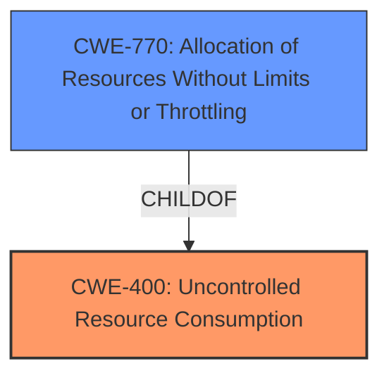

# Analysis Report for CVE-2024-39548

# Vulnerability Analysis Report: CVE-2024-39548

## Description

An **Uncontrolled Resource Consumption** vulnerability in the aftmand process of Juniper Networks Junos OS Evolved allows an unauthenticated, network-based attacker to consume memory resources, resulting in a Denial of Service (DoS) condition. The processes do not recover on their own and must be manually restarted. This issue affects both IPv4 and IPv6. Changes in memory usage can be monitored using the following CLI command user@device> show system memory node | grep evo-aftmann This issue affects Junos OS Evolved * All versions before 21.2R3-S8-EVO, * 21.3 versions before 21.3R3-S5-EVO, * 21.4 versions before 21.4R3-S5-EVO, * 22.1 versions before 22.1R3-S4-EVO, * 22.2 versions before 22.2R3-S4-EVO, * 22.3 versions before 22.3R3-S3-EVO, * 22.4 versions before 22.4R2-S2-EVO, 22.4R3-EVO, * 23.2 versions before 23.2R1-S1-EVO, 23.2R2-EVO.

## Vulnerability Description Key Phrases

- **Rootcause:** Uncontrolled Resource Consumption
- **Impact:** ['Denial of Service (DoS)', 'Resource Consumption', 'consume memory resources']
- **Attacker:** unauthenticated network-based attacker
- **Product:** Juniper Networks Junos OS Evolved
- **Version:** ['All versions before 21.2R3-S8-EVO', '21.3 versions before 21.3R3-S5-EVO', '21.4 versions before 21.4R3-S5-EVO', '22.1 versions before 22.1R3-S4-EVO', '22.2 versions before 22.2R3-S4-EVO', '22.3 versions before 22.3R3-S3-EVO', '22.4 versions before 22.4R2-S2-EVO and 22.4R3-EVO', '23.2 versions before 23.2R1-S1-EVO and 23.2R2-EVO']
- **Component:** aftmand process

## Analysis (with Relationship Data)

# Summary
| CWE ID | CWE Name | Confidence | CWE Abstraction Level | CWE Vulnerability Mapping Label | CWE-Vulnerability Mapping Notes |
|---|---|---|---|---|---|
| CWE-400 | Uncontrolled Resource Consumption | 1.0 | Class | Primary | Allowed |
| CWE-770 | Allocation of Resources Without Limits or Throttling | 0.7 | Base | Secondary | Allowed |

## Evidence and Confidence

*   **Confidence Score:** 1.0
*   **Evidence Strength:** HIGH

## Relationship Analysis
The primary relationship influencing the decision is the direct match of the vulnerability description to the definition of **CWE-400**: Uncontrolled Resource Consumption. While other CWEs were considered, **CWE-400** most accurately captures the essence of the vulnerability as described, where an unauthenticated attacker can consume memory resources leading to a denial-of-service condition. **CWE-770** is a more specific type of **CWE-400** where resources are allocated without limits or throttling, so it could be a secondary candidate, but the provided information does not give enough information to confirm.



## Vulnerability Chain
The vulnerability chain starts with the **Uncontrolled Resource Consumption** (CWE-400). The attacker exploits this by sending network requests that cause the system to consume excessive memory. This leads to a denial-of-service (DoS) condition as the system becomes unresponsive due to resource exhaustion.

## Summary of Analysis
The initial analysis strongly points to **CWE-400**: Uncontrolled Resource Consumption as the primary weakness. The vulnerability description explicitly states "**Uncontrolled Resource Consumption** vulnerability" and further details how an attacker can consume memory resources, leading to a denial-of-service condition. This aligns perfectly with the definition of **CWE-400**.

Other CWEs were considered, particularly those related to resource management and input validation, but none matched the core issue as directly as **CWE-400**. For instance, while **CWE-770**: Allocation of Resources Without Limits or Throttling is a child of **CWE-400** and could be relevant, the description doesn't explicitly state that the resources are allocated without limits, only that they are consumed in an uncontrolled manner.

The decision to classify this vulnerability as **CWE-400** is based on the direct statement in the vulnerability description and the subsequent explanation of how resource consumption leads to a denial-of-service. This classification is at the Class level of abstraction, which is appropriate given the information provided.

Relevant CWE Information:

# Enhanced Context (25 CWEs)
The following CWEs were identified as potentially relevant to this vulnerability:

## CWE-400: Uncontrolled Resource Consumption
**Abstraction Level**: Class
**Similarity Score**: 0.74
**Source**: dense

**Description**:
The product does not properly control the allocation and maintenance of a limited resource, thereby enabling an actor to influence the amount of resources consumed, eventually leading to the exhaustion of available resources.

**Mapping Guidance**:
- Usage: Discouraged
- Rationale: CWE-400 is intended for incorrect behaviors in which the product is expected to track and restrict how many resources it consumes, but CWE-400 is often misused because it is conflated with the "technical impact" of vulnerabilities in which resource consumption occurs. It is sometimes used for low-information vulnerability reports. It is a level-1 Class (i.e., a child of a Pillar).


## CWE-664: Improper Control of a Resource Through its Lifetime
**Abstraction Level**: Pillar
**Similarity Score**: 0.71
**Source**: dense

**Description**:
The product does not maintain or incorrectly maintains control over a resource throughout its lifetime of creation, use, and release.

**Mapping Guidance**:
- Usage: Discouraged
- Rationale: This CWE entry is high-level when lower-level children are available.


## CWE-401: Missing Release of Memory after Effective Lifetime
**Abstraction Level**: Variant
**Similarity Score**: 0.71
**Source**: dense

**Description**:
The product does not sufficiently track and release allocated memory after it has been used, which slowly consumes remaining memory.

**Mapping Guidance**:
- Usage: Allowed
- Rationale: This CWE entry is at the Variant level of abstraction, which is a preferred level of abstraction for mapping to the root causes of vulnerabilities.


## CWE-789: Memory Allocation with Excessive Size Value
**Abstraction Level**: Variant
**Similarity Score**: 0.71
**Source**: dense

**Description**:
The product allocates memory based on an untrusted, large size value, but it does not ensure that the size is within expected limits, allowing arbitrary amounts of memory to be allocated.

**Mapping Guidance**:
- Usage: Allowed
- Rationale: This CWE entry is at the Variant level of abstraction, which is a preferred level of abstraction for mapping to the root causes of vulnerabilities.


## CWE-696: Incorrect Behavior Order
**Abstraction Level**: Class
**Similarity Score**: 0.70
**Source**: dense

**Description**:
The product performs multiple related behaviors, but the behaviors are performed in the wrong order in ways which may produce resultant weaknesses.

**Mapping Guidance**:
- Usage: Allowed-with-Review
- Rationale: This CWE entry is a Class and might have Base-level children that would be more appropriate


## CWE-410: Insufficient Resource Pool
**Abstraction Level**: Base
**Similarity Score**: 0.70
**Source**: dense

**Description**:
The product's resource pool is not large enough to handle peak demand, which allows an attacker to prevent others from accessing the resource by using a (relatively) large number of requests for resources.

**Mapping Guidance**:
- Usage: Allowed
- Rationale: This CWE entry is at the Base level of abstraction, which is a preferred level of abstraction for mapping to the root causes of vulnerabilities.


## CWE-770: Allocation of Resources Without Limits or Throttling
**Abstraction Level**: Base
**Similarity Score**: 0.70
**Source**: dense

**Description**:
The product allocates a reusable resource or group of resources on behalf of an actor without imposing any restrictions on the size or number of resources that can be allocated, in violation of the intended security policy for that actor.

**Mapping Guidance**:
- Usage: Allowed
- Rationale: This CWE entry is at the Base level of abstraction, which is a preferred level of abstraction for mapping to the root causes of vulnerabilities.


## CWE-755: Improper Handling of Exceptional Conditions
**Abstraction Level**: Class
**Similarity Score**: 0.69
**Source**: dense

**Description**:
The product does not handle or incorrectly handles an exceptional condition.

**Mapping Guidance**:
- Usage: Discouraged
- Rationale: This CWE entry is a level-1 Class (i.e., a child of a Pillar). It might have lower-level children that would be more appropriate


## CWE-775: Missing Release of File Descriptor or Handle after Effective Lifetime
**Abstraction Level**: Variant
**Similarity Score**: 0.69
**Source**: dense

**Description**:
The product does not release a file descriptor or handle after its effective lifetime has ended, i.e., after the file descriptor/handle is no longer needed.

**Mapping Guidance**:
- Usage: Allowed
- Rationale: This CWE entry is at the Variant level of abstraction, which is a preferred level of abstraction for mapping to the root causes of vulnerabilities.


## CWE-1285: Improper Validation of Specified Index, Position, or Offset in Input
**Abstraction Level**: Base
**Similarity Score**: 0.69
**Source**: dense

**Description**:
The product receives input that is expected to specify an index, position, or offset into an indexable resource such as a buffer or file, but it does not validate or incorrectly validates that the specified index/position/offset has the required properties.

**Mapping Guidance**:
- Usage: Allowed
- Rationale: This CWE entry is at the Base level of abstraction, which is a preferred level of abstraction for mapping to the root causes of vulnerabilities.


## CWE-775: Missing Release of File Descriptor or Handle after Effective Lifetime
**Abstraction Level**: Variant
**Similarity Score**: 986.53
**Source**: sparse

**Description**:
The product does not release a file descriptor or handle after its effective lifetime has ended, i.e., after the file descriptor/handle is no longer needed.

**Mapping Guidance**:
- Usage: Allowed
- Rationale: This CWE entry is at the Variant level of abstraction, which is a preferred level of abstraction for mapping to the root causes of vulnerabilities.


## CWE-664: Improper Control of a Resource Through its Lifetime
**Abstraction Level**: Pillar
**Similarity Score**:


## CWE Relationship Analysis

Current CWEs represent these abstraction levels: .


### Vulnerability Chain Analysis

**Chain starting from CWE-400:**
- 400 (Uncontrolled Resource Consumption) - ROOT


**Chain starting from CWE-770:**
- 770 (Allocation of Resources Without Limits or Throttling) - ROOT


### CWE Relationship Diagram

```mermaid
graph TD
    classDef primary fill:#f96,stroke:#333,stroke-width:2px
    classDef secondary fill:#69f,stroke:#333
    classDef tertiary fill:#9e9,stroke:#333
```


*Report generated on 2025-07-13 11:31:07*
