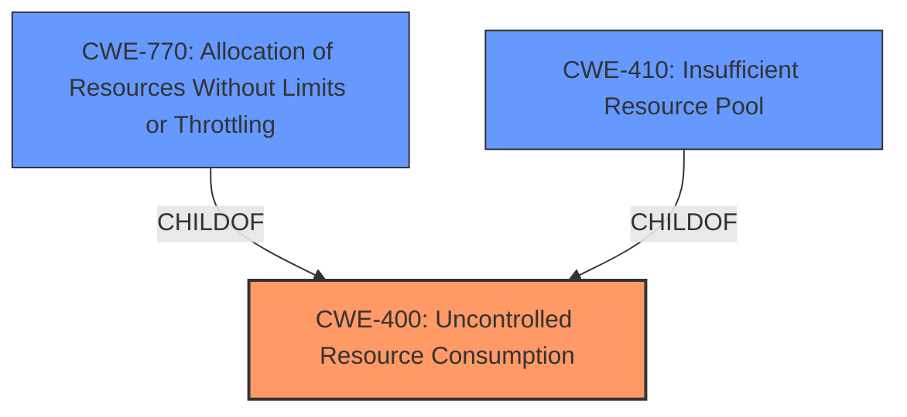

# Analysis Report for CVE-2024-39551

# Vulnerability Analysis Report: CVE-2024-39551

## Description

An **Uncontrolled Resource Consumption** vulnerability in the H.323 ALG (Application Layer Gateway) of Juniper Networks Junos OS on SRX Series and MX Series with SPC3 and MS-MPC/MIC, allows an unauthenticated network-based attacker to send specific packets causing traffic loss leading to Denial of Service (DoS). Continued receipt and processing of these specific packets will sustain the Denial of Service condition. The memory usage can be monitored using the below command. user@host> show usp memory segment sha data objcache jsf This issue affects SRX Series and MX Series with SPC3 and MS-MPC/MIC * 20.4 before 20.4R3-S10, * 21.2 before 21.2R3-S6, * 21.3 before 21.3R3-S5, * 21.4 before 21.4R3-S6, * 22.1 before 22.1R3-S4, * 22.2 before 22.2R3-S2, * 22.3 before 22.3R3-S1, * 22.4 before 22.4R3, * 23.2 before 23.2R2.

## Vulnerability Description Key Phrases

- **Rootcause:** Uncontrolled Resource Consumption
- **Impact:** ['Denial of Service (DoS)', 'Resource Consumption']
- **Vector:** specific packets
- **Attacker:** unauthenticated network-based attacker
- **Product:** Juniper Networks Junos OS
- **Version:** multiple versions
- **Component:** H.323 ALG

## Analysis (with Relationship Data)

# Summary
| CWE ID  | CWE Name                                                                | Confidence | CWE Abstraction Level | CWE Vulnerability Mapping Label | CWE-Vulnerability Mapping Notes |
| :-------- | :---------------------------------------------------------------------- | :--------- | :---------------------- | :------------------------------ | :------------------------------ |
| CWE-400   | Uncontrolled Resource Consumption                                       | 0.9        | Class                   | Primary                         | Discouraged                    |
| CWE-770   | Allocation of Resources Without Limits or Throttling                  | 0.7        | Base                    | Secondary                       | Allowed                        |
| CWE-410   | Insufficient Resource Pool                                            | 0.6        | Base                    | Secondary                       | Allowed                        |

## Evidence and Confidence

*   **Confidence Score:** 0.8
*   **Evidence Strength:** MEDIUM

## Relationship Analysis

The primary relationship impacting the decision is the hierarchical structure, where CWE-400 is a class-level CWE. More specific base-level CWEs like CWE-770 and CWE-410 are considered to provide a more detailed classification of the vulnerability. The chain relationships don't directly apply here, as this vulnerability centers on resource management rather than a sequence of events. Abstraction levels were considered to select the most specific CWE available while remaining accurate.



## Vulnerability Chain

The vulnerability chain starts with **Uncontrolled Resource Consumption** (CWE-400), potentially due to **Allocation of Resources Without Limits or Throttling** (CWE-770) or an **Insufficient Resource Pool** (CWE-410), leading to the impact of Denial of Service (DoS). The chain is as follows:

1.  **Root Cause:** **Uncontrolled Resource Consumption** (CWE-400)
2.  Contributing Factor: **Allocation of Resources Without Limits or Throttling** (CWE-770) or **Insufficient Resource Pool** (CWE-410)
3.  Impact: Denial of Service (DoS)

## Summary of Analysis

The initial analysis focused on the provided vulnerability description, which clearly indicates an **Uncontrolled Resource Consumption** issue. The description includes the key phrase "**Uncontrolled Resource Consumption**" and the resulting impact of Denial of Service (DoS).

The primary CWE is CWE-400 **Uncontrolled Resource Consumption**. While CWE-400 is a class-level CWE and is generally discouraged, it is appropriate because the description doesn't provide enough information to pinpoint the exact resource consumption issue, only that it is "uncontrolled".

CWE-770 **Allocation of Resources Without Limits or Throttling** and CWE-410 **Insufficient Resource Pool** are also considered as they represent potential root causes or contributing factors for the **Uncontrolled Resource Consumption**. These are included as secondary candidates.

The retriever results also suggest CWE-401 **Missing Release of Memory after Effective Lifetime** and CWE-789 **Memory Allocation with Excessive Size Value**, however, the vulnerability description does not specifically mention memory leaks or excessive memory allocation.

Ultimately, the selection is based on the evidence provided in the vulnerability description, with consideration of the relationships between CWEs. The chosen CWEs are at the optimal level of specificity given the available information.

Relevant CWE Information:

# Enhanced Context (25 CWEs)
The following CWEs were identified as potentially relevant to this vulnerability:

## CWE-400: Uncontrolled Resource Consumption
**Abstraction Level**: Class
**Similarity Score**: 0.78
**Source**: dense

**Description**:
The product does not properly control the allocation and maintenance of a limited resource, thereby enabling an actor to influence the amount of resources consumed, eventually leading to the exhaustion of available resources.

**Mapping Guidance**:
- Usage: Discouraged
- Rationale: CWE-400 is intended for incorrect behaviors in which the product is expected to track and restrict how many resources it consumes, but CWE-400 is often misused because it is conflated with the "technical impact" of vulnerabilities in which resource consumption occurs. It is sometimes used for low-information vulnerability reports. It is a level-1 Class (i.e., a child of a Pillar).

*Technical Explanation:* The vulnerability description explicitly states "**Uncontrolled Resource Consumption**", which directly aligns with the description of CWE-400.
*Security Implications:* This can lead to Denial of Service (DoS) due to resource exhaustion.
*Relationship Analysis:* CWE-400 is a class-level CWE, and there might be more specific base-level CWEs available, but the information in the description is not specific enough.
*Mapping Guidance Influence:* The mapping guidance discourages using CWE-400 directly because it is high-level, but in this case, without knowing more details, it is the most appropriate.

## CWE-770: Allocation of Resources Without Limits or Throttling
**Abstraction Level**: Base
**Similarity Score**: 0.74
**Source**: dense

**Description**:
The product allocates a reusable resource or group of resources on behalf of an actor without imposing any restrictions on the size or number of resources that can be allocated, in violation of the intended security policy for that actor.

**Mapping Guidance**:
- Usage: Allowed
- Rationale: This CWE entry is at the Base level of abstraction, which is a preferred level of abstraction for mapping to the root causes of vulnerabilities.

*Technical Explanation:* This vulnerability could be due to allocating resources without proper limits.
*Security Implications:* This can lead to resource exhaustion and Denial of Service (DoS).
*Relationship Analysis:* CWE-770 is a child of CWE-400, representing a more specific case of uncontrolled resource consumption.
*Mapping Guidance Influence:* The mapping guidance allows this CWE as it is a Base level of abstraction.

## CWE-410: Insufficient Resource Pool
**Abstraction Level**: Base
**Similarity Score**: 0.74
**Source**: dense

**Description**:
The product's resource pool is not large enough to handle peak demand, which allows an attacker to prevent others from accessing the resource by using a (relatively) large number of requests for resources.

**Mapping Guidance**:
- Usage: Allowed
- Rationale: This CWE entry is at the Base level of abstraction, which is a preferred level of abstraction for mapping to the root causes of vulnerabilities.

*Technical Explanation:* The vulnerability could also be due to an insufficient resource pool.
*Security Implications:* This can lead to Denial of Service (DoS) as the resource pool gets exhausted.
*Relationship Analysis:* CWE-410 is a child of CWE-664 (Improper Control of a Resource Through Its Lifetime), indicating a resource management issue.
*Mapping Guidance Influence:* The mapping guidance allows this CWE as it is a Base level of abstraction.

## CWE-401: Missing Release of Memory after Effective Lifetime
**Abstraction Level**: Variant
**Similarity Score**: 0.74
**Source**: dense

**Description**:
The product does not sufficiently track and release allocated memory after it has been used, which slowly consumes remaining memory.

**Mapping Guidance**:
- Usage: Allowed
- Rationale: This CWE entry is at the Variant level of abstraction, which is a preferred level of abstraction for mapping to the root causes of vulnerabilities.

*Technical Explanation:* Although memory is mentioned in the description it isn't clear if the rootcause is a memory leak.
*Security Implications:* This can lead to resource exhaustion and Denial of Service (DoS).
*Relationship Analysis:* Is not a child of CWE-400 but can result in that condition.
*Mapping Guidance Influence:* The mapping guidance allows this CWE as it is a Variant level of abstraction.

## Other CWEs Considered and Rejected:

*   CWE-1285 **Improper Validation of Specified Index, Position, or Offset in Input**: Rejected because the vulnerability description does not mention anything related to index or offset validation.
*   CWE-1286 **Improper Validation of Syntactic Correctness of Input**: Rejected because the vulnerability description does not mention anything about syntactic correctness of input.
*   CWE-696 **Incorrect Behavior Order**: Rejected because the vulnerability description does not suggest any problems with behavior order.
*   CWE-664 **Improper Control of a Resource Through its Lifetime**: Rejected because while it is related, CWE-400 is more specific to the stated problem.
*   CWE-754 **Improper Check for Unusual or Exceptional Conditions**: Rejected because it is not clear that the resource consumption is a result of exceptional conditions.
*   CWE-789 **Memory Allocation with


## CWE Relationship Analysis

Current CWEs represent these abstraction levels: .


### Vulnerability Chain Analysis

**Chain starting from CWE-400:**
- 400 (Uncontrolled Resource Consumption) - ROOT


**Chain starting from CWE-770:**
- 770 (Allocation of Resources Without Limits or Throttling) - ROOT


### CWE Relationship Diagram

```mermaid
graph TD
    classDef primary fill:#f96,stroke:#333,stroke-width:2px
    classDef secondary fill:#69f,stroke:#333
    classDef tertiary fill:#9e9,stroke:#333
```


*Report generated on 2025-07-13 11:31:28*
