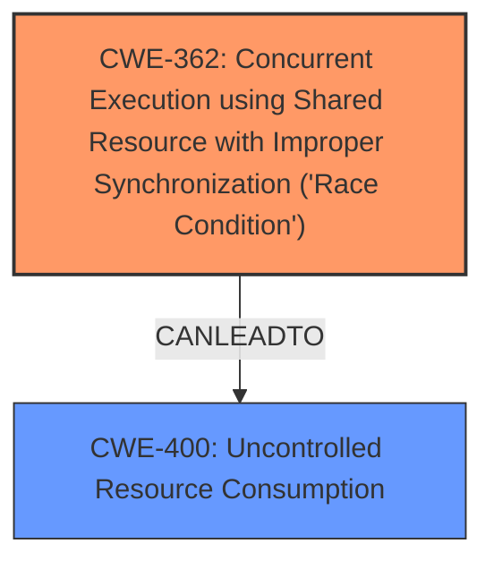

# Analysis Report for CVE-2024-39554

# Vulnerability Analysis Report: CVE-2024-39554

## Description

A Concurrent Execution using Shared Resource with Improper Synchronization (Race Condition) vulnerability the Routing Protocol Daemon (rpd) of Juniper Networks Junos OS and Juniper Networks Junos OS Evolved allows an unauthenticated, network-based attacker to inject incremental routing updates when BGP multipath is enabled, causing rpd to crash and restart, resulting in a Denial of Service (DoS). Since this is a timing issue (race condition), the successful exploitation of this vulnerability is outside the attackers control. However, continued receipt and processing of this packet may create a sustained Denial of Service (DoS) condition. On all Junos OS and Junos OS Evolved platforms with BGP multipath enabled, a specific multipath calculation removes the original next hop from the multipath lead routes nexthop-set. When this change happens, multipath relies on certain internal timing to record the update. Under certain circumstance and with specific timing, this could result in an rpd crash. This issue only affects systems with BGP multipath enabled. This issue affects Junos OS * All versions of 21.1 * from 21.2 before 21.2R3-S7, * from 21.4 before 21.4R3-S6, * from 22.1 before 22.1R3-S5, * from 22.2 before 22.2R3-S3, * from 22.3 before 22.3R3-S2, * from 22.4 before 22.4R3, * from 23.2 before 23.2R2. Junos OS Evolved * All versions of 21.1-EVO, * All versions of 21.2-EVO, * from 21.4-EVO before 21.4R3-S6-EVO,

## Vulnerability Description Key Phrases

- **Rootcause:** concurrent execution using shared resource with improper synchronization (race condition)
- **Impact:** ['crash and restart', 'denial of service (DoS)']
- **Vector:** incremental routing updates
- **Attacker:** unauthenticated network-based attacker
- **Product:** ["['Juniper Networks Junos OS'", "'Juniper Networks Junos OS Evolved']"]
- **Version:** ["['21.1'", "'21.2 before 21.2R3-S7'", "'21.4 before 21.4R3-S6'", "'22.1 before 22.1R3-S5'", "'22.2 before 22.2R3-S3'", "'22.3 before 22.3R3-S2'", "'22.4 before 22.4R3'", "'23.2 before 23.2R2'", "'21.1-EVO'", "'21.2-EVO'", "'21.4-EVO before 21.4R3-S6-EVO']"]
- **Component:** Routing Protocol Daemon (rpd)

## Analysis (with Relationship Data)

# Summary

| CWE ID | CWE Name | Confidence | CWE Abstraction Level | CWE Vulnerability Mapping Label | CWE-Vulnerability Mapping Notes |
|---|---|---|---|---|---|
| CWE-362 | Concurrent Execution using Shared Resource with Improper Synchronization ('Race Condition') | 1.0 | Class | Allowed-with-Review | Primary CWE |
| CWE-400 | Uncontrolled Resource Consumption | 0.5 | Class | Discouraged | Secondary Candidate |

## Evidence and Confidence

*   **Confidence Score:** 0.8
*   **Evidence Strength:** MEDIUM

## Relationship Analysis
The primary relationship to consider is the nature of the vulnerability itself. The description clearly states a **"Concurrent Execution using Shared Resource with Improper Synchronization (Race Condition)"**, which directly corresponds to CWE-362. The impact, a crash and restart leading to a denial of service, suggests a potential connection to resource consumption issues, which are captured by CWE-400. However, the race condition is the direct cause, making CWE-362 the primary classification. CWE-400 represents a potential consequence or impact rather than the root cause.



## Vulnerability Chain
The vulnerability chain starts with a **race condition** (CWE-362) that leads to a crash and restart of the Routing Protocol Daemon (rpd). This crash results in a denial of service (DoS). The potential uncontrolled resource consumption (CWE-400) could be a factor in the DoS, but is not explicitly stated.

CWE-362 (Improper Synchronization) -> rpd crash -> DoS

## Summary of Analysis
The initial analysis focused on identifying the root cause of the vulnerability. The vulnerability description explicitly states the **rootcause** as **"Concurrent Execution using Shared Resource with Improper Synchronization (Race Condition)"**. This statement directly maps to CWE-362. The retriever results also list CWE-362 as the top combined result, further supporting this classification.

The next consideration was the impact of the vulnerability. The crash and restart of the rpd lead to a denial of service (DoS). This impact could be related to uncontrolled resource consumption (CWE-400). However, the description does not explicitly state that resource consumption is the direct cause of the DoS. Therefore, CWE-400 is considered a secondary candidate.

The final decision was to classify the vulnerability as CWE-362 (primary) with a possible secondary classification of CWE-400. This decision is based on the explicit statement of the root cause in the vulnerability description and the retriever results. The selected CWEs are at the optimal level of specificity, as CWE-362 is a Class-level CWE, but accurately describes the **race condition**, while CWE-400 describes the potential impact.

Relevant CWE Information:

# Enhanced Context (25 CWEs)
The following CWEs were identified as potentially relevant to this vulnerability:

## CWE-696: Incorrect Behavior Order
**Abstraction Level**: Class
**Similarity Score**: 0.75
**Source**: dense

**Description**:
The product performs multiple related behaviors, but the behaviors are performed in the wrong order in ways which may produce resultant weaknesses.

**Mapping Guidance**:
- Usage: Allowed-with-Review
- Rationale: This CWE entry is a Class and might have Base-level children that would be more appropriate

## CWE-755: Improper Handling of Exceptional Conditions
**Abstraction Level**: Class
**Similarity Score**: 0.75
**Source**: dense

**Description**:
The product does not handle or incorrectly handles an exceptional condition.

**Mapping Guidance**:
- Usage: Discouraged
- Rationale: This CWE entry is a level-1 Class (i.e., a child of a Pillar). It might have lower-level children that would be more appropriate

## CWE-362: Concurrent Execution using Shared Resource with Improper Synchronization ('Race Condition')
**Abstraction Level**: Class
**Similarity Score**: 0.75
**Source**: dense

**Description**:
The product contains a concurrent code sequence that requires temporary, exclusive access to a shared resource, but a timing window exists in which the shared resource can be modified by another code sequence operating concurrently.

**Mapping Guidance**:
- Usage: Allowed-with-Review
- Rationale: This CWE entry is a Class and might have Base-level children that would be more appropriate

## CWE-754: Improper Check for Unusual or Exceptional Conditions
**Abstraction Level**: Class
**Similarity Score**: 0.74
**Source**: dense

**Description**:
The product does not check or incorrectly checks for unusual or exceptional conditions that are not expected to occur frequently during day to day operation of the product.

**Mapping Guidance**:
- Usage: Allowed-with-Review
- Rationale: This CWE entry is a Class and might have Base-level children that would be more appropriate

## CWE-1285: Improper Validation of Specified Index, Position, or Offset in Input
**Abstraction Level**: Base
**Similarity Score**: 0.74
**Source**: dense

**Description**:
The product receives input that is expected to specify an index, position, or offset into an indexable resource such as a buffer or file, but it does not validate or incorrectly validates that the specified index/position/offset has the required properties.

**Mapping Guidance**:
- Usage: Allowed
- Rationale: This CWE entry is at the Base level of abstraction, which is a preferred level of abstraction for mapping to the root causes of vulnerabilities.

## CWE-703: Improper Check or Handling of Exceptional Conditions
**Abstraction Level**: Pillar
**Similarity Score**: 0.73
**Source**: dense

**Description**:
The product does not properly anticipate or handle exceptional conditions that rarely occur during normal operation of the product.

**Mapping Guidance**:
- Usage: Discouraged
- Rationale: This CWE entry is extremely high-level, a Pillar.

## CWE-617: Reachable Assertion
**Abstraction Level**: Base
**Similarity Score**: 0.73
**Source**: dense

**Description**:
The product contains an assert() or similar statement that can be triggered by an attacker, which leads to an application exit or other behavior that is more severe than necessary.

**Mapping Guidance**:
- Usage: Allowed
- Rationale: This CWE entry is at the Base level of abstraction, which is a preferred level of abstraction for mapping to the root causes of vulnerabilities.

## CWE-400: Uncontrolled Resource Consumption
**Abstraction Level**: Class
**Similarity Score**: 0.73
**Source**: dense

**Description**:
The product does not properly control the allocation and maintenance of a limited resource, thereby enabling an actor to influence the amount of resources consumed, eventually leading to the exhaustion of available resources.

**Mapping Guidance**:
- Usage: Discouraged
- Rationale: CWE-400 is intended for incorrect behaviors in which the product is expected to track and restrict how many resources it consumes, but CWE-400 is often misused because it is conflated with the "technical impact" of vulnerabilities in which resource consumption occurs. It is sometimes used for low-information vulnerability reports. It is a level-1 Class (i.e., a child of a Pillar).

## CWE-606: Unchecked Input for Loop Condition
**Abstraction Level**: Base
**Similarity Score**: 0.72
**Source**: dense

**Description**:
The product does not properly check inputs that are used for loop conditions, potentially leading to a denial of service or other consequences because of excessive looping.

**Mapping Guidance**:
- Usage: Allowed
- Rationale: This CWE entry is at the Base level of abstraction, which is a preferred level of abstraction for mapping to the root causes of vulnerabilities.

## CWE-410: Insufficient Resource Pool
**Abstraction Level**: Base
**Similarity Score**: 0.72
**Source**: dense

**Description**:
The product's resource pool is not large enough to handle peak demand, which allows an attacker to prevent others from accessing the resource by using a (relatively) large number of requests for resources.

**Mapping Guidance**:
- Usage: Allowed
- Rationale: This CWE entry is at the Base level of abstraction, which is a preferred level of abstraction for mapping to the root causes of vulnerabilities.

## CWE-252: Unchecked Return Value
**Abstraction Level**: Base
**Similarity Score**: 1093.27
**Source**: sparse

**Description**:
The product does not check the return value from a method or function, which can prevent it from detecting unexpected states and conditions.

**Mapping Guidance**:
- Usage: Allowed
- Rationale: This CWE entry is at the Base level of abstraction, which is a preferred level of abstraction for mapping to the root causes of vulnerabilities.

## CWE-755: Improper Handling of Exceptional Conditions


## CWE Relationship Analysis

Current CWEs represent these abstraction levels: .


### Vulnerability Chain Analysis

**Chain starting from CWE-400:**
- 400 (Uncontrolled Resource Consumption) - ROOT


**Chain starting from CWE-1285:**
- 1285 (Improper Validation of Specified Index, Position, or Offset in Input) - ROOT


### CWE Relationship Diagram

```mermaid
graph TD
    classDef primary fill:#f96,stroke:#333,stroke-width:2px
    classDef secondary fill:#69f,stroke:#333
    classDef tertiary fill:#9e9,stroke:#333
```


*Report generated on 2025-07-13 11:31:48*
