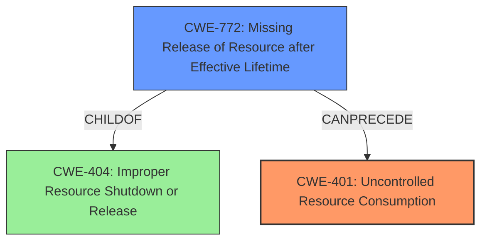

# Raw Analyzer Response for CVE-2024-39557

# Summary
| CWE ID | CWE Name | Confidence | CWE Abstraction Level | CWE Vulnerability Mapping Label | CWE-Vulnerability Mapping Notes |
|---|---|---|---|---|---|
| CWE-401 | Uncontrolled Resource Consumption | 1.0 | Base | Primary | Allowed |
| CWE-772 | Missing Release of Resource after Effective Lifetime | 0.9 | Base | Secondary | Allowed |

## Evidence and Confidence

*   **Confidence Score:** 0.95
*   **Evidence Strength:** HIGH

## Relationship Analysis
The primary weakness is **CWE-401 Uncontrolled Resource Consumption**, which directly reflects the vulnerability description of **uncontrolled resource consumption** in the Layer 2 Address Learning Daemon.
**CWE-772 Missing Release of Resource after Effective Lifetime** is a more specific cause of the **uncontrolled resource consumption**, indicating a **memory leak** due to resources not being released properly after use.
**CWE-772** is a child of **CWE-404**, while **CWE-401** is a parent of **CWE-410**.

## Vulnerability Chain
The vulnerability chain starts with the **uncontrolled resource consumption** (**CWE-401**), specifically a **memory leak** caused by **missing release of resources** (**CWE-772**). This leads to **exhausting all system memory**, and eventually causing a system **crash and Denial of Service (DoS)**.

## Summary of Analysis
The initial assessment correctly identified **CWE-401 Uncontrolled Resource Consumption** as a primary issue, which aligns directly with the **"Uncontrolled Resource Consumption"** vulnerability described. The key evidence supporting this is the statement: "An **Uncontrolled Resource Consumption** vulnerability in the Layer 2 Address Learning Daemon (l2ald) of Juniper Networks Junos OS Evolved allows an unauthenticated, adjacent attacker to cause a **memory leak**, eventually exhausting all system memory, leading to a system crash and Denial of Service (DoS)." The relationship analysis reveals that **CWE-772 Missing Release of Resource after Effective Lifetime** is a more specific cause of the **uncontrolled resource consumption**, indicating a **memory leak** due to resources not being released properly after use. This refined selection provides a more precise understanding of the vulnerability's root cause and its progression to system failure. I have high confidence in this assessment due to the clear description of the **uncontrolled resource consumption** leading to a **memory leak** and system crash, and the relationships between the selected CWEs.

Relevant CWE Information:

**CWE-401: Uncontrolled Resource Consumption** - The product does not properly control the allocation and maintenance of a limited resource, thereby enabling an actor to influence the amount of resources consumed, eventually leading to the exhaustion of available resources.

**CWE-772: Missing Release of Resource after Effective Lifetime** - The product does not release a resource after its effective lifetime has ended, i.e., after the resource is no longer needed.