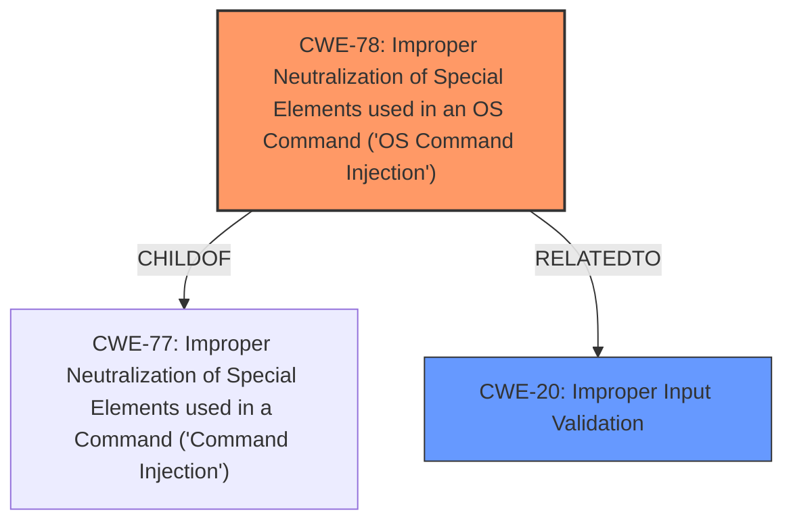

# Enhanced Analysis for CVE-2024-39569

# Summary
| CWE ID | CWE Name | Confidence | CWE Abstraction Level | CWE Vulnerability Mapping Label | CWE-Vulnerability Mapping Notes |
|---|---|---|---|---|---|
| CWE-78 | Improper Neutralization of Special Elements used in an OS Command ('OS Command Injection') | 1.0 | Base | Primary CWE | Allowed |
| CWE-20 | Improper Input Validation | 0.7 | Class | Secondary Candidate | Discouraged |

## Evidence and Confidence

*   **Confidence Score:** 0.9
*   **Evidence Strength:** HIGH

## Relationship Analysis
The primary CWE is CWE-78, which is a base-level CWE and a child of CWE-77. CWE-20 is a class-level CWE that could be considered because of the **missing input sanitization**. The analysis focuses on identifying the most specific CWE that describes the vulnerability based on the provided evidence and MITRE's mapping guidance.



## Vulnerability Chain
The vulnerability chain starts with **missing server side input sanitation** (Improper Input Validation), leading to **command injection**, which allows an attacker to execute arbitrary code with system privileges.

## Summary of Analysis
The analysis is based on the provided evidence, which clearly indicates a **command injection** vulnerability due to **missing server-side input sanitization**. The selection of CWE-78 is based on the detailed description of the vulnerability and its alignment with the characteristics of the CWE. The graph relationships helped to confirm the hierarchical structure and ensure the selection of the most specific CWE.

Relevant CWE Information:

# Enhanced Context (25 CWEs)
The following CWEs were identified as potentially relevant to this vulnerability:

## CWE Classification Rationale

### Initial Assessment

The vulnerability description explicitly states that the system service is vulnerable to **command injection** due to **missing server side input sanitation**. This suggests that an attacker can inject commands into the system through unsanitized input, leading to arbitrary code execution.

### Primary CWE Selection

*   **CWE-78: Improper Neutralization of Special Elements used in an OS Command ('OS Command Injection')**
    *   **Rationale:** This CWE is the most appropriate because the vulnerability description explicitly mentions **command injection** and the ability to execute arbitrary code with system privileges. This aligns perfectly with the characteristics of CWE-78, which involves injecting commands into the operating system.
    *   **Evidence:**
        *   "The system service of affected applications is vulnerable to **command injection** due to **missing server side input sanitation** when loading VPN configurations."
        *   "This could allow an administrative remote attacker running a corresponding SINEMA Remote Connect Server to execute arbitrary code with system privileges on the client system."
    *   **Usage:** Allowed
    *   **Confidence:** 1.0

### Secondary CWE Candidates

*   **CWE-20: Improper Input Validation**
    *   **Rationale:** This CWE is considered because the root cause of the vulnerability is **missing server side input sanitation**. However, CWE-20 is a more general class. Since the specific type of vulnerability is **command injection**, CWE-78 is more specific and appropriate.
    *   **Evidence:** "The system service of affected applications is vulnerable to command injection due to **missing server side input sanitation** when loading VPN configurations."
    *   **Usage:** Discouraged (when lower-level CWEs are available)
    *   **Confidence:** 0.7

### Rejected CWEs

*   **CWE-77: Improper Neutralization of Special Elements used in a Command ('Command Injection')**: While similar to CWE-78, CWE-78 is more specific because it explicitly mentions OS commands.
*   **CWE-89: Improper Neutralization of Special Elements used in an SQL Command ('SQL Injection')**: This CWE is not applicable because the vulnerability does not involve SQL commands.
*   **CWE-94: Improper Control of Generation of Code ('Code Injection')**: This CWE is not applicable as the code is not being generated, but rather existing OS commands are being injected.
*   **CWE-120: Buffer Copy without Checking Size of Input ('Classic Buffer Overflow')**: This CWE is not applicable as the vulnerability is not related to buffer overflows.
*   **CWE-1336: Improper Neutralization of Special Elements Used in a Template Engine**: This CWE is not applicable because there is no mention of a template engine being used.
*   **CWE-269: Improper Privilege Management**, **CWE-285: Improper Authorization**, **CWE-863: Incorrect Authorization**: These CWEs relate to privilege or authorization issues, but the primary weakness is **command injection** due to **missing input sanitization**.
*   **CWE-306: Missing Authentication for Critical Function**: Authentication is not mentioned in the vulnerability description.
*   **CWE-918: Server-Side Request Forgery (SSRF)**: This CWE is not applicable as there is no mention of the server making requests on behalf of the client.
*   **CWE-280: Improper Handling of Insufficient Permissions or Privileges** and **CWE-274: Improper Handling of Insufficient Privileges**: These CWEs are not applicable as the vulnerability is not related to privilege handling.
*   **CWE-250: Execution with Unnecessary Privileges**: This CWE is not applicable as the vulnerability is not related to unnecessary privileges.

### Final Conclusion

The primary CWE is **CWE-78: Improper Neutralization of Special Elements used in an OS Command ('OS Command Injection')** because it accurately reflects the **command injection** vulnerability caused by **missing server-side input sanitization**. CWE-20 is a secondary consideration due to the **missing input sanitization**, but CWE-78 is more specific.


## CWE Relationship Analysis

Current CWEs represent these abstraction levels: .


### Vulnerability Chain Analysis

**Chain starting from CWE-274:**
- 274 (Improper Handling of Insufficient Privileges) - ROOT


**Chain starting from CWE-89:**
- 89 (Improper Neutralization of Special Elements used in an SQL Command ('SQL Injection')) - ROOT


### CWE Relationship Diagram

```mermaid
graph TD
    classDef primary fill:#f96,stroke:#333,stroke-width:2px
    classDef secondary fill:#69f,stroke:#333
    classDef tertiary fill:#9e9,stroke:#333
```