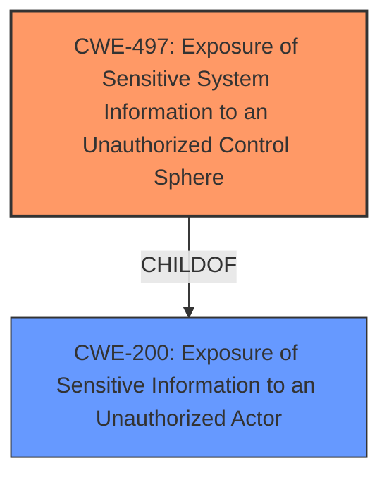

# Analysis Report for CVE-2024-39593

# Vulnerability Analysis Report: CVE-2024-39593

## Description

SAP Landscape Management allows an authenticated user to read confidential data disclosed by the REST Provider Definition response. Successful exploitation can cause high impact on confidentiality of the managed entities.

## Vulnerability Description Key Phrases

- **Impact:** read confidential data
- **Attacker:** authenticated user
- **Product:** SAP Landscape Management
- **Component:** REST Provider Definition response

## Analysis (with Relationship Data)

# Summary
| CWE ID | CWE Name | Confidence | CWE Abstraction Level | CWE Vulnerability Mapping Label | CWE-Vulnerability Mapping Notes |
|---|---|---|---|---|---|
| CWE-497 | Exposure of Sensitive System Information to an Unauthorized Control Sphere | 0.7 | Base | Allowed | Primary CWE |
| CWE-200 | Exposure of Sensitive Information to an Unauthorized Actor | 0.4 | Class | Discouraged | Secondary Candidate |

## Evidence and Confidence

*   **Confidence Score:** 0.7
*   **Evidence Strength:** LOW

## Relationship Analysis
The primary CWE is CWE-497, which is a Base level CWE. CWE-200 is a Class level CWE and is a parent of more specific weaknesses. Choosing the Base level CWE provides a more specific classification of the vulnerability.



## Vulnerability Chain
The vulnerability chain starts with the SAP Landscape Management system **failing to properly prevent sensitive system-level information** from being accessed by an authenticated but unauthorized user. This leads to the **exposure of confidential data** disclosed by the REST Provider Definition response. The root cause is the **missing or insufficient access control**, and the impact is the **unauthorized disclosure of sensitive system information**.

## Summary of Analysis
The vulnerability description states that SAP Landscape Management allows an authenticated user to **read confidential data** disclosed by the REST Provider Definition response. This suggests a problem with access control or authorization, leading to information exposure.

CWE-497 (Exposure of Sensitive System Information to an Unauthorized Control Sphere) seems like the most fitting primary CWE. This is because the vulnerability involves the **exposure of sensitive system-level information** (confidential data) to an unauthorized actor (an authenticated user who should not have access to that data).

CWE-200 (Exposure of Sensitive Information to an Unauthorized Actor) was also considered, but it's a high-level class and discouraged for use when more specific CWEs are available. Since CWE-497 provides a more specific description of the vulnerability, it is preferred.

The evidence is weak since there is no "CVE Reference Links Content Summary" section. Also, the "Vulnerability Description Key Phrases" section doesn't have a rootcause or weakness entry.

Relevant CWE Information:

# Enhanced Context (25 CWEs)
The following CWEs were identified as potentially relevant to this vulnerability:

## CWE-497: Exposure of Sensitive System Information to an Unauthorized Control Sphere
**Abstraction Level**: Base
**Similarity Score**: 0.75
**Source**: dense

**Description**:
The product **does not properly prevent sensitive system-level information** from being accessed by unauthorized actors who do not have the same level of access to the underlying system as the product does.

**Mapping Guidance**:
- Usage: Allowed
- Rationale: This CWE entry is at the Base level of abstraction, which is a preferred level of abstraction for mapping to the root causes of vulnerabilities.

#
## CWE-200: Exposure of Sensitive Information to an Unauthorized Actor
**Abstraction Level**: Class
**Similarity Score**: 0.73
**Source**: dense

**Description**:
The product **exposes sensitive information** to an actor that is not explicitly authorized to have access to that information.

**Mapping Guidance**:
- Usage: Discouraged
- Rationale: CWE-200 is commonly misused to represent the loss of confidentiality in a vulnerability, but confidentiality loss is a technical impact - not a root cause error. As of CWE 4.9, over 400 CWE entries can lead to a loss of confidentiality. Other options are often available. [REF-1287].

#
## CWE-668: Exposure of Resource to Wrong Sphere
**Abstraction Level**: Class
**Similarity Score**: 0.72
**Source**: dense

**Description**:
The product **exposes a resource** to the wrong control sphere, providing unintended actors with inappropriate access to the resource.

**Mapping Guidance**:
- Usage: Discouraged
- Rationale: CWE-668 is high-level and is often misused as a catch-all when lower-level CWE IDs might be applicable. It is sometimes used for low-information vulnerability reports [REF-1287]. It is a level-1 Class (i.e., a child of a Pillar). It is not useful for trend analysis.


## CWE Relationship Analysis

Current CWEs represent these abstraction levels: .


### Vulnerability Chain Analysis

**Chain starting from CWE-200:**
- 200 (Exposure of Sensitive Information to an Unauthorized Actor) - ROOT


**Chain starting from CWE-497:**
- 497 (Exposure of Sensitive System Information to an Unauthorized Control Sphere) - ROOT


### CWE Relationship Diagram

```mermaid
graph TD
    classDef primary fill:#f96,stroke:#333,stroke-width:2px
    classDef secondary fill:#69f,stroke:#333
    classDef tertiary fill:#9e9,stroke:#333
```


*Report generated on 2025-07-13 11:36:39*
