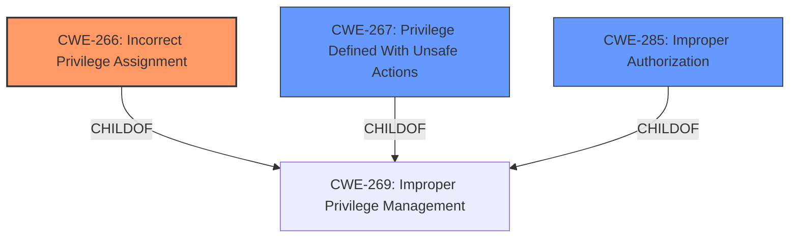

# Analysis Report for CVE-2024-39670

# Vulnerability Analysis Report: CVE-2024-39670

## Description

**Privilege escalation vulnerability** in the account synchronisation module. Impact Successful exploitation of this vulnerability will affect availability.

## Vulnerability Description Key Phrases

- **Weakness:** Privilege escalation vulnerability
- **Impact:** ['Privilege escalation', 'affect availability']
- **Component:** account synchronisation module

## Analysis (with Relationship Data)

# Summary
| CWE ID  | CWE Name                                                                          | Confidence | CWE Abstraction Level | CWE Vulnerability Mapping Label | CWE-Vulnerability Mapping Notes |
| :------- | :-------------------------------------------------------------------------------- | :--------- | :-------------------- | :------------------------------ | :------------------------------ |
| CWE-266 | Incorrect Privilege Assignment                                                    | 0.8        | Base                  | Primary                         | Allowed                       |
| CWE-267 | Privilege Defined With Unsafe Actions                                             | 0.6        | Base                  | Secondary                       | Allowed                       |
| CWE-285 | Improper Authorization                                                              | 0.5        | Class                  | Secondary                       | Discouraged                      |

## Evidence and Confidence

*   **Confidence Score:** 0.7
*   **Evidence Strength:** MEDIUM

## Relationship Analysis
The primary CWE is CWE-266, representing the root cause of the vulnerability. CWE-267 and CWE-285 are secondary considerations. CWE-266 is at the Base level of abstraction, which is preferred. The vulnerability description indicates a privilege escalation issue within the account synchronization module. The description contains the key phrase "**Privilege escalation vulnerability**". The guidance highlights that privilege escalation impacts are not suitable for CWE-269 and it encourages exploring root causes like CWE-266.



## Vulnerability Chain
The vulnerability chain starts with **incorrect privilege assignment** (CWE-266), leading to a privilege escalation. The exploitation of this vulnerability affects availability.

## Summary of Analysis
The initial assessment identified **Privilege escalation vulnerability** as the primary issue. However, the guidance advises against directly mapping privilege escalation to CWE-269 (Improper Privilege Management), and encourages identifying the root cause. The root cause appears to be in the area of **Incorrect Privilege Assignment** (CWE-266).

The selection of CWE-266 is based on:
   - The **Vulnerability Description Key Phrases** indicates "**Privilege escalation vulnerability**".
   - The **CVE Reference Links Content Summary** indicates "**Privilege escalation vulnerability** in the account synchronization module".
   - The MITRE guidance points to using CWE-266 for cases of role misassignment.

Relevant CWE Information:

# Enhanced Context (25 CWEs)
The following CWEs were identified as potentially relevant to this vulnerability:

## CWE-267: Privilege Defined With Unsafe Actions
**Abstraction Level**: Base
**Similarity Score**: 0.79
**Source**: dense

**Description**:
A particular privilege, role, capability, or right can be used to perform unsafe actions that were not intended, even when it is assigned to the correct entity.

**Mapping Guidance**:
- Usage: Allowed
- Rationale: This CWE entry is at the Base level of abstraction, which is a preferred level of abstraction for mapping to the root causes of vulnerabilities.

## CWE-266: Incorrect Privilege Assignment
**Abstraction Level**: Base
**Similarity Score**: 0.79
**Source**: dense

**Description**:
A product incorrectly assigns a privilege to a particular actor, creating an unintended sphere of control for that actor.

**Mapping Guidance**:
- Usage: Allowed
- Rationale: This CWE entry is at the Base level of abstraction, which is a preferred level of abstraction for mapping to the root causes of vulnerabilities.

## CWE-285: Improper Authorization
**Abstraction Level**: Class
**Similarity Score**: 1308.89
**Source**: sparse

**Description**:
The product does not perform or incorrectly performs an authorization check when an actor attempts to access a resource or perform an action.

**Mapping Guidance**:
- Usage: Discouraged
- Rationale: CWE-285 is high-level and lower-level CWEs can frequently be used instead. It is a level-1 Class (i.e., a child of a Pillar).


## CWE Relationship Analysis

Current CWEs represent these abstraction levels: .


### Vulnerability Chain Analysis

**Chain starting from CWE-266:**
- 266 (Incorrect Privilege Assignment) - ROOT


**Chain starting from CWE-269:**
- 269 (Improper Privilege Management) - ROOT


### CWE Relationship Diagram

```mermaid
graph TD
    classDef primary fill:#f96,stroke:#333,stroke-width:2px
    classDef secondary fill:#69f,stroke:#333
    classDef tertiary fill:#9e9,stroke:#333
```


*Report generated on 2025-07-13 11:40:24*
