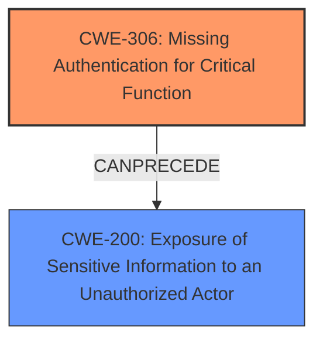

# Raw Analyzer Response for CVE-2024-39676

# Summary

| CWE ID | CWE Name | Confidence | CWE Abstraction Level | CWE Vulnerability Mapping Label | CWE-Vulnerability Mapping Notes |
|---|---|---|---|---|---|
| CWE-306 | Missing Authentication for Critical Function | 0.9 | Base | Primary CWE | Allowed |
| CWE-200 | Exposure of Sensitive Information to an Unauthorized Actor | 0.7 | Class | Secondary | Discouraged |

## Evidence and Confidence

*   **Confidence Score:** 0.8
*   **Evidence Strength:** HIGH

## Relationship Analysis
The primary relationship that influenced the CWE selection was the parent-child relationship. CWE-306 is a more specific (Base) case of a broader authentication issue, whereas CWE-200 describes the impact. The vulnerability stems from the lack of authentication which directly leads to the exposure of sensitive information.

## Vulnerability Chain
The vulnerability chain starts with the **missing authentication** for a critical function (CWE-306). This **weakness** allows unauthorized access to the `/appconfigs` endpoint, which results in the **exposure of sensitive information** to unauthorized actors (CWE-200).

## Summary of Analysis
The initial analysis identified several potential CWEs based on the vulnerability description. The retriever results suggested CWE-863 (Incorrect Authorization), CWE-200 (Exposure of Sensitive Information to an Unauthorized Actor), and CWE-306 (Missing Authentication for Critical Function) as top candidates.

However, based on the vulnerability details and the CWE classification guidance, CWE-306 (Missing Authentication for Critical Function) was selected as the primary CWE. The evidence clearly states that the `/appconfigs` endpoint lacks proper access control, allowing unauthorized access. This aligns with the definition of CWE-306, which focuses on the absence of authentication for critical functions.

The vulnerability description states: "When using a request to path /appconfigs to the controller, it can lead to the **disclosure of sensitive information** such as system information (e.g. arch, os version), environment information (e.g. maxHeapSize) and Pinot configurations (e.g. zookeeper path)." The CVE Reference Links Content Summary further supports this, stating: "**Lack of Access Control:** The primary **weakness** is the absence of proper access control on the `/appconfigs` endpoint. This allows unauthorized actors to access the endpoint and retrieve sensitive information."

CWE-200 (Exposure of Sensitive Information to an Unauthorized Actor) was considered as a secondary CWE, representing the impact of the missing authentication. However, it's a Class-level CWE and discouraged for use as a primary root cause.

CWE-863 (Incorrect Authorization) was not selected because the issue is not with an incorrect authorization check, but rather the complete absence of one. The CWE classification guidance emphasizes the distinction between missing authentication (CWE-306) and missing authorization after authentication (CWE-862). Since there is no authentication required, CWE-306 is the more appropriate choice.

The selected CWEs are at the optimal level of specificity. CWE-306 is a Base-level CWE that directly addresses the root cause of the vulnerability.

Relevant CWE Information:

# Enhanced Context (25 CWEs)
The following CWEs were identified as potentially relevant to this vulnerability:

## CWE-497: Exposure of Sensitive System Information to an Unauthorized Control Sphere
**Abstraction Level**: Base
**Similarity Score**: 0.77

## CWE-668: Exposure of Resource to Wrong Sphere
**Abstraction Level**: Class
**Similarity Score**: 0.76

## CWE-41: Improper Resolution of Path Equivalence
**Abstraction Level**: Base
**Similarity Score**: 0.75

## CWE-212: Improper Removal of Sensitive Information Before Storage or Transfer
**Abstraction Level**: Base
**Similarity Score**: 0.75

## CWE-74: Improper Neutralization of Special Elements in Output Used by a Downstream Component ('Injection')
**Abstraction Level**: Class
**Similarity Score**: 0.75

## CWE-639: Authorization Bypass Through User-Controlled Key
**Abstraction Level**: Base
**Similarity Score**: 0.75

## CWE-472: External Control of Assumed-Immutable Web Parameter
**Abstraction Level**: Base
**Similarity Score**: 0.75

## CWE-923: Improper Restriction of Communication Channel to Intended Endpoints
**Abstraction Level**: Class
**Similarity Score**: 0.75

## CWE-1390: Weak Authentication
**Abstraction Level**: Class
**Similarity Score**: 0.74

## CWE-538: Insertion of Sensitive Information into Externally-Accessible File or Directory
**Abstraction Level**: Base
**Similarity Score**: 0.74

## CWE-863: Incorrect Authorization
**Abstraction Level**: Class
**Similarity Score**: 1953.99

## CWE-306: Missing Authentication for Critical Function
**Abstraction Level**: Base
**Similarity Score**: 1928.80

## CWE-639: Authorization Bypass Through User-Controlled Key
**Abstraction Level**: Base
**Similarity Score**: 1924.98

## CWE-285: Improper Authorization
**Abstraction Level**: Class
**Similarity Score**: 1909.20

## CWE-200: Exposure of Sensitive Information to an Unauthorized Actor
**Abstraction Level**: Class
**Similarity Score**: 1830.14

## CWE-22: Improper Limitation of a Pathname to a Restricted Directory ('Path Traversal')
**Abstraction Level**: base
**Similarity Score**: 4.33

## CWE-201: Insertion of Sensitive Information Into Sent Data
**Abstraction Level**: base
**Similarity Score**: 4.33

## CWE-41: Improper Resolution of Path Equivalence
**Abstraction Level**: Base
**Similarity Score**: 2.91

## CWE-212: Improper Removal of Sensitive Information Before Storage or Transfer
**Abstraction Level**: Base
**Similarity Score**: 2.90

## CWE-73: External Control of File Name or Path
**Abstraction Level**: Base
**Similarity Score**: 2.90

## CWE-322: Key Exchange without Entity Authentication
**Abstraction Level**: base
**Similarity Score**: 2.87

## CWE-226: Sensitive Information in Resource Not Removed Before Reuse
**Abstraction Level**: base
**Similarity Score**: 2.87

## CWE-1272: Sensitive Information Uncleared Before Debug/Power State Transition
**Abstraction Level**: base
**Similarity Score**: 2.73

## CWE-942: Permissive Cross-domain Policy with Untrusted Domains
**Abstraction Level**: variant
**Similarity Score**: 2.68

## CWE-499: Serializable Class Containing Sensitive Data
**Abstraction Level**: variant
**Similarity Score**: 2.68