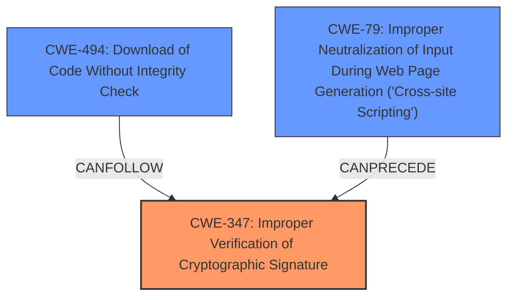

# Analysis for CVE-2024-39698

# Summary
| CWE ID | CWE Name | Confidence | CWE Abstraction Level | CWE Vulnerability Mapping Label | CWE-Vulnerability Mapping Notes |
|---|---|---|---|---|---|
| CWE-347 | Improper Verification of Cryptographic Signature | 0.9 | Base | Allowed | Primary CWE. The root cause is that the product does not properly verify the cryptographic signature for data. |
| CWE-79 | Improper Neutralization of Input During Web Page Generation ('Cross-site Scripting') | 0.7 | Base | Allowed | Secondary CWE. An attack vector is Cross-Site Scripting to point the application to a malicious updater server. |
| CWE-494 | Download of Code Without Integrity Check | 0.6 | Base | Allowed | Secondary CWE. The product downloads source code or an executable from a remote location and executes the code without sufficiently verifying the origin and integrity of the code. |

## Evidence and Confidence

*   **Confidence Score:** 0.8
*   **Evidence Strength:** HIGH

## Relationship Analysis
The primary weakness is **CWE-347 Improper Verification of Cryptographic Signature** because the core vulnerability lies in the improper validation of the cryptographic signature of the update file. **CWE-79 Improper Neutralization of Input During Web Page Generation ('Cross-site Scripting')** is a secondary weakness because it represents one of the attack vectors through which a compromised update manifest can be delivered. **CWE-494 Download of Code Without Integrity Check** is related since the code is downloaded and executed without proper integrity checks, which is a consequence of the signature verification failure.

## Vulnerability Chain
The vulnerability chain starts with a compromised update manifest, potentially achieved through **CWE-79 Improper Neutralization of Input During Web Page Generation ('Cross-site Scripting')**. This leads to the download of a malicious update. The core issue is **CWE-347 Improper Verification of Cryptographic Signature**, which allows the malicious update to bypass security checks. Finally, this results in **CWE-494 Download of Code Without Integrity Check** and arbitrary code execution on the user's machine.

Compromised Update Manifest -> **CWE-79** (Attack Vector) -> Download Malicious Update -> **CWE-347** (Root Cause) -> **CWE-494** -> Arbitrary Code Execution.

## Summary of Analysis
The analysis is based on the provided vulnerability description and the CVE Reference Links Content Summary. The description explicitly states the **rootcause** as **improper certificate validation**, which directly corresponds to CWE-347. The reference links further detail how the environment variable expansion in `cmd.exe` leads to the verification of an incorrect file, solidifying the selection of CWE-347 as the primary weakness. The graph relationships support this by showing how CWE-79 can precede CWE-347 in the attack chain. The selection of CWE-347 is at the optimal level of specificity because it precisely describes the flawed cryptographic signature verification process.

CWE-79 is selected as a secondary weakness as it is listed as an attack vector.

CWE-494 is chosen as a secondary weakness because it describes the lack of integrity check during the download and execution of code, resulting from the bypassed signature validation.

CWE-295 was considered but not selected as the primary weakness because CWE-347 is a more specific description of the vulnerability. CWE-295 states that the product does not validate, or incorrectly validates, a certificate. CWE-347 is more specific in that it highlights the cryptographic signature. The vulnerability specifically bypasses the cryptographic signature, so CWE-347 is a better choice.