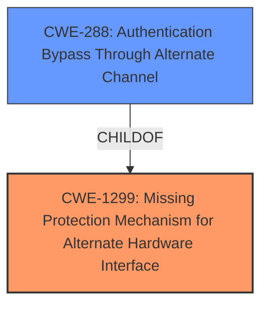

# Analysis for CVE-2024-39723

# Summary
| CWE ID | CWE Name | Confidence | CWE Abstraction Level | CWE Vulnerability Mapping Label | CWE-Vulnerability Mapping Notes |
|---|---|---|---|---|---|
| CWE-1299 | Missing Protection Mechanism for Alternate Hardware Interface | 0.9 | Base | Allowed | Primary CWE. The vulnerability is that the protection mechanism to disable the USB port is **missing** or not working as expected. |
| CWE-288 | Authentication Bypass Through Alternate Channel | 0.7 | Base | Allowed | Secondary Candidate. The vulnerability allows bypassing authentication through an alternate channel (USB port) when it should have been disabled. |

## Evidence and Confidence

*   **Confidence Score:** 0.9
*   **Evidence Strength:** HIGH

## Relationship Analysis
The primary relationship is that CWE-1299 Missing Protection Mechanism for Alternate Hardware Interface is a parent of CWE-288 Authentication Bypass Through Alternate Channel. The vulnerability is caused by the **missing** protection mechanism, and the consequence is an Authentication Bypass.

## Vulnerability Chain
The chain of events starts with a **missing** protection mechanism on the USB port (CWE-1299), which allows an attacker with physical access to bypass the intended security controls, leading to potential data access issues. The chain is:
1.  CWE-1299: Missing Protection Mechanism for Alternate Hardware Interface (Root Cause)
2.  CWE-288: Authentication Bypass Through Alternate Channel (Consequence)

## Summary of Analysis
The vulnerability lies in the fact that the USB ports can still be used even when disabled by the administrator. The key phrase is that the protection mechanism is **missing** or ineffective.

CWE-1299 (Missing Protection Mechanism for Alternate Hardware Interface) is the most appropriate because the root cause is the absence of a working protection mechanism for the USB port. This allows a bypass of the intended security controls.

CWE-288 (Authentication Bypass Through Alternate Channel) is a secondary candidate because the **missing** protection mechanism allows a potential bypass of authentication through the USB port.

The graph relationships highlight the connection between the **missing** protection and the resulting bypass. CWE-1299 is the root cause, making it the primary CWE.

The selected CWEs are at the optimal level of specificity, as they directly address the root cause and consequence of the vulnerability.

Relevant CWE Information:

# Enhanced Context (25 CWEs)
The following CWEs were identified as potentially relevant to this vulnerability:

## CWE-497: Exposure of Sensitive System Information to an Unauthorized Control Sphere
**Abstraction Level**: Base
**Similarity Score**: 0.73
**Source**: dense

**Description**:
The product does not properly prevent sensitive system-level information from being accessed by unauthorized actors who do not have the same level of access to the underlying system as the product does.

**Mapping Guidance**:
- Usage: Allowed
- Rationale: This CWE entry is at the Base level of abstraction, which is a preferred level of abstraction for mapping to the root causes of vulnerabilities.

*Not Used:* This CWE is about exposure of sensitive system information, which is not the primary issue described in the vulnerability. The main problem is the **missing** protection mechanism.

## CWE-807: Reliance on Untrusted Inputs in a Security Decision
**Abstraction Level**: Base
**Similarity Score**: 0.72
**Source**: dense

**Description**:
The product uses a protection mechanism that relies on the existence or values of an input, but the input can be modified by an untrusted actor in a way that bypasses the protection mechanism.

**Mapping Guidance**:
- Usage: Allowed
- Rationale: This CWE entry is at the Base level of abstraction, which is a preferred level of abstraction for mapping to the root causes of vulnerabilities.

*Not Used:* While there is reliance on a security decision (disabling the USB port), the core issue is the **missing** or ineffective protection mechanism, not directly the reliance on untrusted input.

## CWE-1391: Use of Weak Credentials
**Abstraction Level**: Class
**Similarity Score**: 0.72
**Source**: dense

**Description**:
The product uses weak credentials (such as a default key or hard-coded password) that can be calculated, derived, reused, or guessed by an attacker.

**Mapping Guidance**:
- Usage: Allowed-with-Review
- Rationale: This CWE entry is a Class and might have Base-level children that would be more appropriate

*Not Used:* This CWE is not applicable as the vulnerability doesn't involve weak credentials.

## CWE-326: Inadequate Encryption Strength
**Abstraction Level**: Class
**Similarity Score**: 0.72
**Source**: dense

**Description**:
The product stores or transmits sensitive data using an encryption scheme that is theoretically sound, but is not strong enough for the level of protection required.

**Mapping Guidance**:
- Usage: Allowed-with-Review
- Rationale: This CWE entry is a Class and might have Base-level children that would be more appropriate

*Not Used:* This CWE is not relevant because the vulnerability does not involve encryption.

## CWE-345: Insufficient Verification of Data Authenticity
**Abstraction Level**: Class
**Similarity Score**: 0.72
**Source**: dense

**Description**:
The product does not sufficiently verify the origin or authenticity of data, in a way that causes it to accept invalid data.

**Mapping Guidance**:
- Usage: Discouraged
- Rationale: This CWE entry is a level-1 Class (i.e., a child of a Pillar). It might have lower-level children that would be more appropriate

*Not Used:* This vulnerability isn't related to data authenticity verification.

## CWE-755: Improper Handling of Exceptional Conditions
**Abstraction Level**: Class
**Similarity Score**: 0.71
**Source**: dense

**Description**:
The product does not handle or incorrectly handles an exceptional condition.

**Mapping Guidance**:
- Usage: Discouraged
- Rationale: This CWE entry is a level-1 Class (i.e., a child of a Pillar). It might have lower-level children that would be more appropriate

*Not Used:* This CWE is not relevant, as the issue is not about handling exceptional conditions but a **missing** security control.

## CWE-327: Use of a Broken or Risky Cryptographic Algorithm
**Abstraction Level**: Class
**Similarity Score**: 0.71
**Source**: dense

**Description**:
The product uses a broken or risky cryptographic algorithm or protocol.

**Mapping Guidance**:
- Usage: Allowed-with-Review
- Rationale: This CWE entry is a Class and might have Base-level children that would be more appropriate

*Not Used:* This is not about cryptographic algorithms.

## CWE-311: Missing Encryption of Sensitive Data
**Abstraction Level**: Class
**Similarity Score**: 0.71
**Source**: dense

**Description**:
The product does not encrypt sensitive or critical information before storage or transmission.

**Mapping Guidance**:
- Usage: Discouraged
- Rationale: CWE-311 is high-level with more precise children available. It is a level-1 Class (i.e., a child of a Pillar).

*Not Used:* Not related to encryption.

## CWE-200: Exposure of Sensitive Information to an Unauthorized Actor
**Abstraction Level**: Class
**Similarity Score**: 0.71
**Source**: dense

**Description**:
The product exposes sensitive information to an actor that is not explicitly authorized to have access to that information.

**Mapping Guidance**:
- Usage: Discouraged
- Rationale: CWE-200 is commonly misused to represent the loss of confidentiality in a vulnerability, but confidentiality loss is a technical impact - not a root cause error. As of CWE 4.9, over 400 CWE entries can lead to a loss of confidentiality. Other options are often available. [REF-1287].

*Not Used:* The vulnerability is not directly about information exposure but rather a bypass of a security control.

## CWE-203: Observable Discrepancy
**Abstraction Level**: Base
**Similarity Score**: 0.70
**Source**: dense

**Description**:
The product behaves differently or sends different responses under different circumstances in a way that is observable to an unauthorized actor, which exposes security-relevant information about the state of the product, such as whether a particular operation was successful or not.

**Mapping Guidance**:
- Usage: Allowed
- Rationale: This CWE entry is at the Base level of abstraction, which is a preferred level of abstraction for mapping to the root causes of vulnerabilities.

*Not Used:* This CWE is not relevant because the vulnerability does not hinge on observable