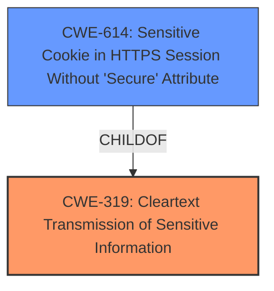

# Analysis for CVE-2024-39746

# Summary
| CWE ID | CWE Name | Confidence | CWE Abstraction Level | CWE Vulnerability Mapping Label | CWE-Vulnerability Mapping Notes |
|---|---|---|---|---|---|
| CWE-319 | Cleartext Transmission of Sensitive Information | 0.9 | Base | Allowed | Primary CWE. The **failure to properly enable HTTP Strict Transport Security** leads to data being transmitted in cleartext. |
| CWE-614 | Sensitive Cookie in HTTPS Session Without 'Secure' Attribute | 0.7 | Variant | Allowed | Secondary CWE. The **failure to properly enable HTTP Strict Transport Security** could lead to sensitive cookies being transmitted without the 'Secure' attribute. |

## Evidence and Confidence

*   **Confidence Score:** 0.8
*   **Evidence Strength:** MEDIUM

## Relationship Analysis
The primary CWE is CWE-319, which directly relates to the cleartext transmission of sensitive information due to the **failure to enable HSTS**. CWE-614 is a variant that focuses on the specific case of sensitive cookies being transmitted without the 'Secure' attribute in HTTPS sessions, which is a potential consequence of not enforcing HSTS.

## Vulnerability Chain
The vulnerability chain starts with the **failure to properly enable HTTP Strict Transport Security**, leading to cleartext transmission of sensitive information, and potentially insecure cookies.
  - Root Cause: **Failure to properly enable HTTP Strict Transport Security**
  - Weakness: Cleartext Transmission of Sensitive Information (CWE-319)
  - Impact: Potential exposure of sensitive information via man-in-the-middle attacks.

## Summary of Analysis
The initial assessment identified CWE-319 as the primary weakness, stemming from the **failure to enable HTTP Strict Transport Security**, which results in data being transmitted in cleartext. The description explicitly mentions the potential for man-in-the-middle attacks, which aligns with the implications of CWE-319. CWE-614 was also considered as a secondary weakness, as the **failure to properly enable HTTP Strict Transport Security** could leave sensitive cookies vulnerable.

The vulnerability description indicates a **failure to properly enable HTTP Strict Transport Security**, which leads to sensitive information being transmitted in cleartext. This aligns directly with CWE-319, "Cleartext Transmission of Sensitive Information." The evidence is found in the "Vulnerability Description Key Phrases" section, which states that the root cause is a "**failure to properly enable HTTP Strict Transport Security**".

The relationship graph shows that CWE-614 is a child of CWE-319, which further supports the decision to include both CWEs. CWE-319 is the root cause, and CWE-614 is a specific instance of the vulnerability related to cookies.

The selected CWEs are at the optimal level of specificity because they accurately represent the weakness described in the vulnerability. CWE-319 is a Base level CWE, and CWE-614 is a Variant, which is a preferred level of abstraction.

Relevant CWE Information:
# Enhanced Context (25 CWEs)
The following CWEs were identified as potentially relevant to this vulnerability:

## CWE-311: Missing Encryption of Sensitive Data
**Abstraction Level**: Class
**Similarity Score**: 0.75
**Source**: dense

**Description**:
The product does not encrypt sensitive or critical information before storage or transmission.

**Mapping Guidance**:
- Usage: Discouraged
- Rationale: CWE-311 is high-level with more precise children available. It is a level-1 Class (i.e., a child of a Pillar).

*CWE-311 was considered but not selected because CWE-319 is more specific and relevant to the vulnerability description.*

## CWE-614: Sensitive Cookie in HTTPS Session Without 'Secure' Attribute
**Abstraction Level**: Variant
**Similarity Score**: 0.74
**Source**: dense

**Description**:
The Secure attribute for sensitive cookies in HTTPS sessions is not set, which could cause the user agent to send those cookies in plaintext over an HTTP session.

**Mapping Guidance**:
- Usage: Allowed
- Rationale: This CWE entry is at the Variant level of abstraction, which is a preferred level of abstraction for mapping to the root causes of vulnerabilities.

*CWE-614 was selected as a secondary CWE because it is a specific case of CWE-319 related to cookies.*

## CWE-326: Inadequate Encryption Strength
**Abstraction Level**: Class
**Similarity Score**: 0.74
**Source**: dense

**Description**:
The product stores or transmits sensitive data using an encryption scheme that is theoretically sound, but is not strong enough for the level of protection required.

**Mapping Guidance**:
- Usage: Allowed-with-Review
- Rationale: This CWE entry is a Class and might have Base-level children that would be more appropriate

*CWE-326 was considered but not selected because the issue is not about encryption strength, but about the absence of encryption due to the **failure to properly enable HTTP Strict Transport Security**.*

## CWE-319: Cleartext Transmission of Sensitive Information
**Abstraction Level**: Base
**Similarity Score**: 0.73
**Source**: dense

**Description**:
The product transmits sensitive or security-critical data in cleartext in a communication channel that can be sniffed by unauthorized actors.

**Mapping Guidance**:
- Usage: Allowed
- Rationale: This CWE entry is at the Base level of abstraction, which is a preferred level of abstraction for mapping to the root causes of vulnerabilities.

*CWE-319 was selected as the primary CWE because the **failure to properly enable HTTP Strict Transport Security** directly leads to the transmission of sensitive information in cleartext.*

## CWE-598: Use of GET Request Method With Sensitive Query Strings
**Abstraction Level**: Variant
**Similarity Score**: 0.72
**Source**: dense

**Description**:
The web application uses the HTTP GET method to process a request and includes sensitive information in the query string of that request.

**Mapping Guidance**:
- Usage: Allowed
- Rationale: This CWE entry is at the Variant level of abstraction, which is a preferred level of abstraction for mapping to the root causes of vulnerabilities.

*CWE-598 was considered but not selected because the vulnerability is not specifically related to the use of the GET method.*