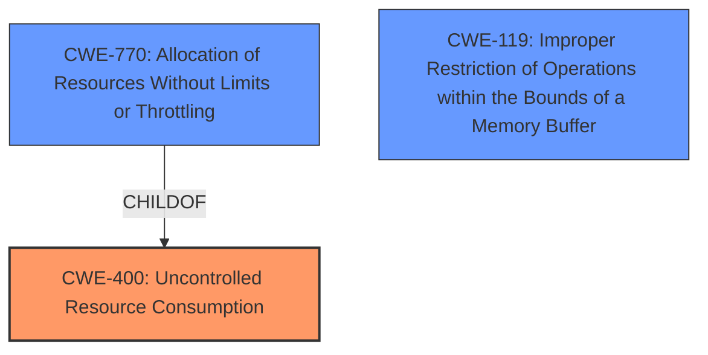

# Enhanced Analysis for CVE-2024-39778

# Summary
| CWE ID | CWE Name | Confidence | CWE Abstraction Level | CWE Vulnerability Mapping Label | CWE-Vulnerability Mapping Notes |
|---|---|---|---|---|---|
| **CWE-400** | **Uncontrolled Resource Consumption** | 0.7 | Class | Primary | Discouraged |
| CWE-770 | Allocation of Resources Without Limits or Throttling | 0.6 | Base | Secondary | Allowed |
| CWE-119 | Improper Restriction of Operations within the Bounds of a Memory Buffer | 0.5 | Class | Secondary | Discouraged |

## Evidence and Confidence

*   **Confidence Score:** 0.7
*   **Evidence Strength:** LOW

## Relationship Analysis
The primary CWE selected is CWE-400, which is a Class-level CWE. CWE-770 is a child of CWE-400 and represents a more specific case of resource consumption without limits. CWE-119 is related to memory buffers, which could be a resource being consumed. However, the description is too vague to determine the specific type of resource consumption, so CWE-400 is the more appropriate choice, though it is discouraged and a more specific child would be preferred.



## Vulnerability Chain
The vulnerability chain starts with **undisclosed requests** leading to **uncontrolled resource consumption**, ultimately causing the **TMM to terminate**.

## Summary of Analysis
The analysis is based on the limited information provided in the vulnerability description. The key phrase "TMM to terminate" suggests a resource exhaustion issue. The vulnerability description is vague, and there is no "CVE Reference Links Content Summary" section to provide more detailed information. The "Vulnerability Description Key Phrases" section lacks a strong indication of the root cause.

CWE-400 (Uncontrolled Resource Consumption) is selected as the primary CWE because it aligns with the observed behavior of TMM termination. However, CWE-400 is a Class-level CWE and is discouraged.

CWE-770 (Allocation of Resources Without Limits or Throttling) is considered as a secondary CWE because it is a more specific case of resource consumption. However, without more information about the nature of the **undisclosed requests** and the specific resource being exhausted, it is difficult to confirm that CWE-770 is the most appropriate choice.

CWE-119 (Improper Restriction of Operations within the Bounds of a Memory Buffer) is considered because memory could be a resource, and the termination might involve memory corruption or access violations, but this is less likely based on the limited evidence.

The retriever results also suggest CWE-444 (Inconsistent Interpretation of HTTP Requests ('HTTP Request/Response Smuggling')), but this is less likely given the lack of detail.

Relevant CWE Information:

# Enhanced Context (25 CWEs)

## CWE-444: Inconsistent Interpretation of HTTP Requests ('HTTP Request/Response Smuggling')
**Abstraction Level**: Base
**Similarity Score**: 0.68
**Source**: dense

**Description**:
The product acts as an intermediary HTTP agent
         (such as a proxy or firewall) in the data flow between two
         entities such as a client and server, but it does not
         interpret malformed HTTP requests or responses in ways that
         are consistent with how the messages will be processed by
         those entities that are at the ultimate destination.

**Mapping Guidance**:
- Usage: Allowed
- Rationale: This CWE entry is at the Base level of abstraction, which is a preferred level of abstraction for mapping to the root causes of vulnerabilities.
**NOT USED:** While the attack vector is related to requests, there is no evidence of HTTP request smuggling.

## CWE-696: Incorrect Behavior Order
**Abstraction Level**: Class
**Similarity Score**: 0.68
**Source**: dense

**Description**:
The product performs multiple related behaviors, but the behaviors are performed in the wrong order in ways which may produce resultant weaknesses.

**Mapping Guidance**:
- Usage: Allowed-with-Review
- Rationale: This CWE entry is a Class and might have Base-level children that would be more appropriate
**NOT USED:** There is no evidence that the behavior order is incorrect.

## CWE-400: Uncontrolled Resource Consumption
**Abstraction Level**: Class
**Similarity Score**: 0.67
**Source**: dense

**Description**:
The product does not properly control the allocation and maintenance of a limited resource, thereby enabling an actor to influence the amount of resources consumed, eventually leading to the exhaustion of available resources.

**Mapping Guidance**:
- Usage: Discouraged
- Rationale: CWE-400 is intended for incorrect behaviors in which the product is expected to track and restrict how many resources it consumes, but CWE-400 is often misused because it is conflated with the "technical impact" of vulnerabilities in which resource consumption occurs. It is sometimes used for low-information vulnerability reports. It is a level-1 Class (i.e., a child of a Pillar).

**USED:** The vulnerability description states that "undisclosed requests can cause TMM to terminate," which aligns with the concept of uncontrolled resource consumption leading to a crash. While discouraged, it is the best fit given the limited information.

## CWE-617: Reachable Assertion
**Abstraction Level**: Base
**Similarity Score**: 0.67
**Source**: dense

**Description**:
The product contains an assert() or similar statement that can be triggered by an attacker, which leads to an application exit or other behavior that is more severe than necessary.

**Mapping Guidance**:
- Usage: Allowed
- Rationale: This CWE entry is at the Base level of abstraction, which is a preferred level of abstraction for mapping to the root causes of vulnerabilities.
**NOT USED:** There is no evidence of an assertion being triggered.

## CWE-404: Improper Resource Shutdown or Release
**Abstraction Level**: Class
**Similarity Score**: 0.67
**Source**: dense

**Description**:
The product does not release or incorrectly releases a resource before it is made available for re-use.

**Mapping Guidance**:
- Usage: Allowed-with-Review
- Rationale: This CWE entry is a Class and might have Base-level children that would be more appropriate
**NOT USED:** There is no information about resource shutdown or release.

## CWE-294: Authentication Bypass by Capture-replay
**Abstraction Level**: Base
**Similarity Score**: 0.67
**Source**: dense

**Description**:
A capture-replay flaw exists when the design of the product makes it possible for a malicious user to sniff network traffic and bypass authentication by replaying it to the server in question to the same effect as the original message (or with minor changes).

**Mapping Guidance**:
- Usage: Allowed
- Rationale: This CWE entry is at the Base level of abstraction, which is a preferred level of abstraction for mapping to the root causes of vulnerabilities.
**NOT USED:** This is unrelated to the vulnerability description.

## CWE-789: Memory Allocation with Excessive Size Value
**Abstraction Level**: Variant
**Similarity Score**: 0.67
**Source**: dense

**Description**:
The product allocates memory based on an untrusted, large size value, but it does not ensure that the size is within expected limits, allowing arbitrary amounts of memory to be allocated.

**Mapping Guidance**:
- Usage: Allowed
- Rationale: This CWE entry is at the Variant level of abstraction, which is a preferred level of abstraction for mapping to the root causes of vulnerabilities.
**NOT USED:** There is no specific mention of memory allocation issues.

## CWE-755: Improper Handling of Exceptional Conditions
**Abstraction Level**: Class
**Similarity Score**: 0.66
**Source**: dense

**Description**:
The product does not handle or incorrectly handles an exceptional condition.

**Mapping Guidance**:
- Usage: Discouraged
- Rationale: This CWE entry is a level-1 Class (i.e., a child of a Pillar). It might have lower-level children that would be more appropriate
**NOT USED:** There is no direct evidence of improper handling of exceptional conditions.

## CWE-346: Origin Validation Error
**Abstraction Level**: Class
**Similarity Score**: 0.66
**Source**: dense

**Description**:
The product does not properly verify that the source of data or communication is valid.

**Mapping Guidance**:
- Usage: Allowed-with-Review
- Rationale: This CWE entry is a Class and might have Base-level children that would be more appropriate
**NOT USED:** This is unrelated to the vulnerability description.

## CWE-130


## CWE Relationship Analysis

Current CWEs represent these abstraction levels: .


### Vulnerability Chain Analysis

**Chain starting from CWE-400:**
- 400 (Uncontrolled Resource Consumption) - ROOT


**Chain starting from CWE-130:**
- 130 (Improper Handling of Length Parameter Inconsistency) - ROOT


### CWE Relationship Diagram

```mermaid
graph TD
    classDef primary fill:#f96,stroke:#333,stroke-width:2px
    classDef secondary fill:#69f,stroke:#333
    classDef tertiary fill:#9e9,stroke:#333
```